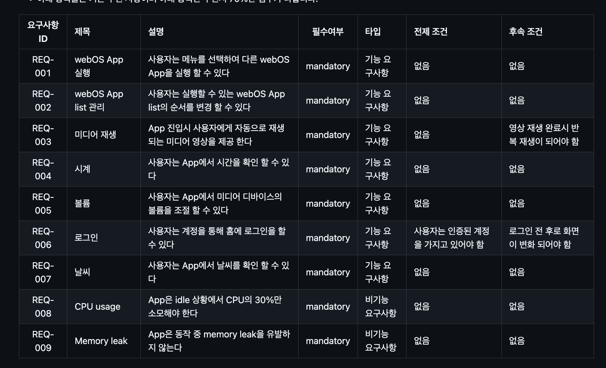
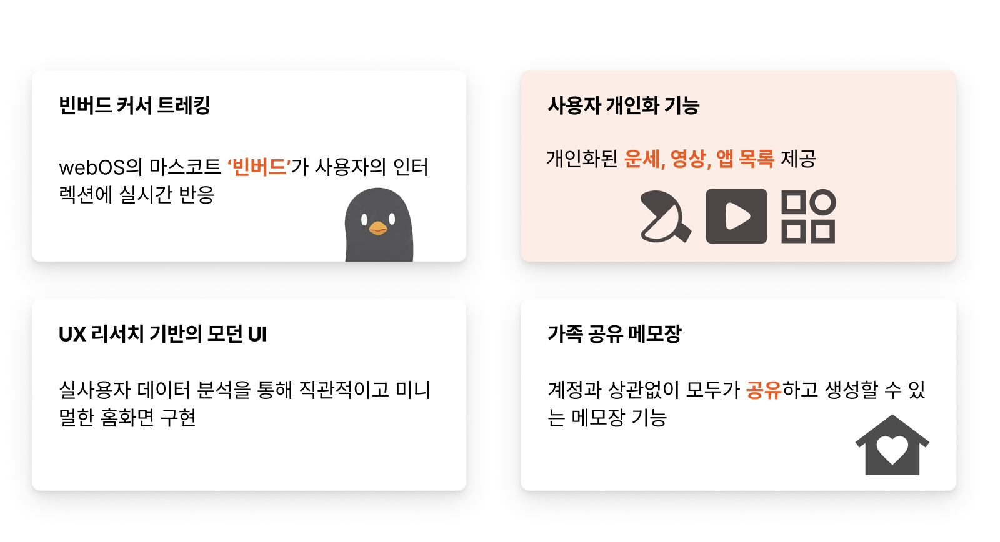
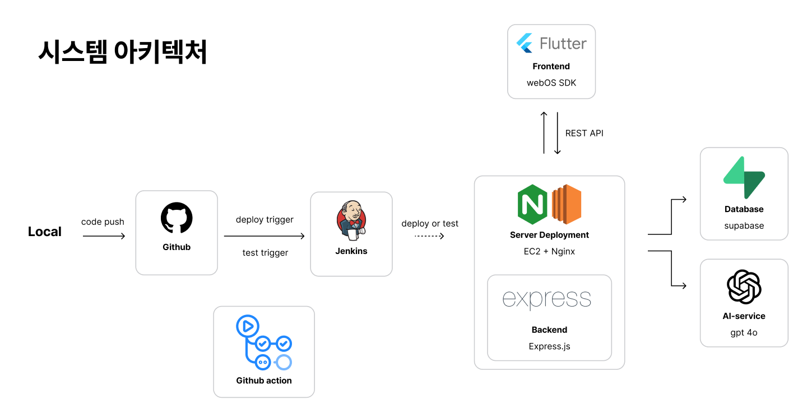
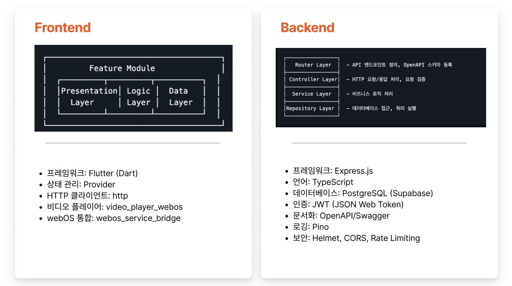
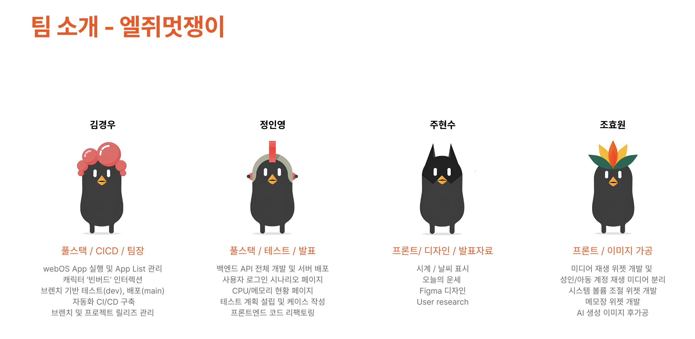

> 25-2학기에 LG 전자에서 산학 협력 커넥티드 플랫폼 수업을 들으면서 배웠던 점을 공유합니다.

## 1️⃣ 수업을 듣게 된 계기

1년 6개월 동안 2번의 인턴을 하면서 오랜 시간 학교를 떠나 있다가 이번 학기에 드디어 복귀를 하게 되었다.
어떤 수업을 들을까 찾아보던 중, 우수 성적자들에 한해 LG 전자 취업 기회를 제공하는 '커넥티드플랫폼과이론' 이라는 수업을 알게 되었다. LG전자에서 직접 개발 전과정에 대해 교육을 제공받을 수 있고, 파이널 프로젝트로서 `webOS`를 통해 TV에 들어갈 `임베디드 개발 경험`을 할 수 있다는 점에서 메리트를 느꼈다.

그동안 web 분야에서 경험했던 지식들을 기반으로, 임베디드 개발 경험을 쌓아보고 싶다는 생각이 제일 커서 지원하게 되었고, 간단한 면접을 보고 수업을 수강하게 되었다.

### 수업 구성

수업은 스탠바이미 실습 8회, 이론 수업 8회와 이론 수업을 바탕으로 한 기말 시험으로 구성되었다.

## 2️⃣ 교육 세션

다음 주제에 대한 교육 세션이 진행되었다.

- Application framework
- web
- devops
- cloud
- media
- connectivity
- AI

교육 세션을 들으며 컴퓨터공학 전 과정에서 배웠던 핵심 개념들을 다시 리마인드하고, 이를 실제 시스템 관점에서 재구성해볼 수 있었다. 특히 강사님들 대부분이 현직 개발자였기 때문에, 이론적인 개념이 실제 소프트웨어 아키텍처에서 어떤 문제를 해결하기 위해 사용되는지를 구체적인 사례를 통해 이해할 수 있었다.

가장 인상 깊었던 강의는 웹 엔진(Web Engine)의 내부 구조와 멀티 프로세스 아키텍처를 다룬 세션이었다. 초기의 WebKit 기반 브라우저가 UI, 렌더링, JavaScript 실행을 하나의 프로세스 안에서 처리하는 Single Process Model을 사용했을 때, 특정 웹 페이지의 버그나 렌더링 엔진 오류가 곧바로 브라우저 전체의 크래시로 이어질 수 있다는 구조적 한계를 설명해주셨다. 단순히 `스레드`를 분리하는 방식만으로는 메모리 보호나 보안 격리를 보장하기 어렵다는 점에서, `프로세스` 단위 분리가 필요하다는 배경도 함께 이해할 수 있었다.

이러한 한계를 해결하기 위해 현대 브라우저, 특히 Chromium 기반 브라우저는 `Browser Process`와 `Renderer Process`를 분리하는 `Multi-Process Architecture`를 채택하고 있다는 점이 핵심이었다. Browser Process는 탭 관리, 네트워크 요청, 리소스 접근을 담당하고, 각 Renderer Process는 WebKit/Blink 엔진과 JavaScript 엔진(V8)을 포함해 개별 웹 페이지를 렌더링한다. 이 구조를 통해 특정 렌더링 프로세스에서 오류가 발생하더라도 브라우저 전체의 안정성은 유지될 수 있다.

`IPC`(Inter-Process Communication)를 통해 프로세스 간 통신이 이루어지며, `Renderer Process`가 시스템 자원이나 다른 프로세스에 직접 접근하지 못하도록 명확한 API boundary와 보안 제한(sandboxing) 이 적용된다는 점도 강조되었다.

이런 걸 왜 배우는 거지했던 고리타분한 개념들이 내가 전문성을 갖고자 하는 웹 개발이라는 분야에서 밀접하게 사용되고 있었다는 점이 굉장히 인상깊었다. 수업을 들으며 내용이 명확히 와닿지가 않아서, 관련 내용을 더 깊이 이해하기 위해 교보문고에 가서 운영체제의 프로세스·스레드 개념과 현대 웹 엔진 구조를 추가로 찾아았다. 혼자 공부하는 운영체제 책이 큰 도움이 되었다.

+운이 좋게도 이 부분이 기말 시험에 주관식 문제로 출제되어서 엄청난 이득을 보았다.

## 3️⃣ Final Project

파이널 프로젝트는 스탠바이미에 들어갈 화면을 개발하는 것이었다. 기본 요구사항(영상 재생, 볼륨 조절, 날씨 디스플레이, CPU 현황, 메모리 leak 금지 등)을 만족하면서 각 팀이 자율적으로 AI나 개인별 맞춤화 기능을 추가하는 방식이었다.

LG 전자에서 제공하는 `flutter-webos sdk` 를 사용하여 프론트엔드 코드를 개발하여 스탠바이미에서 이를 빌드해서 개발/배포를 진행했고 백엔드는 팀마다 자율적으로 구성했다. 그리고 webos 플랫폼에서 제공하는 `Luna service api` 를 통해 TV를 조작했다. (볼륨, 미디어 재생 등)

원래는 React 기반의 `Enact`를 사용했다는데, 이번 년도부터 성능 개선을 위해 `flutter-webos` 로 전환했다고 한다. (React에 익숙한 나로서는 청천벽력이었다.)

### 기본 요구사항

### 서비스 차별점

기본 요구사항 외에 우리 팀이 추가한 심화 기능은 다음과 같았다.

#### 빈버드 인터랙티브

LG webOS 마스코트인 빈버드 캐릭터가 사용자의 위젯 클릭에 실시간으로 반응하도록 만들었다. 단순히 화면에 떠있는 게 아니라, 사용자가 어떤 위젯을 클릭하면 빈버드가 그쪽을 바라보고 움직이는 식이다. 머리/가슴/배로 빈버드의 2d 이미지를 각각 불러와서 3d 모델처럼 rotate 되는 효과를 구현했다.

`GlobalKey`로 위젯 트리에서 특정 위젯을 참조하고, `AnimationController`로 빈버드의 이동과 회전을 제어했다. 터치 이벤트가 발생하면 빈버드가 해당 위치로 부드럽게 이동하면서 회전하는데, `AnimatedBuilder`를 써서 프레임별로 제어했다.

#### UX 리서치 기반 UI 설계

개인적으로 진행한 인터뷰 2건과 reddit의 LG TV 사용자 여론을 조사해봤더니, 현재 webOS 홈 화면이 너무 복잡하다는 의견이 많았다. 특히 2020년 webOS 버전의 `단순하고 직관적인` UI를 그리워하는 사람들이 많았다.

이런 피드백을 바탕으로 2020 webOS를 레퍼런스 삼아서 불필요한 요소를 최대한 제거하고, 빠른 접근이 가능한 홈 화면을 만드는 데 집중했다.

#### 개인 맞춤형 경험

가족 구성원마다 계정을 만들어서 각자 맞춤 화면을 제공받을 수 있다. 로그인하면 백엔드 API로 사용자 정보를 받아와서 `Luna Database API`에 저장하고, 이걸 기반으로 개인화 데이터를 보여준다.

성인/아동 계정에 따라 영상 콘텐츠를 분리하고, 앱 목록은 `drag & drop`으로 직접 수정할 수 있게 했다. 그리고 계정 생성 시 선택한 별자리로 오늘의 운세를 보여주는데, `gpt-4o`에 `few shot prompting`을 적용해서 일관된 형식으로 운세를 생성하도록 만들었다.

#### 가족 공유 메모장

TV는 보통 가정에서 쓰이니까, 가족끼리 소통할 수 있는 공유 메모장을 추가했다. `Luna Database API`에 메모를 저장해서 어떤 계정으로 로그인해도 모두가 같은 메모를 보고 작성할 수 있다. TV를 단순한 영상 시청 기기가 아니라 가족 커뮤니케이션 플랫폼으로 확장하고 싶었다.

### 시스템 아키텍처

전체 시스템을 프론트엔드(Flutter), 백엔드(Express.js), 배포 파이프라인(Jenkins)으로 구성하였다.

코드를 푸시하면 `Github Action`이 `Jenkins`를 호출하고, 브랜치에 따라 자동으로 테스트나 배포가 진행된다. 백엔드 서버는 `Express`를 `EC2` + `Nginx` 조합으로 배포했고, DB는 웹에서 관리가 편한 `Supabase`(PostgreSQL)를 사용했다.

프론트엔드는 `Flutter`로 개발했고, `Presentation` - `Logic` - `Data layer`로 계층을 나눴다. 상태 관리는 `Provider`를 쓰고, webOS 통합을 위해 `webos_service_bridge`와 `video_player_webos` 패키지를 사용했다.

백엔드는 `Express.js` + `TypeScript`로 작성했고, 4-layer 아키텍처(`Router` - `Controller` - `Service` - `Repository`)로 구성했다. 기능 명세가 확정된 상태였지만 나중에 기능이 추가될 가능성을 고려해서 Feature 단위로 레이어를 만들었다. 인증은 `JWT`로 하고, API 문서는 `Swagger`로 자동 생성했다. 보안은 `Helmet`, `CORS`, rate limiting으로 기본적인 부분을 챙겼다.

### 나의 역할

처음에는 각자 기능 단위로 프론트/백엔드를 나눠서 하려고 했는데, 내가 백엔드 초기 세팅을 하다 보니 아키텍처를 내가 제일 잘 아는 상황이 되어서 그냥 백엔드를 전담했다.

그리고 테스트 케이스를 작성했고, 프론트 파트에선 로그인/회원가입 시나리오와 CPU/메모리 현황 페이지를 만들었다. 마지막으로 프론트 코드 리팩토링도 일부 담당했다.

### ⭐️ 트러블 슈팅

개발하면서 겪었던 주요 이슈들을 정리해보았다.

#### TV별 데이터를 어떻게 구분할 것인가

공유 메모랑 TV별 계정 리스트를 백엔드에 저장하려고 했는데, TV를 어떻게 구분할지가 문제였다. 처음에는 `IP`나 `Device-info`를 헤더에 넣어서 구분하려고 했는데, IP가 바뀌거나 Wi-Fi를 바꾸면 문제가 생길 것 같았다.

관련 API가 있나 찾아보니 `Luna Database API`라는 게 있어서, TV 로컬 DB에 데이터를 저장하는 방식으로 바꿨다. 플랫폼 문서를 제대로 보면 백엔드 없이도 해결되는 게 많다는 걸 느꼈다.

#### 메모 수정 시 앱 강제 종료

메모 수정 후 확인 버튼을 누르면 앱이 강제 종료됐다. 디버깅해보니 상태 관리 문제에 대한 에러 코드가 나왔는데, 코드를 확인해보니 상태는 잘 관리하고 있었다.

진짜 문제는 가상 키보드 `IME(Input Method Editor)` 이슈였다. 텍스트 필드가 IME와 연결된 상태에서 API 호출하고 상태를 바꾸면, 텍스트 필드가 IME와의 연결을 끊으려고 하는데 여전히 IME는 `EditableText`를 참조하고 있어서 `isEmpty` assertion 오류가 발생하는 거였다.

> 💡 **IME**는 키보드 입력을 운영체제가 받아서 문자로 변환하는 시스템이다. 가상 키보드가 열린 상태에서 UI 업데이트가 발생하면 `EditableText` overlay가 살아있는 동안 parent widget이 dispose되면서 에러가 난다.

해결 방법은 간단했다. 수정 버튼 클릭 → 팝업 먼저 닫기 → API 호출 순서로 바꿔서 IME가 정상적으로 detach되도록 했다. TextField가 있는 팝업에서는 입력 중 상태 변화(`setState`, API 호출, 화면 전환)를 조심해야 한다는 걸 배웠다.

#### 빈버드 애니메이션에서 메모리, CPU 사용량의 급증

빈버드 이미지가 탭 이벤트에 반응해서 3d처럼 움직이는 모션을 구현했는데, 탭을 여러 번 하면 메모리랑 CPU 사용량이 급증했다.

원인은 여러 가지였다. 빈버드 위젯 안팎에 탭 이벤트 처리 코드가 중복돼서 애니메이션 컨트롤러가 새로 생성될 때 이전 컨트롤러가 제대로 해제 안 됐고, `AnimationStatusListener`도 정리가 안 되어서 리스너가 계속 쌓였다. 거기다 탭을 연타하면 애니메이션이 중첩 실행되면서 리스너가 더 많이 등록됐다.

해결은 다음과 같이 했다:

- 중복 `GestureDetector` 제거해서 탭 입력 경로 단일화
- dispose에서 컨트롤러와 리스너 확실히 제거
- 애니메이션 실행 중이면 중복 실행 방지
- 컨트롤러는 `initState`에서만 생성

Flutter에서 애니메이션 다룰 때는 React에서처럼, 컴포넌트의 생명주기 관리가 중요하다는 것을 느꼈고 DevTool 모니터링의 중요성을 느꼈다.

### 프로젝트 내에서의 AI 활용

솔직히 Cursor가 없었으면 프로젝트를 못 끝냈을 것 같다. Flutter는 처음 써보는 거라 문법도 낯설고 webOS 관련 API 문서도 생소했는데, AI를 적극 활용하면서 생산성을 엄청 높일 수 있었다.

서비스 기능 자체에도 AI를 많이 썼다. 빈버드 캐릭터 2D 이미지는 Gemini Nano banana+ 모델로 생성했고, 운세 기능은 `gpt-4o`를 써서 사용자의 별자리 기반으로 운세 문구를 만들었다. few shot prompting을 적용해서 매번 일관된 포맷으로 나오게 했다.

개발 생산성 측면에서는 더 적극적으로 활용했다. webOS Luna API 문서를 크롤링해서 개발할 때 바로 참조할 수 있는 내부 문서를 자동으로 만들었다. Cursor로 코드 짤 때도 이 문서랑 수업 repo 코드베이스를 맥락에 넣어서 낯선 Luna API 연동하는 게 훨씬 수월했다.

그리고 개발 끝나고 나서 코드 리팩토링할 때도 AI를 썼는데, 코드량이 너무 많아서 Cursor에서 토큰이 터져버렸다. 그래서 `Repomix`로 코드베이스를 추출하고 Google AI Studio(토큰 100만 개까지 가능)에 넣어서 우리가 정한 코딩 스타일과 best practice에 맞춰서 코드를 정리했다.

### 배우고 느낀 것

Flutter가 처음이라 AI를 어떻게 하면 잘 쓸 수 있을지 고민을 많이 했다. 내가 활동하는 AI 동아리 Hateslop의 바이브 코딩 세션 자료를 참고하면서 프롬프팅 방법이나 컨텍스트 관리하는 법을 배웠고, 이걸 실제로 적용해보면서 효율적으로 코드를 작성하는 법을 익혔다.

TV 임베디드 환경에서 개발하다 보니 예상치 못한 low-level 이슈들이 많이 나왔다. IME 문제나 메모리 관리 같은 건 웹 개발할 때는 크게 신경 안 써도 됐는데, 여기서는 직접 부딪히면서 운영체제나 시스템 프로그래밍 개념을 다시 찾아보게 됐다. 학교에서 배웠던 걸 실제로 써먹는 일이 생기니까 더 잘 이해되었던 거 같다.
