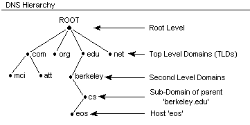

> `혼자 공부하는 네트워크` 책을 읽으면서 배운 점을 정리합니다.
>
> 응용 계층의 핵심은 HTTP이다. 개발자가 가장 자주 접하고 다루게 될 프로토콜로, 웹의 근간을 이루는 프로토콜이다. HTTP를 이해하기 위해서는 DNS와 URI/URL에 대한 배경지식이 필요하며, HTTP의 특징과 메시지 구조, 메서드와 상태 코드에 대한 이해가 필수적이다.


## 1️⃣ DNS와 URI/URL

### 도메인 네임과 DNS

#### 1-1 도메인 네임의 필요성

네트워크 상의 호스트를 식별하기 위해 기본적으로 사용되는 정보는 `IP 주소`이다. 하지만 IP 주소만을 사용하기에는 다소 번거롭다. IP 주소로는 특정 호스트의 특징을 나타내기 어렵고, 호스트의 IP 주소는 언제든 바뀔 수 있기 때문이다.

`도메인 네임(Domain Name)`은 이러한 문제를 해결하기 위한 문자열 형태의 호스트 식별 정보로, 호스트의 IP 주소와 대응된다.

```txt
이런 것들이 다 도메인 네임이다.
www.example.com
developers.naver.com
git.kernel.org
```

도메인 네임은 IP 주소에 비해 **기억이 쉽다**. 또한 IP 주소가 바뀌더라도 바뀐 IP 주소에 도메인 네임을 다시 대응하면 되므로 IP 주소만으로 호스트를 특정하는 것보다 더 간편하다.

> 💡 **도메인 네임의 리졸빙(Resolving)**
>
> 도메인 네임과 그에 대응하는 IP 주소는 `네임 서버(Name Server)` 또는 `DNS 서버`에서 관리된다. IP 주소를 모르는 상태에서 도메인 네임에 대응되는 IP 주소를 알아내는 과정을 **리졸빙(Resolving)** 한다고 표현한다.
>
> ```java
> // 도메인 네임 리졸빙 개념
> String domainName = "www.example.com";
> InetAddress ipAddress = InetAddress.getByName(domainName);
> // DNS 서버에 질의하여 IP 주소 획득
> ```

#### 1-2 도메인 네임의 계층 구조

하나의 도메인 네임은 점(.)을 기준으로 **계층적으로 분류**되어 있다.



| 계층          | 명칭                   | 예시                  |
| ------------- | ---------------------- | --------------------- |
| 루트 도메인   | Root Domain            | `.` (생략 가능)       |
| 최상위 도메인 | TLD (Top-Level Domain) | com, net, org, kr, jp |
| 2단계 도메인  | Second-Level Domain    | example               |
| 3단계 도메인  | Third-Level Domain     | www, mail, developer  |

`FQDN(Fully Qualified Domain Name)`은 도메인 네임을 모두 포함하는 전체 주소 도메인 네임을 의미하며, 이를 통해 호스트를 식별할 수 있다.

> 💡 **서브 도메인(Subdomain)**
>
> 다른 도메인이 포함된 도메인을 서브 도메인이라고 부른다. 예를 들어 다음은 모두 `example.com`의 서브 도메인이다.
>
> - `mail.example.com`
> - `www.example.com`
> - `developer.example.com`

#### 1-3 DNS의 계층 구조

계층적 형태로 이뤄진 도메인 네임을 관리하는 네임 서버 또한 계층적 형태를 이룬다. 네임 서버는 여러 개가 존재하며 전 세계 여러 곳에 분산되어 있다. 이렇게 계층적으로 분산되어 있는 도메인 네임에 대한 관리 체계를 `DNS(Domain Name System)`라고 부른다.

##### DNS 리졸빙 과정

호스트가 `minchul.net`이라는 도메인 네임을 통해 IP 주소를 알아내고자 하는 경우를 가정해보자.

**1. 로컬 네임 서버에 질의**

- `로컬 네임 서버(Local Name Server)`는 클라이언트와 맞닿아 있는 네임 서버
- 클라이언트가 도메인 네임을 통해 IP 주소를 알아내고자 할 때 가장 먼저 찾는 서버
- ISP가 자동으로 할당하거나 공개 DNS 서버(구글의 `8.8.8.8`, 클라우드플레어의 `1.1.1.1`) 사용

**2. 계층적 질의**

- 로컬 네임 서버가 IP 주소를 알고 있다면 즉시 반환
- 모른다면 `루트 네임 서버` → `TLD 네임 서버` → 하위 네임 서버 순으로 질의
- 최종적으로 IP 주소를 찾아 클라이언트에게 전달

```
클라이언트
    ↓ ① 도메인 질의
로컬 네임 서버
    ↓ ② 루트 네임 서버 질의
루트 네임 서버
    ↓ ③ TLD 네임 서버 정보 응답
로컬 네임 서버
    ↓ ④ TLD 네임 서버 질의
TLD 네임 서버
    ↓ ⑤ 권한 네임 서버 정보 응답
로컬 네임 서버
    ↓ ⑥ 권한 네임 서버 질의
권한 네임 서버
    ↓ ⑦ IP 주소 응답
로컬 네임 서버
    ↓ ⑧ IP 주소 전달
클라이언트
```

> 💡 **DNS 캐시(DNS Cache)**
>
> 질의 과정이 반복되면 네트워크 트래픽이 증가하고 리졸빙에 오랜 시간이 걸린다. 따라서 실제로는 네임 서버들이 기존에 응답받은 결과를 임시로 저장했다가 추후 같은 질의에 활용한다.
>
> - **DNS 캐시**: 이전 질의 결과를 임시 저장
> - **TTL(Time To Live)**: 캐시될 수 있는 시간 (IP 헤더의 TTL과는 무관)
> - 자주 접속하는 웹사이트는 대부분 로컬 네임 서버 선에서 캐시되어 있음

#### 1-4 DNS 레코드 타입

도메인 네임을 IP 주소에 대응하기 위해서는 네임 서버에 `DNS 자원 레코드(DNS Resource Record)` 또는 `DNS 레코드`를 추가해야 한다.

##### DNS 레코드의 구성

모든 DNS 레코드는 기본적으로 다음 정보를 포함한다.

- **이름(Record Name)**: 도메인 네임
- **값(Value)**: 이름에 대응하는 값
- **레코드 타입(Record Type)**: <이름, 값> 쌍의 유형
- **TTL**: 레코드가 캐시될 수 있는 시간

##### 주요 레코드 타입

| 레코드 유형 | 설명                                           |
| ----------- | ---------------------------------------------- |
| A           | 도메인 네임과 IPv4 주소의 대응 관계            |
| AAAA        | 도메인 네임과 IPv6 주소의 대응 관계            |
| CNAME       | 호스트 네임에 대한 별칭 지정                   |
| NS          | 특정 호스트의 IP 주소를 찾을 수 있는 네임 서버 |
| MX          | 해당 도메인과 연동되어 있는 메일 서버          |

**레코드 예시**

| 레코드 유형 | 이름            | 값           | TTL |
| ----------- | --------------- | ------------ | --- |
| A           | example.com.    | 1.2.3.4      | 300 |
| CNAME       | www.example.com | example.com. | 300 |

첫 번째 레코드는 `example.com.`이 `1.2.3.4`에 대응됨을 의미한다. 두 번째 레코드는 `www.example.com.`을 `example.com.`의 별칭으로 사용하므로, `www.example.com.`을 질의하면 `1.2.3.4`를 응답받게 된다.

### 자원과 URI/URL

#### 1-5 자원의 개념

`자원(Resource)`이란 네트워크 상의 메시지를 통해 주고받는 최종 대상을 의미한다. HTML 파일, 이미지, 동영상 파일, 텍스트 파일 등이 모두 자원이 될 수 있다. 두 호스트가 네트워크를 통해 서로 정보를 주고받을 때 송수신하는 대상이 바로 자원이다.

#### 1-6 URI와 URL

`URI(Uniform Resource Identifier)`는 웹 상에서의 자원을 식별하기 위한 정보를 의미한다. 자원을 **통일된 방식(Uniform)** 으로 **식별(Identifier)** 하는 것이 URI이다.

자원을 식별할 때는 **이름**을 기반으로 식별하기도 하고, **위치**를 기반으로 식별하기도 한다.

- **URN(Uniform Resource Name)**: 이름으로 자원을 식별
- **URL(Uniform Resource Locator)**: 위치로 자원을 식별

오늘날 인터넷 환경에서는 **위치 기반의 식별자인 URL**이 더 많이 사용된다.

#### 1-7 URL의 구조

일반적인 URL의 구조는 다음과 같다.

```
http://www.example.com:8042/over/there?name=ferret#nose
└─┬─┘ └──────┬──────┘└─┬─┘└────┬────┘└────┬────┘└─┬─┘
scheme    authority   port   path      query    fragment
```

##### ① scheme

`scheme`는 자원에 접근하는 방법을 나타낸다. 일반적으로 **사용할 프로토콜**이 명시된다.

```
http://   → HTTP 프로토콜 사용
https://  → HTTPS 프로토콜 사용
```

##### ② authority

`authority`에는 호스트를 특정할 수 있는 **IP 주소나 도메인 네임**이 명시된다. 콜론(`:`) 뒤에 포트 번호를 명시할 수도 있다.

```
www.example.com:8042
```

##### ③ path

`path`에는 자원이 위치하고 있는 **경로**가 명시된다. 슬래시(`/`)를 기준으로 계층적으로 표현된다.

```
http://example.com/home/images/a.png
                   └─────┬─────────┘
                       path
```

##### ④ query

`query`는 URL에 대한 **매개변수** 역할을 하는 문자열이다. `쿼리 문자열(Query String)` 또는 `쿼리 파라미터(Query Parameter)`라고도 부른다.

쿼리 문자열은 **물음표(`?`)로 시작**되는 `<키=값>` 형태의 데이터로, **앰퍼샌드(`&`)**를 사용하여 여러 쿼리 문자열을 연결할 수 있다.

**쿼리 문자열 예시 1: 부동산 검색**

```
http://example.com/search?location=seoul&rooms=2&size=100&min_price=200000

지역: seoul
침실 수: 2개
면적: 100
최소 가격: 200000
```

**쿼리 문자열 예시 2: 상품 검색**

```
http://example.com/search?category=books&brand=hanbit&discounted=true&sorted=price_desc

카테고리: 도서
브랜드: 한빛
할인: 진행 중
정렬: 가격별 내림차순
```

##### ⑤ fragment

`fragment`는 자원의 일부분, 자원의 한 조각을 가리키기 위한 정보이다. 일반적으로 HTML 파일에서 **특정 부분을 가리키는 데** 사용된다.

```java
// URL 비교
String url1 = "https://datatracker.ietf.org/doc/html/rfc3986";
// → HTML 파일의 첫 부분으로 이동

String url2 = "https://datatracker.ietf.org/doc/html/rfc3986#section-1.1.2";
// → HTML 파일의 특정 섹션(section-1.1.2)으로 이동
```

> 💡 **URN의 특징**
>
> `URN`은 자원에 고유한 이름을 붙이는 이름 기반의 식별자이다. **자원의 위치와 무관**하게 자원을 식별할 수 있다는 장점이 있다.
>
> ```
> urn:isbn:0451450523
> ```
>
> 위는 ISBN이 `0451450523`인 도서를 나타내는 URN이다. 위치나 프로토콜과 무관하게 자원을 식별할 수 있다. 다만 URN은 아직 URL만큼 널리 채택된 방식은 아니다.

## 2️⃣ HTTP의 특징과 메시지 구조

### HTTP의 목적과 특징

HTTP의 목적은 애플리케이션의 다양한 자원을 네트워크를 통해 송수신하는 것이다. **데이터의 형식에 구애받지 않고** 다양한 애플리케이션 데이터의 송수신을 가능하게 하는 것이 HTTP의 주된 목적이다.

#### 2-1 HTTP의 4가지 특징

HTTP에는 주요한 특징 4가지가 있으며, 이는 프로그래밍에 큰 영향을 끼친다.

| 특징                    | 설명                                       |
| ----------------------- | ------------------------------------------ |
| 요청-응답 기반 프로토콜 | 요청 메시지와 응답 메시지를 주고받는 구조  |
| 미디어 독립적 프로토콜  | 다양한 종류의 자원을 주고받을 수 있음      |
| 스테이트리스 프로토콜   | 상태를 유지하지 않음                       |
| 지속 연결 프로토콜      | 하나의 TCP 연결로 여러 요청-응답 처리 가능 |

##### 요청-응답 기반 프로토콜

HTTP는 기본적으로 요청 메시지를 보내는 **클라이언트**와 이에 대한 응답 메시지를 보내는 **서버**가 서로 HTTP 요청 메시지와 HTTP 응답 메시지를 주고받는 구조로 작동한다.

##### 미디어 독립적 프로토콜

HTTP 메시지를 통해 HTML, JPEG, PNG, JSON, XML, PDF 등 **다양한 종류의 자원**을 주고받을 수 있다. HTTP는 주고받을 자원의 특성과 무관하게 자원을 주고받는 수단의 역할만 수행한다.

HTTP에서 메시지로 주고받는 자원의 종류를 `미디어 타입(Media Type)` 또는 `MIME 타입(Multipurpose Internet Mail Extensions Type)`이라고 부른다.

**미디어 타입 구조**

미디어 타입은 슬래시를 기준으로 하는 `타입/서브타입(type/subtype)` 형식으로 구성된다.

| 타입        | 설명                      | 서브타입 예시                                       |
| ----------- | ------------------------- | --------------------------------------------------- |
| text        | 텍스트 형식 데이터        | plain, html, css, javascript                        |
| image       | 이미지 형식 데이터        | png, jpeg, webp, gif                                |
| video       | 비디오 형식 데이터        | mp4, ogg, webm                                      |
| audio       | 오디오 형식 데이터        | midi, wav                                           |
| application | 바이너리 형식 데이터      | octet-stream, pdf, xml, json, x-www-form-urlencoded |
| multipart   | 여러 요소로 구성된 데이터 | form-data, encrypted                                |

> 💡 **미디어 타입의 추가 표기**
>
> - **별표(`*`)**: 여러 미디어 타입을 통칭 (`text/*`, `*/*`)
> - **매개변수**: 부가 설명 추가 가능 (`text/html;charset=UTF-8`)

##### 스테이트리스 프로토콜

HTTP는 **상태를 유지하지 않는** `스테이트리스(Stateless)` 프로토콜이다. 서버는 HTTP 요청을 보낸 클라이언트 관련 상태를 기억하지 않는다. 클라이언트의 모든 HTTP 요청은 기본적으로 **독립적인 요청**으로 간주된다.

```
1. Introduction
1.1. Purpose
The Hypertext Transfer Protocol (HTTP) is a family of stateless,
application-level, request/response protocols...
```

**스테이트리스의 이유와 장점**

HTTP 서버는 많은 클라이언트와 동시에 상호작용한다. 모든 클라이언트의 상태 정보를 유지하는 것은 서버에 큰 부담이 된다.

- **확장성(Scalability)**: 서버의 추가나 대체가 쉬움
- **견고성(Robustness)**: 서버 하나에 문제가 생기더라도 다른 서버로 쉽게 대체 가능
- 특정 클라이언트가 특정 서버에 종속되지 않음

##### 지속 연결 프로토콜

오늘날 많이 사용되는 HTTP 버전(HTTP 1.1 이상)에서는 `지속 연결(Persistent Connection)` 또는 `킵 얼라이브(Keep-Alive)` 기술을 제공한다.

- **비지속 연결(HTTP 1.0 이하)**: 요청-응답마다 TCP 연결 수립 및 종료 반복
- **지속 연결(HTTP 1.1 이상)**: 하나의 TCP 연결 상에서 여러 요청-응답 처리


> 💡 **HTTP 버전별 특징**
>
> **HTTP 1.1**
>
> - `지속 연결 기능` 공식 지원
> - 평문으로 메시지 송수신
> - 콘텐츠 협상 기능 추가
>
> **HTTP 2.0**
>
> - 바이너리 데이터 기반 송수신
> - 헤더 압축으로 네트워크 효율 향상
> - 서버 푸시(Server Push): 미래에 필요할 자원을 미리 전송
> - HTTP `멀티플렉싱`: 여러 독립적인 스트림으로 요청-응답 병렬 처리
> - HOL 블로킹(Head-Of-Line blocking) 문제 완화
>
> **HTTP 3.0**
>
> - `UDP` 기반의 QUIC(Quick UDP Internet Connections) 프로토콜 사용
> - 송수신 속도 개선

### HTTP 메시지 구조

#### 2-2 HTTP 메시지의 기본 구조

HTTP 메시지는 **시작 라인**, **필드 라인**, **메시지 본문**으로 이루어져 있다.

```txt
시작 라인 (줄바꿈)
필드 라인* (줄바꿈)
(줄바꿈)
메시지 본문**

* 0개 이상
** 선택적
```

HTTP는 요청-응답 기반의 프로토콜로, 시작 라인으로 메시지가 **요청 메시지**인지 **응답 메시지**인지를 구분할 수 있다.

- **HTTP 요청 메시지**: 시작 라인 = 요청 라인
- **HTTP 응답 메시지**: 시작 라인 = 상태 라인

#### 2-3 요청 라인과 상태 라인

**요청 라인 구조**

```
메서드 (공백) 요청 대상 (공백) HTTP 버전 (줄바꿈)
```

| 필드      | 설명                                               |
| --------- | -------------------------------------------------- |
| 메서드    | 클라이언트가 서버의 자원에 대해 수행할 작업의 종류 |
| 요청 대상 | 요청을 보낼 서버의 자원 (일반적으로 URL의 path)    |
| HTTP 버전 | 사용된 HTTP 버전 (예: HTTP/1.1)                    |

**상태 라인 구조**

```
HTTP 버전 (공백) 상태 코드 (공백) 이유 구문 (줄바꿈)
```

| 필드      | 설명                                   |
| --------- | -------------------------------------- |
| HTTP 버전 | 사용된 HTTP 버전                       |
| 상태 코드 | 요청에 대한 결과를 나타내는 3자리 정수 |
| 이유 구문 | 상태 코드에 대한 문자열 형태의 설명    |

**상태 라인 예시**

```txt
HTTP/1.1 200 OK
HTTP/1.1 404 Not Found
```

#### 2-4 HTTP 헤더

HTTP 메시지의 필드 라인에는 `HTTP 헤더(HTTP Header)`가 명시된다. HTTP 헤더는 **HTTP 메시지 전송과 관련한 부가 정보이자 제어 정보**이다.

HTTP 헤더는 콜론(`:`)을 기준으로 **헤더 이름**과 **헤더 값**으로 구성된다.

```txt
HTTP/1.1 200 OK // 시작 라인 (상태 라인)
Content-Type: text/html // 필드 라인 , name: value 형태
Content-Length: 648

<!DOCTYPE html>
<html태>
...
</html태>
```

HTTP 메시지는 웹 브라우저의 **개발자 도구**에서 쉽게 조회할 수 있다. 크롬 브라우저의 경우 **[개발자 도구] → [네트워크]** 탭에서 확인할 수 있다.

## 3️⃣ HTTP 메서드와 상태 코드

### HTTP 메서드

#### 3-1 주요 HTTP 메서드

HTTP 메서드 중 자주 사용되는 중요 메서드는 **GET, HEAD, POST, PUT, PATCH, DELETE**이다.

| HTTP 메서드 | 설명                                              |
| ----------- | ------------------------------------------------- |
| GET         | 자원을 조회하기 위한 메서드                       |
| HEAD        | GET과 동일하나 헤더만을 응답받는 메서드           |
| POST        | 서버로 하여금 특정 작업을 처리하게끔 하는 메서드  |
| PUT         | 자원을 대체하기 위한 메서드 (덮어쓰기)            |
| PATCH       | 자원에 대한 부분적 수정을 위한 메서드             |
| DELETE      | 자원을 삭제하기 위한 메서드                       |
| CONNECT     | 자원에 대한 양방향 연결을 시작하는 메서드         |
| OPTIONS     | 사용 가능한 메서드 등 통신 옵션을 확인하는 메서드 |
| TRACE       | 자원에 대한 루프백 테스트를 수행하는 메서드       |

#### 3-2 GET과 HEAD

`GET`은 가장 흔히 사용되는 메서드로, **자원을 조회**하는 용도의 메서드이다. 웹 브라우저를 통해 웹사이트의 자원을 조회하는 것은 모두 해당 웹사이트에 GET 요청을 보내는 것과 같다.

**GET 요청 메시지 예시**

```txt
GET /example-page HTTP/1.1
Host: www.example.com
Accept: */*
```

**GET 응답 메시지 예시**

```txt
HTTP/1.1 200 OK
Content-Type: text/html
Content-Length: 648

<!DOCTYPE html>
<html>
<head>
    <title>Example Page</title>
</head>
<body>
    <h1>Hello, World!</h1>
</body>
</html>
```

`HEAD` 메서드는 응답 메시지에 **메시지 본문이 포함되지 않는다**는 점을 제외하면 GET 메서드와 동일하다.

```
HEAD /example-page HTTP/1.1
Host: www.example.com
Accept: */*

───────────────────────────

HTTP/1.1 200 OK
Content-Type: text/html
Content-Length: 648
(메시지 본문 없음)
```

> 💡 **Host 헤더**
>
> `Host` 헤더에는 요청을 보낼 호스트가 명시된다. Host 헤더와 요청 라인의 요청 대상을 조합하면 요청을 보내는 전체 URL을 알 수 있다.

#### 3-3 POST

`POST`는 서버로 하여금 **특정 작업을 처리**하도록 요청하는 용도로 사용되는 메서드이다. 많은 경우 **새로운 자원을 생성**할 때 사용된다.

**POST 요청 메시지 예시**

```txt
POST /posting HTTP/1.1
Host: example.com
Content-Type: application/json
Content-Length: 123

{
    "id": 1,
    "title": "컴퓨터 네트워크",
    "contents": "너무 중요한 과목이니 힘들어도 끝까지 화이팅해서 읽어 주세요!!!!!"
}
```

**POST 응답 메시지 예시 (자원 생성 성공)**

```txt
HTTP/1.1 201 Created
Content-Type: application/json
Content-Length: 100
Date: Mon, 14 Oct 2024 16:35:00 PST
Location: /posting/1

{
    "id": 1,
    "title": "컴퓨터 네트워크",
    "contents": "너무 중요한 과목이니 힘들어도 끝까지 화이팅해서 읽어 주세요!!!!!"
}
```

일반적으로 `Location` 헤더를 통해 생성된 자원의 위치를 응답하고, 메시지 본문으로 생성된 자원을 응답한다.

#### 3-4 PUT과 PATCH

`PUT`과 `PATCH`는 둘의 차이점에 유의해야 한다.

- **PUT**: 덮어쓰기 (자원 전체를 대체)
- **PATCH**: 부분적 수정 (요청한 부분만 수정)

**서버에 존재하는 자원**

```json
{
  "id": 1,
  "title": "오늘도 즐거운 날입니다",
  "contents": "재미있는 글 보고 가세요"
}
```

**PUT 요청**

```txt
PUT /posting HTTP/1.1
Host: example.com
Content-Type: application/json

{
    "id": 1,
    "title": "수정된 제목입니다"
}
```

**PUT 결과 (전체 대체)**

```json
{
  "id": 1,
  "title": "수정된 제목입니다"
  // contents 필드가 사라짐
}
```

**PATCH 요청**

```txt
PATCH /posting HTTP/1.1
Host: example.com
Content-Type: application/json

{
    "id": 1,
    "title": "수정된 제목입니다"
}
```

**PATCH 결과 (부분 수정)**

```json
{
  "id": 1,
  "title": "수정된 제목입니다",
  "contents": "재미있는 글 보고 가세요"
  // contents 필드가 유지됨
}
```

#### 3-5 DELETE

`DELETE` 메서드는 **특정 자원의 삭제**를 요청할 때 사용되는 메서드이다.

```txt
DELETE /texts/a.txt HTTP/1.1
Host: example.com
```

서버가 어떤 URI(URL)에 어떤 메서드로 요청을 받았을 때 어떻게 행동해야 하는지를 설계하는 것은 **개발자의 몫**이다. 같은 URL에 대한 요청이라고 하더라도 여러 메서드에 대한 동작을 구현할 수도 있고, 어떤 메서드에 대한 동작은 구현하지 않을 수도 있다.

### HTTP 상태 코드

#### 3-6 상태 코드의 분류

상태 코드는 요청의 결과를 나타내는 **3자리 정수**이다. **백의 자릿수**를 기준으로 요청 결과의 유형을 구분할 수 있다.

| 상태 코드         | 설명                      |
| ----------------- | ------------------------- |
| 100번대 (100~199) | 정보성 상태 코드          |
| 200번대 (200~299) | 성공 상태 코드            |
| 300번대 (300~399) | 리다이렉션 상태 코드      |
| 400번대 (400~499) | 클라이언트 에러 상태 코드 |
| 500번대 (500~599) | 서버 에러 상태 코드       |

#### 3-7 200번대: 성공 상태 코드

200번대 상태 코드는 **요청이 성공했음**을 의미한다.

| 상태 코드 | 이유 구문  | 설명                                                   |
| --------- | ---------- | ------------------------------------------------------ |
| 200       | OK         | 요청이 성공했음                                        |
| 201       | Created    | 요청이 성공했으며 새로운 자원이 생성되었음             |
| 202       | Accepted   | 요청을 잘 받았으나 아직 작업을 끝내지 않았음           |
| 204       | No Content | 요청이 성공했지만 메시지 본문으로 표시할 데이터가 없음 |

#### 3-8 300번대: 리다이렉션 상태 코드

300번대 상태 코드는 **리다이렉션**과 관련된 상태 코드이다. `리다이렉션(Redirection)`이란 클라이언트가 요청한 자원이 다른 곳에 있을 때 **다른 곳으로 요청을 이동**시키는 것을 의미한다.

| 상태 코드 | 이유 구문          | 설명                                               |
| --------- | ------------------ | -------------------------------------------------- |
| 301       | Moved Permanently  | 영구적 리다이렉션 - 재요청 메서드가 변경될 수 있음 |
| 308       | Permanent Redirect | 영구적 리다이렉션 - 재요청 메서드가 변경되지 않음  |
| 302       | Found              | 일시적 리다이렉션 - 재요청 메서드가 변경될 수 있음 |
| 303       | See Other          | 일시적 리다이렉션 - 재요청 메서드가 GET으로 변경됨 |
| 307       | Temporary Redirect | 일시적 리다이렉션 - 재요청 메서드가 변경되지 않음  |
| 304       | Not Modified       | 캐시 - 자원이 변경되지 않음                        |

##### 영구적 리다이렉션 vs 일시적 리다이렉션

- **영구적 리다이렉션(Permanent Redirection)**: 자원이 완전히 새로운 곳으로 이동하여 경로가 영구적으로 재지정됨. 기존 URL은 기억할 필요가 없음
- **일시적 리다이렉션(Temporary Redirection)**: 자원의 위치가 임시로 변경되었거나 임시로 사용할 URL이 필요한 경우. 기존 URL을 기억해야 함

##### 재요청 메서드 변경 여부

- **301, 302**: 재요청 메서드가 GET으로 변경될 **가능성**이 있음 (애매모호)
- **308, 307**: 재요청 메서드가 **변경되지 않음**
- **303**: 재요청 메서드가 **반드시 GET**으로 변경됨

#### 3-9 400번대: 클라이언트 에러 상태 코드

400번대 상태 코드는 **클라이언트에게 잘못이 있음**을 나타낸다.

| 상태 코드 | 이유 구문          | 설명                                                                                 |
| --------- | ------------------ | ------------------------------------------------------------------------------------ |
| 400       | Bad Request        | 요청 메시지의 내용이나 형식 자체에 문제가 있음                                       |
| 401       | Unauthorized       | 요청한 자원에 대한 유효한 **인증(Authentication)** 이 없음                           |
| 403       | Forbidden          | 요청이 서버에 의해 거부됨. 자원에 대한 접근 **권한(Authorization)** 이 충분하지 않음 |
| 404       | Not Found          | 요청받은 자원을 찾을 수 없음                                                         |
| 405       | Method Not Allowed | 요청한 메서드를 지원하지 않음                                                        |

> 💡 **401 vs 403: 인증과 권한**
>
> - **인증(Authentication)**: 자신이 누구인지를 증명하는 작업 (예: 로그인)
> - **권한(Authorization)**: 인증된 주체에게 허용된 작업 (예: 관리자 권한)
>
> 로그인된 모든 유저는 인증된 유저지만, 로그인된 모든 유저가 관리자 페이지에 들어갈 수는 없다. **인증이 되었더라도 권한은 충분하지 않을 수 있다.**

#### 3-10 500번대: 서버 에러 상태 코드

500번대 상태 코드는 **서버에게 잘못이 있음**을 나타낸다.

| 상태 코드 | 이유 구문             | 설명                  |
| --------- | --------------------- | --------------------- |
| 500       | Internal Server Error | 요청을 처리할 수 없음 |
| 502       | Bad Gateway           | 중간 서버의 통신 오류 |

대부분의 500번대 상태 코드는 `500 (Internal Server Error)`이다. 서버에 어떤 문제가 발생했을 때, 익명의 다수 사용자에게 문제의 발생 원인을 상세히 공개하는 것은 **보안상 좋지 않기** 때문에 서버 문제를 가리키는 상태 코드는 500으로 통칭하는 경우가 많다.

`502 (Bad Gateway)`는 클라이언트와 서버 사이에 위치한 중간 서버에서 **통신 오류**가 있었음을 나타낸다.

### HTTP 주요 헤더

#### 3-11 요청 메시지에서 주로 활용되는 헤더

##### Host

요청을 보낼 호스트가 명시되는 헤더이다. 도메인 네임이나 IP 주소로 표현되며, 포트 번호가 포함될 수도 있다.

```txt
GET /hypertext/WWW/TheProject.html HTTP/1.1
Host: info.cern.ch
```

Host 헤더와 요청 라인을 조합하면 요청을 보낸 URL을 짐작할 수 있다.
→ `http://info.cern.ch/hypertext/WWW/TheProject.html`

##### User-Agent

요청 메시지를 보낸 **클라이언트의 프로그램**과 관련한 정보가 명시된다. 사용된 브라우저의 종류, 운영체제 및 아키텍처 정보, 렌더링 엔진의 종류 등이 포함된다.

```txt
User-Agent: Mozilla/5.0 (<system-information>) <platform> (<platform-details>) <extensions>
```

User-Agent 헤더를 통해 HTTP 요청 메시지를 보낸 클라이언트의 접속 수단을 유추할 수 있다.

##### Referer

클라이언트가 요청을 보낼 때 **머무르던 URL**이 명시된다. 이를 통해 **클라이언트의 유입 경로**를 파악할 수 있다.

```txt
Referer: https://minchul.net
```

> 💡 **Referer는 오타가 아니다**
>
> 개발 초기 당시 오타로 표기됐던 'Referer'라는 단어가 오늘날까지 헤더의 이름으로 사용되고 있다. (올바른 철자는 'Referrer')

#### 3-12 응답 메시지에서 주로 활용되는 헤더

##### Server

HTTP 응답 메시지를 보내는 **서버 호스트와 관련된 정보**가 명시된다.

```txt
Server: Apache/2.4.1 (Unix)
```

##### Allow

**처리 가능한 HTTP 메서드 목록**을 알리기 위해 사용된다. 주로 `405 (Method Not Allowed)` 상태 코드와 함께 사용된다.

```txt
HTTP/1.1 405 Method Not Allowed
Allow: POST, OPTIONS
```

##### Location

클라이언트에게 **자원의 위치**를 알려 주기 위해 사용된다. 주로 리다이렉션이 발생했을 때나 새로운 자원이 생성되었을 때 사용된다.

```txt
HTTP/1.1 301 Moved Permanently
Location: /new

또는

HTTP/1.1 201 Created
Location: /posting/1
```

#### 3-13 요청과 응답 모두에서 활용되는 헤더

##### Date

메시지가 생성된 **날짜와 시각**에 관련된 정보를 담은 헤더이다.

```txt
Date: Tue, 15 Nov 1994 08:12:31 GMT
```

##### Content-Length

메시지 본문의 **바이트 단위 크기(길이)** 를 표현한다.

```txt
Content-Length: 123
```

##### Content-Type, Content-Language, Content-Encoding

메시지 본문이 어떻게 **표현**되었는지와 관련된 헤더로 `표현 헤더(Representation Header)`라고도 부른다.

**Content-Type**

메시지 본문에서 사용된 **미디어 타입**을 의미한다.

```txt
Content-Type: text/html;charset=UTF-8
```

**Content-Language**

메시지 본문에 어떤 **자연어**가 사용되었는지를 나타낸다. 언어 태그는 하이픈(-)으로 여러 서브 태그가 구분된다.

```txt
<언어 코드>-<국가 코드>

예시:
ko-KR  → 한국에서 사용하는 한국어
en-US  → 미국에서 사용하는 영어
en-GB  → 영국에서 사용하는 영어
```

| 언어 코드 | 언어     | 국가 코드 | 국가     |
| --------- | -------- | --------- | -------- |
| ko        | 한국어   | KR        | 대한민국 |
| en        | 영어     | US        | 미국     |
| ja        | 일본어   | GB        | 영국     |
| zh        | 중국어   | JP        | 일본     |
| fr        | 프랑스어 | FR        | 프랑스   |

**Content-Encoding**

메시지 본문을 **압축하거나 변환한 방식**이 명시된다. 메시지 본문이 압축/변환될 수 있으며, 수신지 측에서 압축을 해제하고 재변환하기 위해 필요한 정보이다.

```txt
Content-Encoding: gzip
Content-Encoding: br
Content-Encoding: deflate, gzip  // 여러 인코딩이 사용된 경우 순서대로 명시
```

대표적인 인코딩 방식: `gzip`, `compress`, `deflate`, `br`

##### Connection

HTTP 메시지를 송신하는 호스트가 어떠한 방식의 **연결을 원하는지** 명시하는 헤더이다.

```txt
Connection: keep-alive  // 지속 연결 희망
Connection: close       // 연결 종료 희망
```

## 4️⃣ 정리

1. `HTTP`는 응용 계층의 핵심 프로토콜로, 웹의 근간을 이루는 프로토콜이다. HTTP를 이해하기 위해서는 `DNS`를 통한 `도메인 네임 리졸빙` 과정과 `URI/URL`을 통한 자원 식별 방법에 대한 배경지식이 필요하다.

2. HTTP는 `요청-응답 기반`, `미디어 독립적`, `스테이트리스`, `지속 연결`이라는 4가지 핵심 특징을 가진다. HTTP 메시지는 `시작 라인`, `필드 라인`, `메시지 본문`으로 구성되며, 요청 메시지와 응답 메시지의 구조가 다르다.

3. `HTTP 메서드`는 클라이언트가 서버의 자원에 대해`수행할 작업`의 종류를 나타내며, `GET`, `POST`, `PUT`, `PATCH`, `DELETE` 등이 대표적이다. HTTP 상태 코드는 요청의 결과를 나타내는 3자리 정수로, `2xx(성공)`, `3xx(리다이렉션)`, `4xx(클라이언트 에러)`, `5xx(서버 에러)`로 분류된다.

4. `HTTP 헤더`는 메시지 전송과 관련한 `부가 정보`를 제공하며, `Host`, `User-Agent`, `Content-Type`, `Content-Length` 등 다양한 헤더가 존재한다.
