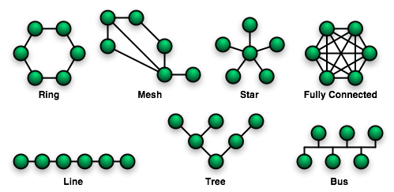

> `혼자 공부하는 네트워크` 책을 읽으면서 배운 점을 정리합니다.
> 네트워크의 기본 구성 요소부터 데이터가 전송되는 방식, 통신을 위한 규칙과 계층 구조까지 네트워크의 큰 그림을 정리합니다.

## 1️⃣ 네트워크의 기본 구조

네트워크는 `노드`와 `간선`으로 이루어진 자료구조라는 점에서 `그래프`의 형태를 띤다. 네트워크 기기가 노드이고, 네트워크 기기 간에 정보를 주고받는 유무선의 통신 매체가 간선이다.

#### 1-1 노드와 토폴로지

네트워크 상에서 노드와 노드 사이의 연결 구조를 `네트워크 토폴로지(Network Topology)`라고 한다. 노드가 어떻게 연결되고 배치되느냐에 따라 망형, 트리형, 링형 등의 유형으로 나뉜다.

#### 1-2 호스트의 개념

##### 호스트란?

네트워크의 가장자리에 위치하면서 네트워크를 통해 주고받는 정보를 최초로 송신하고 최종 수신하는 노드를 `호스트(Host)`라고 한다. 우리가 흔히 접하는 대부분의 네트워크 기기가 호스트이다.

예를 들어 노트북의 웹 브라우저를 통해 구글 홈페이지에 접속했다면, 노트북과 구글의 서버 컴퓨터가 각각 호스트로서 정보를 주고받은 것이다.

- 노트북이 구글의 서버 컴퓨터에게 웹 페이지를 가져다 달라는 요청을 보낸다
- 구글의 서버 컴퓨터가 노트북에게 웹 페이지로 응답한다

#### 1-3 클라이언트와 서버

##### 요청과 응답

요청(`Request`)을 보내는 호스트를 `클라이언트(Client)`, 응답(`Response`)을 보내는 호스트를 `서버(Server)`라고 한다. 클라이언트와 서버는 주고받는 정보의 방향에 따라 부여된 역할이다.

##### 중간 노드의 역할

네트워크를 그래프로 간주했을 때 중간에 위치한 노드는 가장자리에 위치한 호스트가 주고받는 정보들을 원하는 수신지까지 안정적으로 전송하는 역할을 한다. 이러한 중간 노드로써의 역할을 수행하는 네트워크 장비에는 스위치, 라우터, 공유기 등이 있다.

## 2️⃣ 네트워크의 종류

네트워크는 그래프의 형태를 띄고 있지만, 전 세계에 하나의 네트워크만 존재하는 것은 아니다. 여러 개의 네트워크로 나뉘어질 수 있으며, 규모에 따라 `LAN`과 `WAN`으로 구분된다.

#### 2-1 LAN (Local Area Network)

근거리 네트워크를 의미하는 `LAN`은 가정이나 기업처럼 비교적 가까운 거리를 연결하는 한정된 공간에서의 네트워크를 말한다.

집이나 사무실에 있는 공유기를 통해 모든 네트워크 기기가 통신하고 있다면 LAN이 공유기를 기준으로 구축되었다고 할 수 있다. 해당 공유기와 연결된 네트워크 기기들은 모두 같은 네트워크에 속해 있다고 인식한다.

#### 2-2 WAN (Wide Area Network)

원거리 네트워크를 의미하는 `WAN`을 통해 LAN 간 통신이 이루어진다. WAN이 인터넷을 가능하게 만드는 네트워크라고 할 수 있다.

WAN은 일반적으로 `ISP(Internet Service Provider)`라는 인터넷 서비스 업체가 구축하고 관리한다. 대표적인 국내 ISP 업체로는 KT, LG유플러스, SK브로드밴드가 있다.

## 3️⃣ 패킷 교환 네트워크

서로 다른 네트워크에 있는 두 호스트가 유무선의 통신 매체를 통해 100GB의 파일을 주고받는다고 가정해보자. 이때 호스트는 유무선의 통신 매체를 통해 100GB의 파일을 한 번에 전송할 수 있을까?

그렇지 않다. **네트워크를 통해 주고받는 데이터는 한 번에 송수신되지 않고, 여러 데이터로 쪼개져서 송수신된다.** 이렇게 네트워크를 통해 송수신되는 데이터의 단위를 `패킷(Packet)`이라고 한다. 오늘날의 네트워크는 패킷 단위로 정보를 쪼개서 송수신하고 수신지에서 재조립하는 **패킷 교환 네트워크**가 대부분이다.

#### 3-1 패킷의 구조

##### 패킷의 구성 요소

하나의 패킷은 `페이로드(Payload)`와 `헤더(Header)`로 구성되어 있으며, 때로는 `트레일러(Trailer)`라는 정보가 포함되기도 한다.

- **페이로드**: 패킷에서 송수신하고자 하는 실제 데이터
- **헤더**: 패킷에 추가되는 앞쪽 부가 정보
- **트레일러**: 패킷에 추가되는 뒤쪽 부가 정보

페이로드가 택배를 통해 송수신하고자 하는 물품이라면, 헤더와 트레일러는 택배 앞뒤로 붙이는 송장과 같다.

##### 3-2 주소의 개념

네트워크상의 두 호스트가 패킷을 주고받기 위해서는 서로를 특정할 수 있는 정보, 즉 주소가 필요하다.

`주소(Address)`는 패킷의 헤더에 명시되는 정보로, 네트워크에서 사용되는 대표적인 주소로는 **IP 주소**와 **MAC 주소**가 있다.

#### 3-3 전송 방식

주소를 바탕으로 다양한 수신지 유형을 지정해 패킷을 보낼 수 있다.

##### 유니캐스트 (Unicast)

송신지와 수신지가 일대일로 메시지를 주고받는 전송 방식이다. 수신지를 특정 호스트 하나로 지정한다.

##### 브로드캐스트 (Broadcast)

네트워크상의 모든 호스트에게 메시지를 전송하는 전송 방식이다. 브로드캐스트가 전송되는 범위를 `브로드캐스트 도메인(Broadcast Domain)`이라고 하며, 호스트가 같은 브로드캐스트 도메인에 속해 있는 경우에는 같은 LAN에 속해 있다고 간주한다.

> 💡 **기타 전송 방식**
>
> 이 밖에도 네트워크 내의 동일 그룹에 속한 호스트에게만 전송하는 `멀티캐스트(Multicast)`, 네트워크 내의 동일 그룹에 속한 호스트 중 가장 가까운 호스트에게 전송하는 `애니캐스트(Anycast)` 등이 있다. 유니캐스트와 브로드캐스트가 가장 자주 언급된다.

## 4️⃣ 프로토콜

네트워크 내의 호스트는 서로가 주고받을 내용을 이해할 수 있어야 하고, 이를 올바르게 주고받을 수 있어야 한다. 이를 위한 규칙이 바로 프로토콜이다.

#### 4-1 프로토콜의 개념

`프로토콜(Protocol)`은 네트워크에서 통신을 주고받는 노드 간의 합의된 규칙이나 방법을 말한다.

패킷을 주고받는 호스트와 네트워크 장비들이 서로 주고받는 정보를 이해하려면 같은 프로토콜을 이해해야 하고, 같은 프로토콜로 통신해야 한다. 이런 점에서 프로토콜은 흔히 **네트워크의 언어**와 같다고 표현한다.

#### 4-2 주요 프로토콜

네트워크 프로토콜의 종류는 매우 다양하지만, 개발자가 기본적으로 알아야 할 주요 프로토콜은 다음과 같다.

| 계층          | 주요 프로토콜             |
| ------------- | ------------------------- |
| 응용 계층     | HTTP, HTTPS, DNS, SSL/TLS |
| 전송 계층     | TCP, UDP                  |
| 네트워크 계층 | IP, ICMP, ARP, DHCP       |

프로토콜마다 목적과 특징이 다르다. 프로토콜은 아무런 이유 없이 만들어지고 사용되지 않는다. 프로토콜이 존재하는 이유, 즉 목적이 있으며, 유사한 목적을 지닌 프로토콜들이 존재할 경우 각 프로토콜을 구분 짓는 특징이 존재한다.

- **IP**: 네트워크 간의 주소를 지정한다는 목적
- **ARP**: IP 주소와 MAC 주소를 대응시킨다는 목적
- **HTTPS**: 보안상 HTTP에 비해 안전하다는 특징
- **TCP**: UDP에 비해 신뢰성이 높다는 특징

프로토콜을 학습할 때는 각 프로토콜의 **목적과 특징**에 집중해 살펴보는 것이 좋다.

## 5️⃣ 네트워크 참조 모델

호스트 간에 패킷을 주고받는 과정은 택배를 주고받는 과정과 비슷하다. 택배를 주고받는 과정에는 정형화된 순서가 있으며, 계층적으로 표현할 수 있다. 택배를 보내는 과정은 곧 택배를 받는 과정의 반대이다. 네트워크의 경우도 이와 크게 다르지 않다.

패킷을 주고받는 과정에도 정형화된 순서가 있고, 계층적으로 표현할 수 있다. **통신이 이루어지는 단계를 계층적으로 표현한 것**을 `네트워크 참조 모델(Network Reference Model)`이라고 한다.

📤 **패킷 송수신의 방향**

- 패킷을 송신하는 쪽에서는 **상위 계층에서 하위 계층**으로 정보를 보낸다
- 패킷을 수신하는 쪽에서는 **하위 계층에서 상위 계층**으로 정보를 받아들인다

네트워크 참조 모델에서 각각의 계층이 하는 일은 명확하게 정해져 있다. 따라서 계층별 목적에 맞는 프로토콜과 장비를 구성하면 네트워크의 구성과 설계, 문제의 진단과 해결이 용이해진다.

### OSI 모델

#### 5-1 OSI 7계층

`OSI 모델`은 국제 표준화 기구(ISO, International Organization for Standardization)에서 만든 네트워크 참조 모델로, 통신 단계를 7개의 계층으로 나눠 OSI 7계층이라고 부른다.

OSI 모델은 물리 계층, 데이터 링크 계층, 네트워크 계층, 전송 계층, 세션 계층, 표현 계층, 응용 계층으로 구성되어 있다.

**1. 물리 계층 (Physical Layer)**

가장 최하위 계층으로, 비트 신호를 주고받는 계층이다. 컴퓨터는 0과 1만을 이해할 수 있기 때문에 네트워크를 통해 주고받는 정보 또한 0과 1로 이루어진 신호로 구성된다. 물리 계층은 이러한 신호를 유무선 통신 매체를 통해 운반하는 계층이다.

**2. 데이터 링크 계층 (Data Link Layer)**

같은 네트워크에 속한 호스트끼리 올바르게 정보를 주고받기 위한 계층이다. 이를 위해 같은 네트워크에 속한 호스트를 식별할 수 있는 주소(`MAC 주소`)를 사용하고, 물리 계층을 통해 주고받는 정보에 오류가 없는지 확인하기도 한다. 물리 계층과 데이터 링크 계층은 서로 밀접하게 연관된 계층이며, 하드웨어와 밀접하게 맞닿아 있는 계층이다.

**3. 네트워크 계층 (Network Layer)**

네트워크 간 통신을 가능하게 하는 계층이다. 데이터 링크 계층이 기본적으로 같은 LAN에 속한 호스트끼리 올바르게 정보를 주고받기 위해 필요한 계층이라면, 네트워크 계층은 LAN을 넘어 다른 네트워크와 통신을 주고받기 위해 필요한 계층이다. 따라서 네트워크 간 통신 과정에서 호스트를 식별할 수 있는 주소(`IP 주소`)가 필요하다. 네트워크 계층에서 대표적으로 사용되는 프로토콜이 바로 `IP`이다.

**4. 전송 계층 (Transport Layer)**

네트워크를 통해 송수신되는 패킷은 전송 도중에 유실될 때도 있고, 순서가 뒤바뀔 때도 있다. 전송 계층은 이러한 상황에 대비해 신뢰성 있는 전송을 가능하게 하는 계층이다. 또한 `포트(Port)`라는 정보를 통해 특정 응용 프로그램과의 연결 다리 역할을 수행하는 계층이기도 하다. 전송 계층에 속한 대표적인 프로토콜에는 `TCP`와 `UDP`가 있다.

**5. 세션 계층 (Session Layer)**

응용 프로그램 간의 연결 상태를 의미하는 `세션(Session)`을 관리하기 위한 계층이다. 즉, 응용 프로그램 간의 연결 상태를 유지하거나 새롭게 생성하고, 필요하다면 연결을 끊는 역할을 한다.

**6. 표현 계층 (Presentation Layer)**

마치 번역가와 같은 역할을 하는 계층으로, 인코딩과 압축, 암호화와 같은 작업을 수행한다. 세션 계층과 표현 계층은 다른 계층과 달리, 두 계층을 명확하게 구분하지 않거나 응용 계층에 포함하여 간주하는 경우가 많다.

**7. 응용 계층 (Application Layer)**

사용자와 가장 밀접하게 맞닿아 있어 여러 네트워크 서비스를 제공하는 계층으로, 중요한 프로토콜들이 다수 포함되어 있다. 응용 계층에 속한 대표적인 프로토콜에는 `HTTP`, `HTTPS`, `DNS` 등이 있다.

### TCP/IP 모델

#### 5-2 TCP/IP 4계층

`TCP/IP 4계층`이라고도 불리는 TCP/IP 모델은 네트워크 액세스 계층, 인터넷 계층, 전송 계층, 응용 계층으로 구성되어 있다.

OSI 모델은 주로 네트워크의 이론적 기술을 목적으로 사용하는 반면, **TCP/IP 모델은 구현과 프로토콜에 중점**을 둔 네트워크 참조 모델이다.

🔍 **OSI 모델과 TCP/IP 모델 비교**

OSI 모델과 TCP/IP 모델이 만들어진 목적이 다른 만큼, 두 모델에 대한 직접적이고 엄밀한 비교는 어려울 수 있다. 그러나 계층별로 수행하는 역할을 기준으로 두 모델의 계층을 비교하면 어렵지 않게 이해할 수 있다.

| TCP/IP 모델          | OSI 모델                          |
| -------------------- | --------------------------------- |
| 응용 계층            | 응용 계층 + 표현 계층 + 세션 계층 |
| 전송 계층            | 전송 계층                         |
| 인터넷 계층          | 네트워크 계층                     |
| 네트워크 액세스 계층 | 데이터 링크 계층 (+ 물리 계층)    |

TCP/IP 모델의 최하위 계층인 `네트워크 액세스 계층(Network Access Layer)`은 링크 계층 또는 네트워크 인터페이스 계층이라고도 부르는데, 이는 OSI 모델의 데이터 링크 계층과 유사하다. TCP/IP 모델에는 OSI 모델에서의 물리 계층에 해당하는 개념이 없다고 보는 견해도 있다.

### 캡슐화와 역캡슐화

#### 5-3 패킷 송수신 과정

프로토콜과 네트워크 참조 모델을 토대로 이뤄지는 패킷의 송수신 과정 중 송신 과정에서는 `캡슐화`가 이루어지고, 수신 과정에서는 `역캡슐화`가 이루어진다.

- 패킷을 송신하는 쪽에서는 상위 계층에서 하위 계층으로 정보를 보내고, 패킷을 수신하는 쪽에서는 하위 계층에서 상위 계층으로 정보를 받아들인다.
- 네트워크 계층 구조를 이용하면 프로토콜을 계층별로 구성할 수 있다.
- 하나의 패킷은 헤더와 페이로드(때로는 트레일러까지)를 포함하며, 프로토콜의 목적과 특징에 따라 헤더의 내용은 달라질 수 있다.

각 계층에서는 어떤 정보를 송신할 때 상위 계층으로부터 내려받은 패킷을 페이로드로 삼아, 각 계층에 포함된 프로토콜의 각기 다른 목적과 특징에 따라 헤더 혹은 트레일러를 덧붙인 다음 하위 계층으로 전달한다. **상위 계층의 패킷이 하위 계층의 페이로드로 간주**되는 것이다.

##### 캡슐화 (Encapsulation)

송신 과정에서 헤더(및 트레일러)를 추가해 나가는 과정을 의미한다.

##### 역캡슐화 (Decapsulation)

캡슐화 과정에서 붙인 헤더(및 트레일러)를 각 계층에서 확인한 뒤 제거하는 과정을 의미한다.

##### 계층별 패킷 명칭

각 계층에서 주고받는 패킷을 지칭하는 이름이 다르다는 점에 유의해야 한다.

| 계층             | 패킷의 이름                                                   |
| ---------------- | ------------------------------------------------------------- |
| 응용 계층 이상   | 데이터(Data) 또는 메시지(Message)                             |
| 전송 계층        | TCP 기반: 세그먼트(Segment) UDP 기반: 데이터그램(Datagram) |
| 네트워크 계층    | 패킷(Packet) 또는 데이터그램(Datagram)                        |
| 데이터 링크 계층 | 프레임(Frame)                                                 |
| 물리 계층        | 심볼(Symbol) 또는 비트(Bit)                                   |
