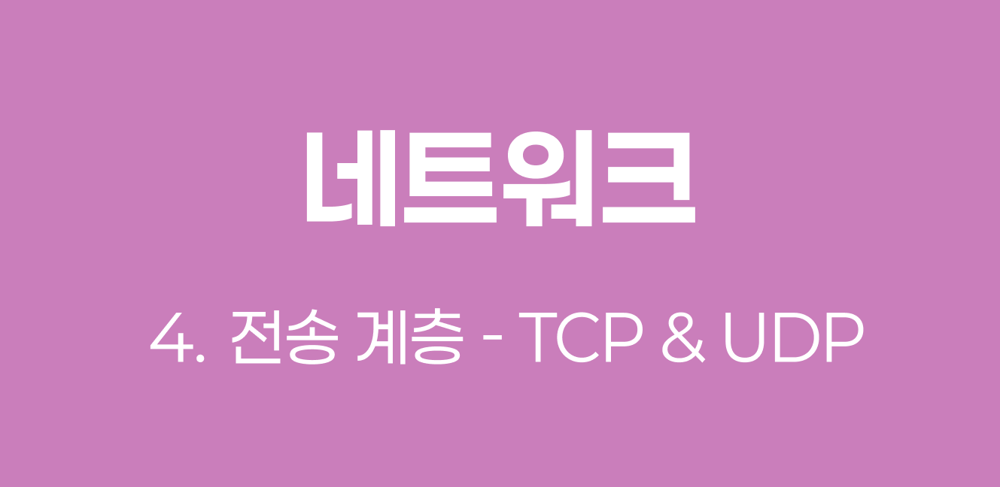
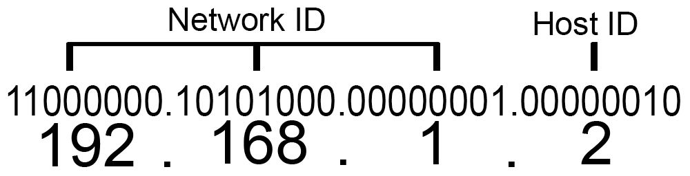
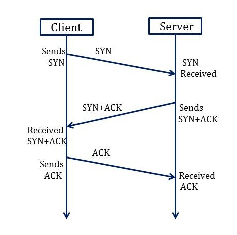
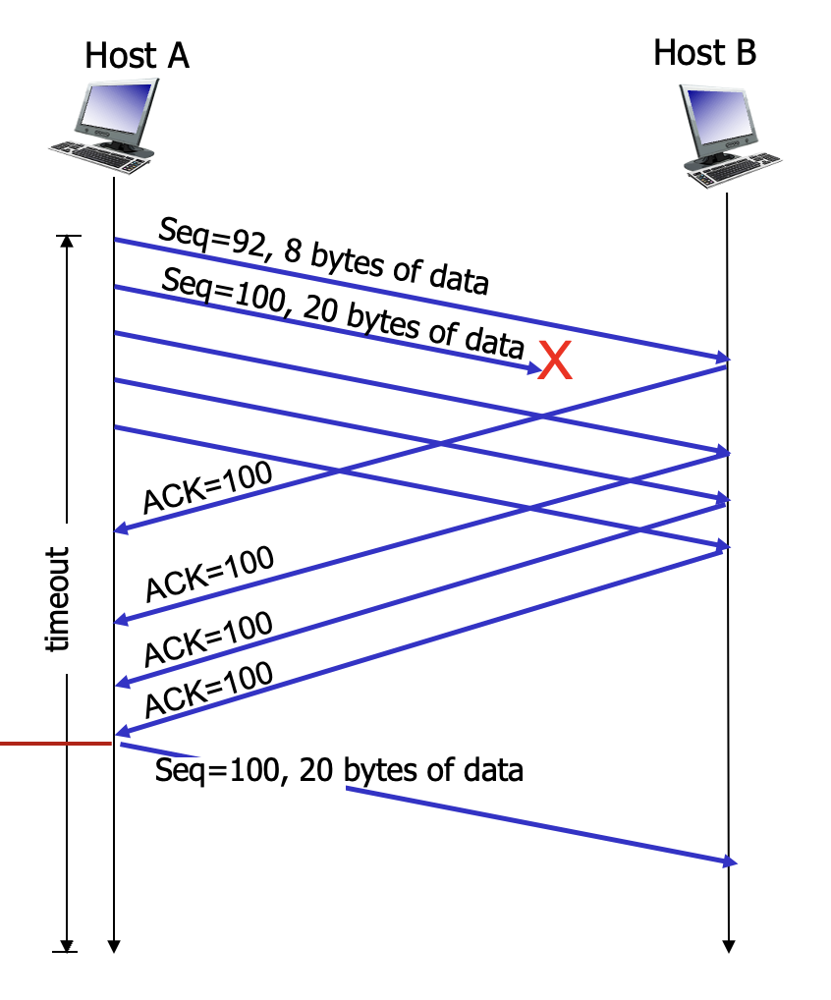

> `혼자 공부하는 네트워크` 책을 읽으면서 배운 점을 정리합니다.
>
> 네트워크 계층에서 IP가 핵심이었다면, 전송 계층에서는 TCP와 UDP가 핵심이다. 이 두 프로토콜은 각각 `신뢰성`과 `속도`라는 서로 다른 목적을 가지고 있으며, 패킷의 최종 목적지인 프로세스까지 데이터를 전달하는 역할을 한다. 이 글에서는 `TCP`와 `UDP`의 동작 원리와 차이점, 그리고 `TCP`의 연결 관리와 제어 메커니즘을 다룬다.



## 1️⃣ 전송 계층의 역할

### 포트를 통한 프로세스 식별

#### 1-1 포트 번호의 필요성

`IP 주소`와 `MAC 주소`는 패킷을 송수신하는 호스트를 특정할 수 있다. 그러나 패킷의 최종 송수신 대상은 호스트가 아니라 **호스트가 실행하는 프로세스**이다. 하나의 호스트는 웹 브라우저, 게임, 채팅 프로그램 등 다양한 프로세스를 동시에 실행할 수 있으며, 네트워크를 통해 주고받는 패킷은 최종적으로 이러한 프로세스에 전달되어야 한다.

네트워크 패킷을 주고받는 프로세스에는 `포트(Port)` 번호가 할당된다. **IP 주소와 포트 번호의 조합**을 통해 특정 호스트가 실행하는 특정 프로세스를 식별할 수 있다.



#### 1-2 포트 번호의 구조

TCP와 UDP 헤더는 모두 `송신지 포트 번호`와 `수신지 포트 번호` 필드를 포함한다. 포트 번호는 **16비트**로 표현되어 총 65536개(0~65535번)를 사용할 수 있으며, 번호 범위에 따라 3가지 종류로 구분된다.

| 포트 종류                        | 포트 번호 범위 | 설명                                     |
| -------------------------------- | -------------- | ---------------------------------------- |
| 잘 알려진 포트 (Well-known Port) | 0~1023         | 범용적으로 사용되는 프로토콜을 위한 포트 |
| 등록된 포트 (Registered Port)    | 1024~49151     | 특정 애플리케이션 프로토콜을 위한 포트   |
| 동적 포트 (Dynamic Port)         | 49152~65535    | 임시 포트, 클라이언트가 주로 사용        |

##### 잘 알려진 포트 예시

| 포트 번호 | 프로토콜 |
| --------- | -------- |
| 20, 21    | FTP      |
| 22        | SSH      |
| 23        | TELNET   |
| 53        | DNS      |
| 67, 68    | DHCP     |
| 80        | HTTP     |
| 443       | HTTPS    |

##### 등록된 포트 예시

| 포트 번호 | 서비스               |
| --------- | -------------------- |
| 1194      | OpenVPN              |
| 1433      | Microsoft SQL Server |
| 3306      | MySQL                |
| 6379      | Redis                |
| 8080      | HTTP 대체            |

#### 1-3 포트의 실사용 사례

서버로 동작하는 프로그램은 주로 **잘 알려진 포트**나 **등록된 포트**를 사용한다. MySQL 데이터베이스 서버는 3306번 포트를, 웹 서버는 80번(HTTP) 또는 443번(HTTPS) 포트를 사용한다.

```apache
# Apache HTTP 서버 설정 예시
Listen 80

<IfModule ssl_module>
    Listen 443
</IfModule>
```

클라이언트로 동작하는 프로그램은 **동적 포트** 범위 내에서 임의의 포트 번호를 자동으로 할당받는다. 웹 브라우저로 웹사이트에 접속할 때 브라우저는 동적 포트를 할당받아 서버의 80번 또는 443번 포트와 통신한다.

> 💡 **NAT와 NAPT**
>
> `NAT(Network Address Translation)`는 공인 IP 주소와 사설 IP 주소 간 변환을 위한 기술이다. 사설 네트워크 내의 호스트가 외부와 통신하기 위해서는 공인 IP 주소로 변환이 필요하다.
>
> `NAPT(Network Address Port Translation)`는 **포트 번호까지 함께 변환**하는 NAT의 일종이다. 여러 사설 IP 주소가 하나의 공인 IP 주소를 공유할 수 있도록 하여, 공인 IP 주소 부족 문제를 개선하는 기술로 활용된다.
>
> - `사설 IP:포트` ↔ `공인 IP:포트`
> - N개의 사설 IP를 1개의 공인 IP로 관리 가능

## 2️⃣ TCP와 UDP의 특징

### 신뢰성과 연결 방식

#### 2-1 TCP와 UDP의 기본 특성

TCP와 UDP는 전송 계층의 대표적인 프로토콜이지만 서로 다른 특성을 가진다.

| 특성      | TCP                         | UDP                      |
| --------- | --------------------------- | ------------------------ |
| 신뢰성    | 신뢰할 수 있는 통신         | 신뢰할 수 없는 통신      |
| 연결 방식 | 연결형(Connection-oriented) | 비연결형(Connectionless) |
| 속도      | 상대적으로 느림             | 상대적으로 빠름          |
| 제어 기능 | 흐름·오류·혼잡 제어 제공    | 제어 기능 미제공         |
| 연결 과정 | 수립 및 종료 단계 존재      | 수립 및 종료 단계 없음   |

**TCP**는 패킷을 주고받기 전에 연결 수립 과정을 거치며, 연결 수립 이후 신뢰성 보장을 위해 상태 관리, 흐름 제어, 오류 제어, 혼잡 제어 등의 기능을 제공한다. 패킷 송수신이 완료되면 연결을 종료한다.

**UDP**는 연결 수립이나 종료 단계를 거치지 않으며, 신뢰성을 높이기 위한 기능도 제공하지 않는다. 따라서 패킷 유실 없는 송수신이 필요하면 TCP를, 빠른 송수신이 필요하면 UDP를 선택하는 것이 유리하다.

#### 2-2 UDP 헤더 구조

UDP 헤더는 단순한 구조를 가진다.

| 필드        | 크기   | 설명                           |
| ----------- | ------ | ------------------------------ |
| 송신지 포트 | 16비트 | 송신 프로세스의 포트 번호      |
| 수신지 포트 | 16비트 | 수신 프로세스의 포트 번호      |
| 길이        | 16비트 | UDP 데이터그램의 바이트 크기   |
| 체크섬      | 16비트 | 데이터그램 훼손 여부 확인 정보 |

UDP 헤더는 사실상 IP 헤더를 감싸는 일종의 껍데기와 같다. 최소한의 정보만 제공하여 오버헤드가 작고 빠른 전송이 가능하다.

#### 2-3 TCP 헤더 구조

TCP 헤더는 UDP보다 훨씬 많은 필드를 포함한다. 연결 수립과 종료, 신뢰성 보장을 위한 다양한 기능을 제공하기 때문이다.

##### 주요 필드

**순서 번호 (Sequence Number)**

- TCP 세그먼트의 올바른 송수신 순서를 보장하기 위해 세그먼트 첫 바이트에 매겨진 번호
- 현재 주고받는 세그먼트가 데이터의 몇 번째 바이트에 해당하는지 식별

**확인 응답 번호 (Acknowledgment Number)**

- 상대 호스트가 보낸 세그먼트에 대한 응답
- 다음으로 수신하길 기대하는 순서 번호
- 일반적으로 **올바르게 수신한 순서 번호 + 1**로 설정

> 💡 **순서 번호와 확인 응답 번호의 관계**
>
> ```java
> // 호스트 A가 순서 번호 100인 세그먼트 전송
> segment.sequenceNumber = 100;
>
> // 호스트 B가 올바르게 수신 후 응답
> responseSegment.acknowledgmentNumber = 101;  // 다음 받을 번호
> responseSegment.setACKFlag(true);  // ACK 플래그 설정
> ```
>
> TCP의 신뢰성 보장은 대부분 확인 응답 번호를 통해 이루어진다.

**제어 비트 (Control Bits)**

- 현재 세그먼트에 대한 부가 정보를 나타내는 플래그
- 8비트로 구성되며 각 비트가 서로 다른 의미를 가짐

| 제어 비트 | 설명                      |
| --------- | ------------------------- |
| ACK       | 세그먼트의 승인을 나타냄  |
| SYN       | 연결을 수립하기 위해 사용 |
| FIN       | 연결을 종료하기 위해 사용 |

## 3️⃣ TCP의 연결 관리

### TCP 연결 수립: 3-way-handshake

#### 3-1 연결 과정 설명

TCP의 연결 수립은 `쓰리 웨이 핸드셰이크(3-way Handshake)`를 통해 이루어진다. 이는 세 단계로 이루어진 TCP 연결 수립 과정을 의미한다.

**1단계: SYN 세그먼트 전송 (A → B)**

- 호스트 A가 `SYN` 비트를 1로 설정한 세그먼트를 호스트 B에게 전송
- 세그먼트의 순서 번호에 호스트 A의 순서 번호 포함

**2단계: SYN+ACK 세그먼트 전송 (B → A)**

- 호스트 B가 `SYN`과 `ACK` 비트를 모두 1로 설정한 세그먼트를 전송
- 호스트 B의 순서 번호와 1단계 세그먼트에 대한 확인 응답 번호 포함

**3단계: ACK 세그먼트 전송 (A → B)**

- 호스트 A가 `ACK` 비트를 1로 설정한 세그먼트를 전송
- 호스트 A의 순서 번호와 2단계 세그먼트에 대한 확인 응답 번호 포함



> 💡 **액티브 오픈과 패시브 오픈**
>
> - **액티브 오픈(Active Open)**: 처음 연결을 시작하는 과정 (주로 클라이언트)
> - **패시브 오픈(Passive Open)**: 연결 요청을 수신한 뒤 연결을 수립하는 과정 (주로 서버)
>
> SYN 비트가 설정된 패킷을 처음 보내는 호스트가 액티브 오픈을 수행하는 호스트이다.

#### 3-2 실제 패킷 분석을 통한 예시

**1단계: SYN 세그먼트**

```
Source Port: 49859 (동적 포트)
Destination Port: 80 (HTTP)
Sequence Number: 3588415412
Flags: SYN=1
```

클라이언트가 동적 포트 49859를 할당받아 HTTP 서버(80번 포트)에 연결 요청을 보낸다.

**2단계: SYN+ACK 세그먼트**

```
Source Port: 80
Destination Port: 49859
Sequence Number: 697411256
Acknowledgment Number: 3588415413
Flags: SYN=1, ACK=1
```

서버가 자신의 순서 번호를 보내고, 클라이언트가 보낸 순서 번호에 1을 더한 확인 응답 번호를 설정한다.

**3단계: ACK 세그먼트**

```
Source Port: 49859
Destination Port: 80
Sequence Number: 3588415413
Acknowledgment Number: 697411257
Flags: ACK=1
```

클라이언트가 서버의 순서 번호에 1을 더한 확인 응답 번호로 응답하면 연결이 수립된다.

### TCP의 제어 메커니즘

#### 3-3 재전송을 통한 오류 제어

TCP는 전송 과정에서 잘못된 세그먼트가 있을 경우 **재전송**을 통해 오류를 제어한다. 재전송이 발생하는 상황은 크게 2가지이다.

##### 중복된 ACK 세그먼트 수신

송신한 세그먼트의 일부가 전송 중 유실되면 수신 측은 계속해서 같은 확인 응답 번호를 보낸다.



중복된 ACK를 받으면 송신 측은 해당 세그먼트를 재전송한다.

##### 타임아웃 발생

TCP는 `재전송 타이머(Retransmission Timer)`를 사용한다. 세그먼트를 전송할 때마다 타이머를 시작하고, 타임아웃 시점까지 ACK를 받지 못하면 세그먼트를 재전송한다.

> 💡 **파이프라이닝 전송**
>
> 기본적으로 TCP는 순서 번호를 보내고 확인 응답을 받는 과정을 반복한다. 그러나 이는 비효율적이므로, 현대 TCP는 **파이프라이닝(Pipelining)** 방식을 사용한다.
>
> - **기존 방식**: 한 번에 하나의 세그먼트만 송수신
> - **파이프라이닝**: 확인 응답을 받기 전에 여러 세그먼트를 연속으로 전송
>
> 파이프라이닝을 통해 네트워크 대역폭을 효율적으로 활용할 수 있다.

#### 3-4 흐름 제어

`흐름 제어(Flow Control)`는 수신 호스트가 한 번에 처리할 수 있을 만큼만 전송하는 것을 의미한다. 송신 호스트가 수신 호스트의 **처리 속도를 고려**하여 송수신 속도를 균일하게 맞추는 기능이다.

##### 수신 윈도우

TCP 헤더의 `윈도우(Window)` 필드에는 수신 호스트가 한 번에 처리할 수 있는 **수신 윈도우(Receiver Window)** 크기가 명시된다.

```
수신 호스트: "나는 한 번에 8192바이트를 처리할 수 있어"
             ↓ (윈도우 필드로 전달)
송신 호스트: "그럼 8192바이트 이하로만 보내겠어"
```

수신 윈도우 크기는 **TCP 수신 버퍼**의 크기에 의해 결정된다. 수신 버퍼는 수신된 세그먼트가 애플리케이션 프로세스에 의해 읽히기 전에 임시 저장되는 공간이다.

#### 3-5 혼잡 제어

`혼잡(Congestion)`이란 많은 트래픽으로 인해 패킷의 처리 속도가 느려지거나 유실될 수 있는 상황을 의미한다. `혼잡 제어(Congestion Control)`는 네트워크의 혼잡 정도에 따라 전송량을 조절하는 기능이다.

##### 혼잡 감지

송신 호스트는 다음 상황에서 네트워크 혼잡을 감지한다.

- 중복된 ACK 세그먼트 도착
- 타임아웃 발생

##### 혼잡 윈도우

`혼잡 윈도우(Congestion Window)`는 혼잡 없이 전송할 수 있을 정도의 양을 나타낸다.

- **큰 혼잡 윈도우**: 한 번에 전송할 수 있는 세그먼트 수가 많음
- **작은 혼잡 윈도우**: 네트워크가 혼잡하여 전송할 수 있는 세그먼트 수가 적음

##### AIMD 알고리즘

`AIMD(Additive Increase/Multiplicative Decrease)`는 가장 기본적인 혼잡 제어 알고리즘이다.

- **증가**: 혼잡이 감지되지 않으면 혼잡 윈도우를 **1씩 선형적으로 증가**
- **감소**: 혼잡이 감지되면 혼잡 윈도우를 **절반으로 감소**

> 💡 **RTT (Round Trip Time)**
>
> `RTT`는 패킷을 보내고 그에 대한 응답을 수신하기까지의 시간이다. AIMD는 RTT마다 혼잡 윈도우를 1씩 증가시킨다고 표현할 수 있다.
>
> - 네트워크 성능 측정의 중요한 지표
> - `ping` 명령어로 RTT 확인 가능

혼잡 윈도우는 AIMD에 따라 톱니 모양으로 변화한다. 네트워크 상태에 따라 적응적으로 전송량을 조절하여 네트워크 효율성을 높인다.

### TCP 연결 종료: 포 웨이 핸드셰이크

#### 3-6 포 웨이 핸드셰이크 과정

TCP 연결 종료는 송수신 호스트가 각자 한 번씩 `FIN`과 `ACK`를 주고받으며 이루어진다. 4개의 단계를 거친다는 점에서 `포 웨이 핸드셰이크(Four-way Handshake)`라고 부른다.

**1단계: FIN 세그먼트 전송 (A → B)**

- 호스트 A가 `FIN` 비트를 1로 설정한 세그먼트를 전송

**2단계: ACK 세그먼트 전송 (B → A)**

- 호스트 B가 `ACK` 세그먼트로 응답

**3단계: FIN 세그먼트 전송 (B → A)**

- 호스트 B가 `FIN` 세그먼트를 전송

**4단계: ACK 세그먼트 전송 (A → B)**

- 호스트 A가 `ACK` 세그먼트로 응답

> 💡 **액티브 클로즈와 패시브 클로즈**
>
> - **액티브 클로즈(Active Close)**: 먼저 연결 종료를 요청하는 호스트의 동작
> - **패시브 클로즈(Passive Close)**: 연결 종료 요청을 받아들이는 호스트의 동작
>
> FIN 세그먼트를 먼저 보내는 호스트가 액티브 클로즈를 수행한다.

### TCP 상태 관리

#### 3-7 TCP 상태의 개념

TCP는 **상태를 유지하고 관리**하는 프로토콜이라는 점에서 `스테이트풀 프로토콜(Stateful Protocol)`이라고 부른다. 상태(State)란 현재 어떤 통신 과정에 있는지를 나타내는 정보이다.

TCP의 상태 정보는 네트워크 명령어(`netstat`, `ss` 등)를 통해 확인할 수 있으며, 현재 TCP 송수신 현황을 판단하고 디버깅에 활용할 수 있다.

```bash
$ netstat -a -p tcp
Proto Local Address      Foreign Address     State
tcp4  10.11.12.13.53625  123.123.123.123     ESTABLISHED
tcp4  10.11.12.13.50102  123.123.123.127     TIME_WAIT
tcp4  localhost.16107    *.*                 LISTEN
```

#### 3-8 TCP 상태 분류

TCP 상태는 연결 단계에 따라 3가지로 분류할 수 있다.

##### 연결 수립 전 상태

| 상태   | 설명                                 |
| ------ | ------------------------------------ |
| CLOSED | 아무런 연결이 없는 상태              |
| LISTEN | 연결 대기 상태 (SYN 세그먼트를 대기) |

서버는 일반적으로 `LISTEN` 상태에서 클라이언트의 연결 요청을 기다린다.

##### 연결 수립 과정 상태

| 상태         | 설명                                                        |
| ------------ | ----------------------------------------------------------- |
| SYN-SENT     | 액티브 오픈 호스트가 SYN을 보낸 후 SYN+ACK를 기다리는 상태  |
| SYN-RECEIVED | 패시브 오픈 호스트가 SYN+ACK를 보낸 후 ACK를 기다리는 상태  |
| ESTABLISHED  | 쓰리 웨이 핸드셰이크 완료 후 데이터를 송수신할 수 있는 상태 |

##### 연결 종료 과정 상태

| 상태       | 설명                                                      |
| ---------- | --------------------------------------------------------- |
| FIN-WAIT-1 | 액티브 클로즈 호스트가 FIN을 보낸 상태                    |
| CLOSE-WAIT | 패시브 클로즈 호스트가 FIN을 받고 ACK를 보낸 후 대기 상태 |
| FIN-WAIT-2 | FIN-WAIT-1 상태에서 ACK를 받은 상태                       |
| LAST-ACK   | CLOSE-WAIT 상태에서 FIN을 보낸 후 ACK를 기다리는 상태     |
| TIME-WAIT  | 액티브 클로즈 호스트가 마지막 ACK를 보낸 후 대기 상태     |

#### 3-9 CLOSING 상태

`CLOSING` 상태는 양쪽 호스트가 동시에 FIN을 보내는 특수한 상황에서 발생한다.

- 서로 FIN 세그먼트를 보내고 받음
- 각자 ACK 세그먼트를 보냄
- 아직 자신의 FIN에 대한 ACK를 받지 못한 상태

이는 드문 경우이지만, 양쪽에서 동시에 연결 종료를 시도할 때 발생할 수 있다.

## 4️⃣ 정리

- TCP와 UDP는 각각 **신뢰성**과 **속도**라는 서로 다른 목표를 가진 프로토콜이다.
  - TCP는 `3-way-handshake`를 통한 연결 수립, `순서 번호`와 `확인 응답 번호`를 통한 신뢰성 보장, 흐름·오류·혼잡 제어를 통한 안정적인 전송, 그리고 `4-way-handshake`를 통한 안전한 연결 종료를 제공한다.
  - UDP는 최소한의 기능만 제공하여 빠른 전송이 가능하다.

포트 번호를 통한 프로세스 식별은 TCP와 UDP 모두가 제공하는 전송 계층의 핵심 기능이다. 이를 통해 네트워크 패킷은 **호스트를 넘어 최종 목적지인 애플리케이션 프로세스**까지 정확히 전달될 수 있다.
