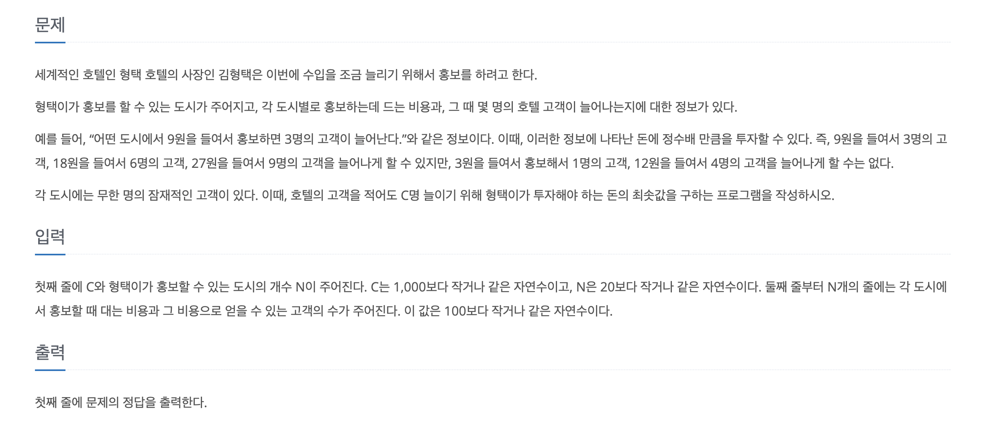
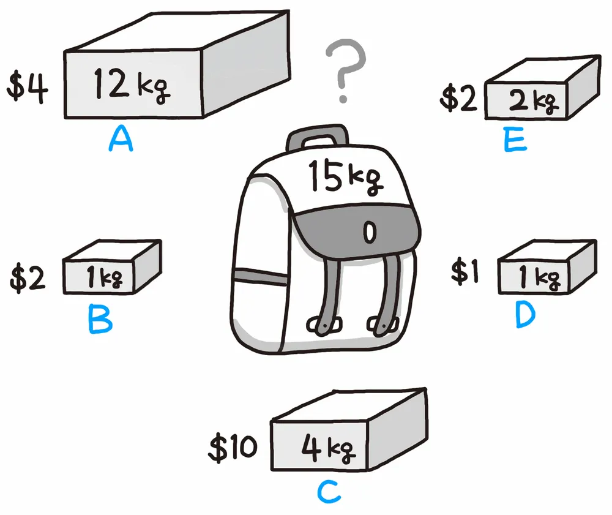

## 문제



### 문제 요약

도시들과 각 도시별로 `홍보 비용`과 그 떄 몇명의 `고객`이 늘어나는지에 대한 정보가 있을 때,
`홍보 비용`을 **최소한**으로 줄이면서 적어도 `C`명 이상의 `고객`을 유치하고 싶을 때,
호텔의 비용을 구하여라.

## 생각의 흐름

### 초기

처음에는 그리디 알고리즘을 적용하면 되지 않을까 생각을 했다.
여러 도시들 중에서, 고객/비용을 나눈 순서로 정렬해서, 거스름돈 거슬러주것마냥 접근하면 그게 무조건 답이 될 수 없는 거 아닌가 생각을 했다.

### 생각의 문제점

예를 들어, 목표 고객 유치수가 12라고 생각해보자.

| 도시 | 비용 | 고객 |
| ---- | ---- | ---- |
| A    | 3    | 5    |
| B    | 4    | 6    |

내 가설에 따르면 가성비순은 A-B 순이므로 A도시에서 10명의 고객을 유치하고, 그 다음 B도시에서 6명을 유치를 해야할 것이다.
그렇게 되면 총 비용은 10이다. 하지만 최적해는 B에서 12명을 유치하여 총 비용이 8이다.
가성비가 제일 떨어지는 회사만 선택이 되었는데, 그게 최적해인 것이다.

그리디를 하면서 다른 조건을 제약사항으로 걸어주면 되지 않나? 하는 의문이 들었지만,
이 문제는 `타겟 넘버`가 아닌 적어도 `타겟 넘버` 이상인 고객을 유치할 때 나오는 최솟값도 고려해야한다.

즉 그리디적 사고방식은 버리는 게 맞다!

### "적어도" 조건이 빠지면 그리디가 될까?

방금 상황에서, 적어도 고객 12명이 아니라 무조건 12명만을 유치하는 경우를 생각해보자.

| 도시 | 비용 | 고객 |
| ---- | ---- | ---- |
| A    | 3    | 5    |
| B    | 4    | 6    |

가성비면에선는 A가 우위지만, 최적 비용은 B에서 8을 소모할 때다. 타겟 넘버가 하나로 정해져도, 그리디로 풀 수 없는 문제가 생긴다.
즉 최소 비용을 구하기 위해서는 모든 도시들에 있어서, 비용 지출을 얼마나 할 지를 고려해야 한다.

### 그렇다면 언제 그리디가 될까

그리디가 되기 위해서는 현재의 선택이 이후 선택에 의해 뒤집혀지지 않아야 한다. 예를 들어 분할이 가능한 배낭 문제, 다익스트라 알고리즘 (최단거리를 poll()할 떄 확정)가 이에 해당하는데...

이 문제는 (비용, 고객)의 입력이 임의로 주어지게 되므로 반례가 무조건 생긴다.
직관적으로 그리디가 생각날 수 있지만, 그리디가 되기 위한 조건 자체가 꽤 까다롭다.

## 풀이

### DP 점화식 설정

DP로 문제를 풀기 위해서는 우선적으로 테이블의 정의와 점화식을 세워야 한다.
점화식을 어떻게 세워야 할까. 만약에 `0-1 배낭 문제`가 기억에 있다면 (필자도 전공수업 때 지겹게 외웠으나 기억에 없다...), 문제에서 어느 정도의 유사적인 느낌을 받을 수 있을 것이다. 정확히 말하면 이 문제는 하나의 배낭에 하나의 물건을 여러 번 선택할 수 있는 `무한으로 물건을 선택할 수 있는 배낭 문제`에 가깝다.

비록 `0-1 배낭 문제`의 경우 배낭 선택을 **한 번**만 할 수 있고, 가치 최대가 목표이지만 배낭 문제의 본질을 알면, 이 문제의 점화식을 세우는데 도움이 될 거라고 생각하여 아래에 정리를 해보겠다.

### 참고 : knapnack problem

잠깐 배낭 문제애 대해서 알아보자.
최대 무게를 `w` 까지 담을 수 있는 배낭이 1개있고, 여기에 무게와 가치가 다른 물건들이 있을 때 가방으로 담을 수 있는 물건의 최대 가치를 구하려면 어떻게 해야 할까?



#### 물건을 쪼갤 수 있을 경우

만약에 물건을 쪼갤 수 있으면, `가치/무게` 가 가장 큰 물건들부터 가방에다가 넣으면 될 것이다.
그리디하게 접근하면, 쉽게 끝나는 경우이다.

#### 물건을 쪼갤 수 없는 경우

하지만 우리가 아는 DP를 활용한 배낭 문제는 이 경우에 해당한다.
이 경우에는 `가치/무게`가 제일 높은 물건이라고 해도, 배낭에 넣지 못하는 경우가 생길 수도 있고 물건을 넣지 못할 수 있는 수많은 고려사항들이 존재하기에 다른 방식으로 접근을 해야 되는데, 이때 필요한 접근법이 `DP`이다.

이 문제는 이렇게 풀면 된다. 먼저 `dp 테이블`을 정의해보자.

- `dp[w] = 가방의 무게 제한이 w일 때 얻을 수 있는 최대 가치`

이렇게 설정한 DP 테이블을 업데이트한다는 건 결국 “현재 물건을 넣을지/말지”를 매 순간 선택하는 것이다.

여기서 유의해야 할점은, 물건 (weight, value)을 한 번만 넣을 수 있으므로 w를 `큰 쪽`에서 `작은 쪽`으로 내림차순으로 내려오며 현재 아이템을 넣지말지에 따라 dp 테이블을 갱신한다.

```java
for (Item item : items) { // 이 아이템을 넣거나 넣지 않을건데.
    for (int w = W; w >= item.weight; w--) { // 목표 무게에서부터 내림차순으로 무게를 순회하면서
        dp[w] = Math.max(dp[w], dp[w - item.weight] + item.value); // 해당 dp 테이블을 업데이트한다.
    }
}
```

왜 내림차순으로 갱신을 해야할까?

내림차순으로 업데이트를 해야, `dp[w-item.weight]` 가 하나의 아이템의 weight에 대해 **여러 번** 갱신되지 않는다.
왜 여러 번 갱신되지 않아야 하는지는 `오름차순`으로 `dp 테이블`을 갱신할 경우를 상정하고 물건 하나를 (무게 2, 가치 3) 용량이 4인 가방에 넣는 상황을 살펴보면 자연스럽게 이해할 수 있다.

```
<초기 상태>
dp = [0,0,0,0,0]

무게를 앞에서부터 돌면 range(w~W): 2~4

1️⃣ w = 2
→ dp[2] = dp[0] + 3 = 3

2️⃣ w = 3
→ dp[3] = dp[1] + 3 = 3

3️⃣ w = 4
→ dp[4] = dp[2] + 3 = 6

```

dp[4]를 업데이트할 때의 dp[2]는 같은 라운드에서 방금 만든 값이다. 즉, 같은 물건을 2번 쓴 결과가 되어버린다.
결론적으로 `무한으로 물건을 선택할 수 있는 배낭`이 돼버린다.

### 호텔 문제에 적용

호텔 문제에서는 `무한으로 물건을 선택할 수 있는 가방`에서 확인한 그 효과를 그대로 적용할 수 있다.
호텔 문제에서는,

- 같은 도시에서 홍보를 `여러 번` 할 수 있고 ( 물건을 여러개 선택해서 가방에 넣는 것과 동일 )
- 즉, (비용, 고객) 쌍을 무한히 선택 가능하기 때문이다.

아래 표와 같이 대응되는 것을 참고하면 좀 더 이해가 쉬울 것이다.

| 배낭 문제     | 호텔 문제           |
| ------------- | ------------------- |
| 가방 용량 (W) | 목표 고객 수 (C)    |
| 물건의 weight | 확보 고객 수 (gain) |
| 물건의 value  | 홍보 비용 (cost)    |
| 가치 최대화   | 비용 최소화         |

### DP 테이블과 점화식 설정

배낭 문제는 “가치 최대화” 를 목표로 하는데, 호텔은 “비용 최소화” 를 목표로 하는 점에서 차이가 있다.
그래서 아래와 같이 `점화식` 과 `dp 테이블`을 정의할 수 있다.

**점화식**

```
dp[x] = min(dp[x], dp[x - gain] + cost)
```

**dp 테이블**

```java
int[] dp = new int[targetCustomers + 1001]; // N명의 고객을 유치하는데 드는 최소 비용
```

목표 고객수에 1001을 더한 이유는, '적어도' 조건으로 인해 `targetCustomers` 값보다 큰 값들도 dp 테이블로 관리해야 되기 떄문이다.
문제 조건에서 유치하는 고객의 수가 최대 1000명이므로, `targetCusomers`가 0일때를 고려하여 1001을 더했다.

### DP 테이블 채우기


이제, 도시 정보를 순회하면서 무게를 오름차순으로 늘려가면서 dp 테이블을 채우면 된다.

```java
Arrays.fill(dp, 100001); // 최솟값 갱신을 위해 dp 테이블을 최대값으로 채움
dp[0] = 0; // 목표 고객 유치수가 0명--> 비용 0

for (int[]arr: info){ // 도시 정보를 순회하면서
    int cost = arr[0]; // 해당 도시의 비용
    int customers = arr[1]; // 해당 도시의 유치할 수 있는 고객 수
    for (int i=customers; i<= targetCustomers+1000; i++){
        dp[i] = Math.min(dp[i], cost + dp[i-customers]);  // ⭐️ dp 점화식
    }
}
```

### 출력

마지막에 출력할 때는, 목표 유치 고객수보다 더 많은 값까지 고려해서 제일 작은 값을 출력한다.
```java
int minCost = 100001;

for (int i=targetCustomers; i<=targetCustomers + 1000; i++){
    minCost = Math.min(minCost, dp[i]);
}

System.out.print(minCost);
```


## TIL 

### 그리디 vs DP 판단 기준

문제를 처음 봤을 때 `가성비(고객/비용)` 기준으로 정렬하여 그리디하게 풀면 되지 않을까 생각했다. 하지만 그리디가 성립하려면 **현재의 선택이 이후 선택에 의해 뒤집히지 않아야** 한다는 조건을 만족해야 한다. 나의 뇌피셜로 그리디하게 접근하는 건 주의해야할 듯

### 배낭 문제를 이해하자
DP 문제의 근본인 knapsack problem을 이해하면 자연스럽게 문제가 풀리는 듯 하다. 


### "적어도" 조건 처리

 정확히 C명이 아니라 C명을 초과하는 경우도 고려해야 하므로 다음과 같은 처리가 필요하다.

- DP 테이블 크기를 `targetCustomers + 1001`로 설정
- 최종 답을 구할 때 `targetCustomers` 이상의 모든 값을 확인