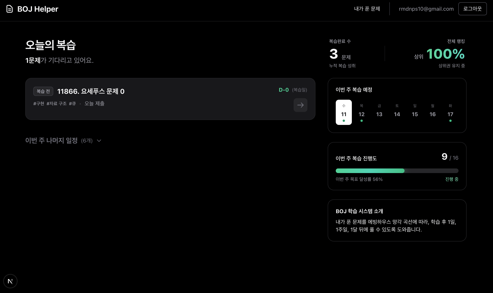
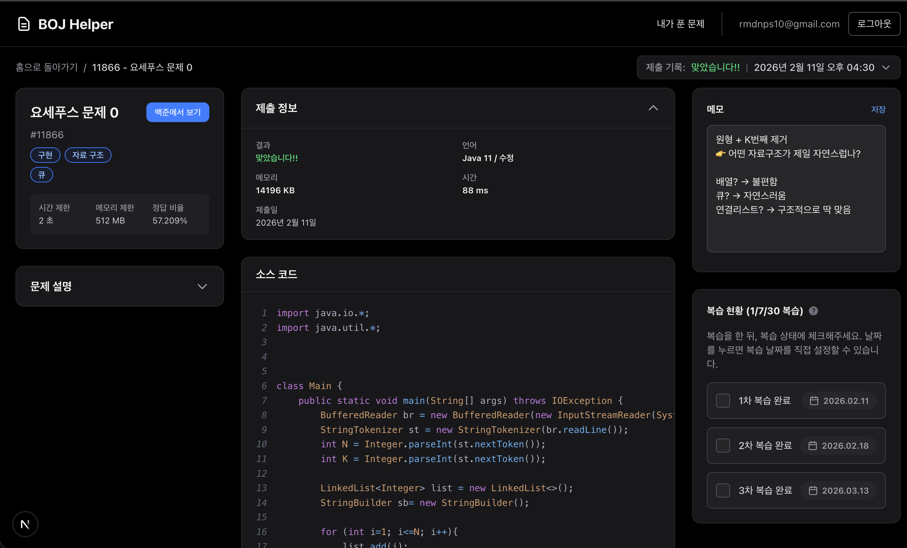
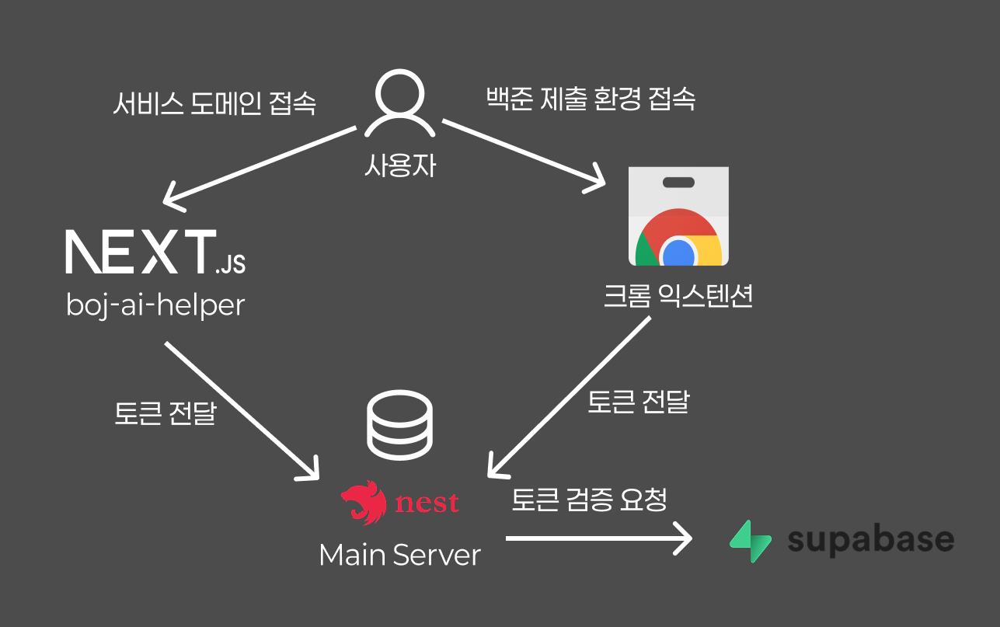
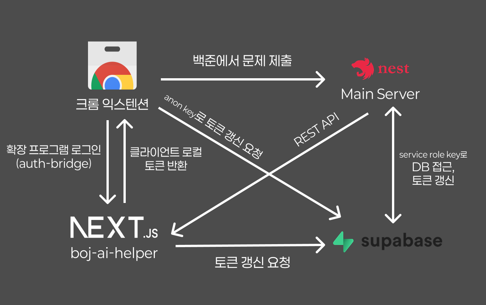

> 최근에 사이드 프로젝트로 **BOJ AI Helper**라는 서비스를 개발하고 있습니다.
>
> Nest.js 서버, Next.js SSR&CSR, Chrome Extension 환경에서 Supabase Auth를 통합하며 몇가지 인증 에러들을 만났고, 이러한 에러를 맞닥뜨리며 인증/인가 아키텍처를 설계한 과정을 기록합니다.



## 프로젝트(BOJ AI Helper) 배경

### 학습 과정의 누락된 부분

백준 온라인 저지는 문제를 풀고 제출하면 "맞았습니다" 또는 "틀렸습니다" 결과를 제공한다. 하지만 제출 이후의 학습 과정은 사용자에게 전적으로 맡겨져 있다.

**백준 플랫폼의 한계**

- 제출 내역은 채점 결과만 표시
- 풀이 과정이나 사고 방식은 기록되지 않음
- 복습 시점을 사용자가 직접 관리해야 함
- 반복되는 실수 패턴을 파악하기 어려움

일주일 전에 풀었던 문제를 다시 보면 어떻게 풀었는지 기억나지 않는 경우가 많다.
단순히 `solved.ac` 티어를 높이기 위해서, 문제를 많이 푸는 것만으로는 실질적인 코딩 테스트를 통과하기 위한 실력을 쌓기는 어렵다.

### 제출을 학습 이벤트로

BOJ AI Helper는 백준의 제출을 단순한 채점 요청이 아니라 `하나의 학습 이벤트`로 바라본다.

하나의 코드 제출에는 많은 정보들이 담겨 있다.

- **틀린 제출**: 어떤 부분을 오해했는지, 어떤 엣지 케이스를 놓쳤는지..
- **맞은 제출**: 그 시점의 사고 방식, 선택한 알고리즘과 자료구조가 적절했는지..

사람마다 코테를 준비하기 위한 코드를 작성할 때 공통적으로 실수하는 패턴이나 본인의 취약점이 존재한다.
이러한 데이터를 체계적으로 수집하고 분석하면 개인화된 학습 피드백을 제공하는 것이 가능하다는 시나리오에서, 개발을 시작하게 됐다.



### 목표

`BOJ AI Helper`는 **"문제 풀이 → AI 피드백 → 복습"** 루프를 통해, 유저가 코드 작성에 있어서 자신의 약점을 보완하고 실력을 향상시킬 수 있도록 돕는 것을 목표로 한다.

현재까지 구현한 핵심 기능은 이렇다.

- 제출 자동 수집: `Chrome Extension`으로 백준 제출 내역 크롤링
- 제출 데이터 영속화: 소스 코드, 결과, 문제 정보 저장
- 학습 데이터 관리: 메모 작성, 복습 일정 관리

그리고 향후에 캡스톤 프로젝트 지원금을 활용해 이 기능까지 추가를 하고, 런칭을 해볼 예정이다.

- AI 기반 분석:제출 내역 기반 피드백 및 패턴 분석

## Supabase Auth의 도입

이번 프로젝트에서는 `Supabase`를 Auth Provider로서 활용하며, 데이터 접근은 자체 백엔드 서버를 통해 수행했다.
즉, 토큰 검증과 토큰 발급의 책임을 서버단이 아닌 `Supabase Auth`가 담당하도록 설계했다.

### 도입 배경

예전에 참여한 AI 해커톤에서 `Next.js`로 프론트엔드 단만을 구현하며 `Supabase`를 사실상의 백엔드로서 활용한 경험이 있었는데, 당시에 직접 백엔드를 구현하지 않고 굉장히 수월하게 서비스를 만들 수 있었다.

그 당시에 경험으로 이번 프로젝트에서도 `Supabase Auth`를 도입하게 되었다.

하지만 이번 프로젝트는 단순한 프론트엔드 앱이 아니라, `Next.js` 풀스택 앱과 `NestJS` 백엔드 서버, 그리고 `Chrome Extension`까지 아우르는 복합적인 아키텍처였기에, `Supabase Auth`를 통합하는 과정에서 여러 가지 트러블슈팅 상황에 직면하게 되었다.

> ##### 이 글에서는 `Supabase Auth`를 활용하여 풀스택 인증/인가 아키텍처를 설계하고, RLS 설정, 토큰 관리, 환경별 인증 처리 문제를 해결한 경험을 공유하고자 한다.

### 인증 아키텍처 설계

먼저 인증 아키텍처는 아래와 같은 시나리오 하에 설계했다.

#### 인증 플로우

1. 사용자가 Next.js 앱에서 Supabase Auth로 로그인
2. Supabase가 JWT와 refresh token 발급
3. Chrome Extension은 auth-bridge를 통해 토큰 수신
4. 모든 API 요청에 JWT 포함
5. 서버가 Supabase Auth를 통해 JWT 검증 후 DB 접근



**Client (Next.js / Chrome Extension)**

- `anon_key` + Supabase Auth SDK로 JWT 발급
- 모든 API 요청에 JWT 포함

**Server (NestJS)**

- 모든 인증 필요 API에 SupabaseAuthGuard 사용, Supabase Auth로 사용자 식별
- `service_role` key로 DB 접근

**Supabase (PostgreSQL + RLS)**

- Supabase Auth만 클라이언트/확장 프로그램 환경에서 직접 사용
- DB는 Nest(Prisma)만 사용

#### 왜 이렇게 설계해야만 하나?

이 프로젝트는 Next.js 기반 웹 애플리케이션과 Chrome Extension이 동시에 동작하는 구조이다. 두 클라이언트가 하나의 인증 체계를 공유해야 한다.

나는 아래의 원칙들을 고수하여 아키텍처를 설계했다.

1. 브라우저 환경에 service_role key가 노출되면 안 된다.
2. 모든 비즈니스 로직을 단일 서버를 통해 실행되어야 한다.
3. 웹 앱과 확장 프로그램이 동일한 인증 체계를 사용해야 한다. 두 환경이 서로 다른 인증 흐름을 가지면 토큰 동기화와 권한 관리가 복잡해진다.

클라이언트는 Supabase Auth를 통해 JWT만 발급받는다.
모든 API 요청은 해당 JWT를 포함해 서버로 전달한다.
서버는 Supabase Auth API를 통해 JWT를 검증하고 사용자 정보를 확인한다.
실제 DB 접근은 NestJS 서버에서만 수행한다. 이때 service_role key는 서버에만 존재한다.

#### 서비스 전체 아키텍처



**핵심 구성 요소**

| 구성 요소           | 역할                                                                                |
| ------------------- | ----------------------------------------------------------------------------------- |
| `boj-chrome-plugin` | 백준 status 페이지에서 제출 데이터 크롤링, 서버로 Submission 전송, 앱과의 인증 연동 |
| `boj-helper-server` | Submission CRUD, Supabase JWT 검증, Prisma를 통한 DB 영속화                         |
| `boj-helper-app`    | Supabase Auth 기반 로그인, 제출 목록/상세/메모 관리 UI 제공                         |

## 1️⃣ 내가 맞닥뜨린 트러블슈팅

나는 시간순으로 다음과 같은 문제들을 겪었다. 먼저, 내가 겪은 문제를 소개하고 글의 후반부에서 근본 원인 분석과 해결책을 다루고자 한다.

### 첫번째, RLS 보안을 키니까 permission denied..?

개발을 하다가 DB에 `RLS` 보안을 설정하지 않고 개발을 하고 있다는 것을 깨달았다. 문득 “이거 RLS 안 켜고 개발하는 거 위험한데?”라는 생각이 들어 RLS를 활성화했다. 켜자마자 앱 전체에서 `permission denied` 에러가 발생했는데..

> 💡 **RLS(Row Level Security)란?**
>
> 데이터베이스의 각 행(row)에 대한 접근 권한을 사용자별로 제어하는 `PostgreSQL`의 보안 기능이다.

데이터 보안을 강화하기 위해 Supabase의 RLS(Row Level Security)를 활성화했다.

RLS OFF 상태에서는 모든 쿼리가 정상 동작했다. 하지만 RLS를 켜는 순간, Next.js 앱 전체에서 `permission denied` 에러가 터졌다.

- 로그인은 되어 있었다.
- 토큰도 있었다.
  그런데 왜 `permission denied`가 발생하는 걸까?

### 두번째, SSR에서 액세스 토큰이 null

서버 컴포넌트에서 `getAccessToken()`을 호출하면 간헐적으로 `null`이 반환됐다.

```javascript
export async function getAccessToken() {
  const supabase = createClient()
  const {
    data: { session },
  } = await supabase.auth.getSession()

  return session?.access_token ?? null // ❌ 가끔 null 반환
}
```

브라우저에서는 정상 동작하는데, 서버에서만 세션을 잃어버리는 현상이었다. Next.js App Router의 SSR 환경에서 Supabase client가 제대로 세션을 유지하지 못하고 있었다.

### 세번째, 백준 문제 제출환경에서 토큰 자동 갱신을 어떻게 ?

Chrome Extension을 설치하고 백준 제출을 몇 개 올린 뒤 1시간 정도가 지나면, 서버에서 `401 Unauthorized` 에러가 발생하고, 이후에 제출을 해도 제출이 수집되지 않는다. 유저가 확장 프로그램에서 직접 로그인을 하여 토큰을 전달해야 했다.
Supabase access token의 주기가 1시간이기에, 유저 입장에서 1시간마다 직접 이 행동을 한다는 것은 매우 불편한 경험이었다.

```javascript
// 🚨 1시간 후 에러
POST /api/submissions
Authorization: Bearer [만료된 토큰]
→ 401 Unauthorized
```

나는 Supabase access token의 기본 만료 시간이 1시간이라는 걸 간과했다. 웹 앱에서는 Supabase SDK가 자동으로 토큰을 갱신해주지만, Chrome Extension의 content script 환경에서는 그런 메커니즘이 작동하지 않았다.

위 세가지 트러블 슈팅 상황과 직결되어 있는 다음과 같은 근본적인 질문들이 이어서 떠올랐다.

- RLS는 `auth.uid()`를 요구하는데, 이게 어떻게 전달되고 있지?
- Next.js의 `SSR/CSR` 환경에서 세션을 유지하는 `best practice`는 뭘까?
- `Chrome Extension`은 브라우저와 다른 환경인데, `토큰 갱신`은 어떻게 처리해야 하지?

이 문제들을 해결하기 위해 근본 원인을 분석해보자.

## 2️⃣ 어떻게 해결해야할까

### 사전 지식

#### anon_key와 service role key의 권한 차이

Supabase를 처음 접하면 `anon_key`를 클라이언트 `인증 키`처럼 생각하기 쉽다. 하지만 `anon_key`는 단순한 **클라이언트 식별용 public key**일 뿐이다.

[supabase 공식 문서 - anon and publishable keys](https://supabase.com/docs/guides/api/api-keys#anon-and-publishable-keys)

> 💡 **Supabase anon_key란?**
>
> Supabase에서 제공하는 공개 키로, 클라이언트가 Supabase 서비스에 접근할 때 사용한다. "익명(anonymous)" 키라는 이름이지만, 실제로는 입장권일 뿐이고 슈퍼키가 아니다. 만약 클라이언트 환경에서 해당 키를 탈취하고 누구나 이 키로 데이터베이스를 조작할 수 있는 상황이 발생하게 된다면 이는 심각한 보안 위협이 될 수 있다.
> 그러므로 실제 권한은,
>
> - 🔑 **JWT (access token)** - 사용자를 식별
> - 🔒 **RLS 정책** - 데이터 접근 제어
> - 🧠 **서버 로직** - 비즈니스 규칙 검증
>   에서 부여해야 한다.

> 💡 **RLS(Row Level Security)란?**
>
> 데이터베이스의 각 행(row)에 대한 접근 권한을 사용자별로 제어하는 PostgreSQL의 보안 기능이다.

RLS가 활성화된 상태에서는 `anon_key`만 가지고는 DB에 아무 작업도 수행할 수 없다. (기본값: 모든 접근 금지)

반면에, `service role key`의 경우는 슈퍼유저 권한을 가지며, RLS 정책을 완전히 우회할 수 있다. 따라서 비교적 안전한 백엔드에서 `service role key`를 사용하여 RLS를 우회하고, 비즈니스 로직에서 최종 권한 검증을 수행하는 것이 안전한 패턴이다.

애초에 RLS 정책을 사용하는 이유가, 보안 계층을 한단계 더 만들어 클라이언트가 `anon_key`를 탈취하더라도 데이터베이스에 직접 접근하는 것을 막기 위함이기 때문이다.

그래서 나는 `Nest.js` 서버 단에서 service role key를 사용하고, DB 접근 없이 supabase인증 api에 접근하는 `Next.js` 단에서는 `anon_key`로만 `supabase client`만 생성했다.
(토큰 검증로직이 `Nest.js` 서버 단에 있는 것이 아닌, `Supabase Auth`에 위임되어 있음)

#### 서비스 RLS 정책

그리고 RLS 정책에는 다음과 같이 추가했다.

```
USING (auth.uid() = user_id);
```

auth.uid()는 JWT 세션에서 유저 ID를 추출하는 함수이다. 즉, 내가 설정했던 RLS 정책은 "현재 인증된 사용자의 ID와 행의 user_id가 일치할 때만 접근을 허용"한다는 의미이다.

### 첫번째 근본 원인: 클라이언트 컴포넌트의 세션 일관성 문제

RLS 보안을 키니까 Next.js 클라이언트에서 `permission denied` 에러가 발생했던 근본 원인을 분석해보자.

RLS 정책에서 사용하는 `auth.uid()`는 Supabase client에 **JWT 세션이 붙어 있어야만** 존재한다. 아래는 permission denied 문제가 발생한 Next.js 클라이언트 컴포넌트에 Supabse client를 생성하는 코드의 예시이다.

```javascript
// 예시
export function createClient() {
  return createBrowserClient(url, anon_key) // ❌
}
```

이렇게 되면 렌더링 할 떄마다 매번 새로운 Supabase client 인스턴스가 생성된다.
이에 따라 각 client는 독립적인 auth context 가지게 되어 로그인 세션이 있어도, 새 client는 이를 알지 못하게 된다.

결과적으로 `auth.uid()` = `null` → RLS 조건 불만족 → permission denied 에러가 발생한 것이었다.

> 💡 **Supabase에서의 세션 관리**
>
> Supabase는 세션을 localStorage와 메모리에 유지하며, **같은 client 인스턴스에서 auth 상태를 추적**한다.

그러므로 세션 일관성 유지를 위해서는 다음 원칙을 지켜야 한다.

```
하나의 사용자 세션 = 하나의 Supabase client
```

해결책은 간단했다. Supabase client를 `싱글톤 패턴`으로 만들어,
애플리케이션 전체에서 동일한 client 인스턴스를 재사용하도록 변경했다.

```javascript
// 싱글톤 패턴의 예시
let browserClient: SupabaseClient | null = null

export function createClient() {
  if (typeof window === "undefined") {
    return createBrowserClient(url, anon_key)
  }

  if (browserClient) return browserClient // ✅ 재사용

  browserClient = createBrowserClient(url, anon_key)
  return browserClient
}
```

### 두번째 근본 원인: 서버 컴포넌트의 세션 관리 문제

> SSR 환경에서 Supabase 세션을 어떻게 유지해야 할까?

Next.js의 SSR 환경에서는 브라우저 환경에 접근이 불가능하기 때문에, 쿠키 기반으로 Supabase client를 생성해야 하고, 당연히 클라이언트 컴포넌트와는 다른 방식으로 세션을 유지해야 한다.

기존에는 세션을 getAccessToken() 안에서 조회만 했다. 너무 쉽게 갱신이 알아서 되겠거니와 생각을 했떤 거 같다. 하지만 이럴 경우 `Next.js 서버` 단에서 토큰이 만료되어도 세션을 갱신하지 않게 되므로, 예외상황이 발생했다.

그렇다면, 서버 컴포넌트에서는 토큰이 만료되었는지 사전에 확인하고, 만료되었거나 곧 만료될 예정이라면 미리 갱신하는 로직이 필요하다. 그래서 나는 토큰을 쿠키를 통해 꺼낼 떄 해당 토큰의 만료 예정 시각을 확인하여, 토큰이 만료되었거나 곧 만료될 예정이라면 `refreshSession()`을 호출하여 토큰을 갱신하도록 변경했다.

### 세번째 근본 원인: Extension의 content script 환경

> 유저의 Extension 환경에서 Supabase 세션을 어떻게 유지해야 할까?

브라우저 전역에서 저장할 수 있는 공간이 뭐가 있을까 찾아보다가, `chrome.storage.local` 이라는 공간이 있다는 것을 알게 되었다.

하지만 브라우저 환경과는 다르게, Chrome Extension의 content script 환경에서는 Supabase SDK의 자동 갱신 메커니즘이 작동하지 않는다. supabase sdk는 브라우저의 `localStorage`를 사용하여 세션을 관리하는데, content script는 브라우저의 localStorage와 완전히 분리되어 있기 때문이다.

그렇다면 세션 갱신을, 주기적으로 백그라운드에서 수행하는 방법이 필요하겠다.

## 4️⃣ 환경별 토큰 갱신 전략

위에서의 고민을 바탕으로 확립한 서버, 클라이언트, Extension 환경별 토큰 갱신 전략을 정리했다.

### Server: Proactive Refresh

서버 컴포넌트에서는 **API 호출 전에 토큰을 미리 갱신**한다.

```javascript
export async function getAccessToken() {
  const supabase = createClient() // createServerClient (쿠키 기반)
  const {
    data: { session },
  } = await supabase.auth.getSession()

  if (!session) return null

  const expiresAt = new Date(session.expires_at * 1000)
  const now = new Date()

  // 만료됐거나 60초 이내면 갱신
  if (expiresAt.getTime() - now.getTime() < 60000) {
    const {
      data: { session: newSession },
    } = await supabase.auth.refreshSession()
    return newSession?.access_token ?? null
  }

  return session.access_token
}
```

#### 동작 원리

- 만료 여부를 `expires_at`으로 사전 확인
- 만료 전에 미리 갱신
- API 호출 시 항상 유효한 토큰 사용

### Client: Reactive Refresh

클라이언트 컴포넌트에서는 액세스 토큰 만료 시 **401 응답을 받은 후에 갱신**한다.

```javascript
async function fetchWithRefreshMiddleware(url, options) {
  const supabase = createClient() // createBrowserClient
  const {
    data: { session },
  } = await supabase.auth.getSession()

  // 첫 요청
  let response = await fetch(url, {
    ...options,
    headers: {
      ...options.headers,
      Authorization: `Bearer ${session.access_token}`,
    },
  })

  // 401이면 재시도
  if (response.status === 401) {
    await supabase.auth.refreshSession()
    const {
      data: { session: newSession },
    } = await supabase.auth.getSession()

    response = await fetch(url, {
      ...options,
      headers: {
        ...options.headers,
        Authorization: `Bearer ${newSession.access_token}`,
      },
    })
  }

  return response
}
```

##### 동작 원리

- 만료 여부 확인 없이 일단 요청
- 401 응답 시 갱신 (reactive)
- 같은 요청 재시도

**서버 vs 클라이언트 비교**

| 구분          | 서버 컴포넌트                            | 클라이언트 컴포넌트                    |
| ------------- | ---------------------------------------- | -------------------------------------- |
| 리프레시 시점 | API 호출 전 (만료/60초 이내면 미리 갱신) | API 호출 후 401 발생 시 갱신 후 재시도 |
| 만료 판단     | `expires_at vs now + 60`                 | 사용 안 함 (401로 판단)                |
| 방식          | Proactive (예방적)                       | Reactive (대응적)                      |
| 토큰 저장     | 쿠키 (`cookies()`)                       | 브라우저 스토리지                      |

### Extension: Background Alarm

Chrome Extension에서는 background alarm 기능을 통해 브라우저의 백그라운드에서 주기적인 작업을 수행할 수 있다.

##### chrome.alarms 사용

```javascript
// background.js - 알람 등록
chrome.alarms.create("refreshToken", {
  periodInMinutes: 50,
})

// 알람 리스너
chrome.alarms.onAlarm.addListener(async alarm => {
  if (alarm.name !== "refreshToken") return

  const { refreshToken } = await chrome.storage.local.get([REFRESH_TOKEN_KEY])
  if (!refreshToken) return

  try {
    const newAccessToken = await refreshAccessToken(refreshToken)
    await chrome.storage.local.set({
      [ACCESS_TOKEN_KEY]: newAccessToken,
    })
  } catch (error) {
    console.error("Token refresh failed:", error)
  }
})
```

##### 동작 원리

- Supabase access token 만료: 1시간
- 알람 주기: 50분 (만료 전에 갱신)
- 사용자 액션 불필요 (자동 갱신)
- Manifest V3 service worker도 알람 시점에 깨어남

## 5️⃣ 최종 교훈

### 1. 세션 일관성 지키기

```
하나의 사용자 세션 = 하나의 Supabase client
```

client를 매번 새로 생성하면:

- 로그인 세션이 있어도
- Supabase 내부 auth context는 리셋

**해결: Client `싱글톤 패턴`**

### 2. 환경별 세션 관리 방법의 차이

| 환경             | 토큰 저장         | 갱신 전략           | 갱신 시점                  |
| ---------------- | ----------------- | ------------------- | -------------------------- |
| Server Component | 쿠키              | Proactive           | API 호출 전 (만료 60초 전) |
| Client Component | 브라우저 스토리지 | Reactive            | 401 응답 후                |
| Chrome Extension | chrome.storage    | Background Periodic | 50분마다 자동              |

### 3. Supabase 보안 설정

```tx
1단계: Client (anon_key + JWT)
  2단계: → Server (JWT 검증 + 비즈니스 로직)
    3단계: → DB (RLS 정책)
```
