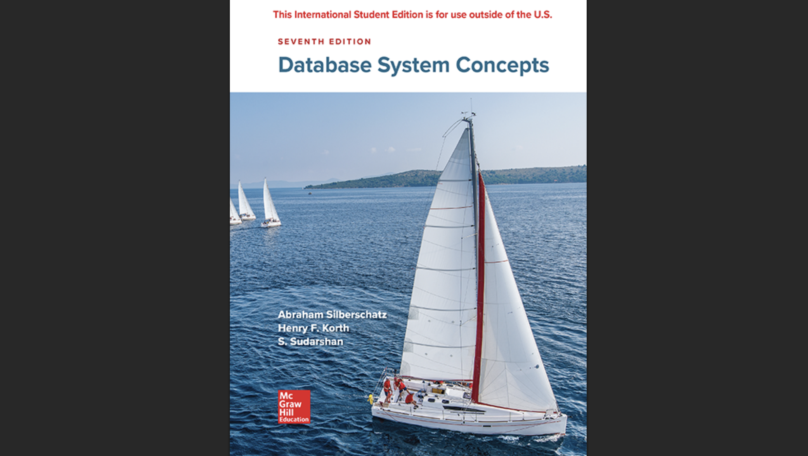

> 학부 수업 "데이터베이스시스템" Chapter 1 정리

## 1-1 An Introductory Example

데이터베이스 시스템은 흔히 `전산화된 기록 관리 시스템(computerized record-keeping system)`이라고 불린다.
쉽게 말하면, 전자 파일 캐비닛 같은 존재다. 데이터를 구조적으로 보관해두고 필요할 때 꺼내 쓸 수 있다.

#### DB의 기본 연산 (CRUD)

- **추가** (`INSERT`)
- **검색** (`SELECT`)
- **수정** (`UPDATE`)
- **삭제** (`DELETE`)

책에서는 `와인 저장고(wine cellar)` 예시를 들고 있다.

- 와인의 이름, 생산자, 연도, 병 수량, 마실 수 있는 시기 등을 테이블 형태로 저장
- `SQL`을 이용하면 특정 연도 와인만 조회하거나, 새로운 와인을 추가하고, 수량을 수정하고, 소진된 와인을 삭제할 수 있다

> 💡 **핵심 포인트**: 데이터베이스는 단순한 데이터 모음이 아니라, 데이터를 구조적으로 관리하고 조작하는 시스템

## 1-2 What is a Database System?

데이터베이스 시스템은 크게 **4가지 축**으로 구성된다.

#### 1️⃣ Data

- 단일 사용자가 아니라 **다수 사용자가 공유**하는 통합된 데이터
- 예: 기업 내 여러 부서가 동일한 고객 데이터를 참조

##### 2️⃣ Hardware

- 디스크, 드라이브, I/O 채널 같은 **저장 장치**
- CPU와 메모리까지 포함
- `DBMS`가 실행되는 물리적 기반

#### 3️⃣ Software

- 핵심은 **DBMS(Database Management System)**
- 사용자는 저장 방식은 몰라도 되고, `논리적 관점`으로만 데이터를 다룰 수 있다

#### 4️⃣ Users

- **응용 프로그래머**: 프로그램을 통해 DB에 접근
- **최종 사용자**: 쿼리나 메뉴 기반 UI로 직접 접근
- **DBA(Database Administrator)**: 전체 시스템 관리(보안, 무결성, 백업 등 책임)

> 💡 **핵심 포인트**: 데이터베이스 시스템은 `데이터 + 하드웨어 + 소프트웨어 + 사용자`가 맞물려 돌아가는 유기적 구조

---

## 1-3 What is a Database?

데이터베이스에서 가장 중요한 개념은 **지속적 데이터(persistent data)**다.
휘발성 데이터(I/O 버퍼, 제어문 등)와 달리, 삭제하지 않는 이상 오랫동안 보존된다.

#### 📌 Database 정의

> 특정 기관의 응용 시스템에서 사용되는 **지속적 데이터의 집합**

- **은행** → 계좌 데이터
- **병원** → 환자 데이터
- **학교** → 학생 데이터

#### Entity(개체)

독립적으로 구분 가능한 객체 (예: `학생`, `직원`)

#### Relationship(관계)

개체 간의 연관성

- **단항(unary)**: 부품-구성관계
- **이항(binary)**: 직원-부서
- **삼항(ternary)**: 공급자-부품-프로젝트

이런 관계는 `ER 다이어그램(ERD)`으로 표현할 수 있고, 관계 자체도 데이터로 간주된다.

#### 📌 Data와 Data Model

#### 데이터의 본질

- **데이터** = 사실(fact), 즉 참인 명제들의 모음
- **데이터베이스** = 이런 명제들의 집합
- **관계형 모델**: 테이블(행=명제, 열=속성)로 표현

#### 데이터 모델(Data Model)의 구성요소

데이터를 표현하는 논리적 틀

1. **객체(object)**: 무엇을 다루는지 (예: 테이블, 속성)
2. **연산자(operator)**: 어떻게 다루는지 (예: `SELECT`, `JOIN`)
3. **제약조건(constraint)**: 반드시 지켜야 하는 규칙 (예: 기본키, 외래키)

> 💡 **핵심**: 사용자는 `데이터 모델`만 알면 된다. 물리적 구현은 몰라도 된다 → **데이터 독립성의 기반**

## 1-4 Why Database?

그렇다면 왜 데이터베이스를 써야 할까?
바로 기존 파일 관리 방식(`FMS`)와 `DBMS`의 차이 때문이다.

#### 📊 FMS vs DBMS 비교표

| 구분                 | **FMS**                              | **DBMS**                                      |
| -------------------- | ------------------------------------ | --------------------------------------------- |
| **데이터 접근 방식** | 프로그램이 직접 파일 read/write      | DBMS 통해 `SQL`/API로 접근                    |
| **구조 의존성**      | 파일 구조에 의존 → `Data Dependence` | 논리적 스키마만 알면 됨 → `Data Independence` |
| **데이터 중복**      | 여러 파일에 중복 저장                | DBA가 통제하는 `Controlled redundancy`        |
| **일관성**           | 일부만 갱신 시 불일치 발생           | 무결성 제약조건으로 자동 일관성 유지          |
| **보안**             | 파일 단위 제한                       | 사용자 권한/뷰(`View`) 기반 세밀한 접근 제어  |
| **동시성 제어**      | 다중 사용자 충돌 발생                | 트랜잭션, 동시성 제어(`ACID`) 지원            |
| **확장성**           | 파일 구조 바뀌면 프로그램 전부 수정  | 스키마 변경 시 영향 최소화                    |
| **처리 단위**        | Record-at-a-time                     | Set-at-a-time (`SQL` 집합 연산)               |

> **DBMS**는 단순히 데이터를 모아두는 게 아니라, 중복을 줄이고, 일관성과 보안을 유지하며, 확장성과 동시성을 보장하는 시스템이다.

#### 📌 관리 주체

- **DA(Data Administrator)**: 어떤 데이터를 보관할지, 보안 정책 등을 결정
- **DBA(Database Administrator)**: DA가 정한 정책을 실제로 구현하고 DB를 운영

## 1-5 Data Independence

마지막으로 데이터베이스 철학의 핵심, **데이터 독립성(Data Independence)**.

#### 🚫 과거의 문제 (Data Dependence)

- 파일 시스템에서는 프로그램이 파일 구조에 의존
- 구조가 바뀌면 프로그램도 전부 수정해야 했다

#### ✅ Data Independence 정의

> 데이터의 저장 방식이나 구조가 바뀌더라도, **응용 프로그램이 영향을 받지 않는 성질**

#### 1️⃣ Physical Data Independence (물리적 독립성)

- 내부 저장 구조(인덱스, 파일 조직 등)가 바뀌어도 논리 스키마는 그대로
- **예시**: `B-Tree` 인덱스를 `해시` 인덱스로 바꿔도 `SELECT` 쿼리는 동일하게 동작

#### 2️⃣ Logical Data Independence (논리적 독립성)

- 논리 스키마(테이블, 속성 등)가 바뀌어도 외부 뷰/응용은 그대로
- **예시**: 테이블 속성을 추가해도 기존 뷰를 쓰는 앱은 문제 없음

> 💡 **결과**: DB는 확장성과 유지보수성이 크게 향상된다

## ✅ 정리

- 📊 **데이터베이스** = 단순한 저장소가 아니라 통합적이고 공유 가능한 `지속적 데이터`의 집합
- 🔧 **DBMS**는 `데이터`, `하드웨어`, `소프트웨어`, `사용자(DBA 포함)` 네 가지 축으로 이루어진다
- 🔗 **데이터**는 엔티티와 관계를 중심으로 구조화되며, `ER 모델`과 `관계형 모델`로 표현된다
- 🆚 **DBMS**는 FMS 대비 중복 제어, 무결성 보장, 보안, 동시성 제어, 데이터 독립성에서 큰 장점을 가진다
- 🎯 **데이터 독립성(Data Independence)** ➡️ 시스템이 변해도 응용 프로그램은 그대로 유지된다
