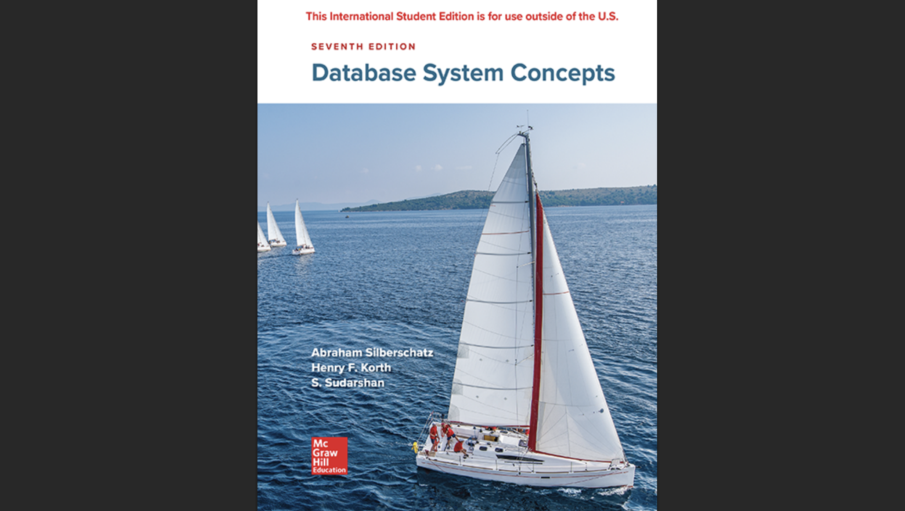

> 학부 수업 "데이터베이스시스템" Chapter 2 정리
>
> [Chapter1 읽어보기](http://localhost:8000/%EB%8D%B0%EC%9D%B4%ED%84%B0%EB%B2%A0%EC%9D%B4%EC%8A%A4%20-%20Chapter1.%20An%20Overview%20of%20Database%20Management/)

## 1️⃣ 데이터베이스 설계 프로세스

#### 📝 설계 단계

데이터베이스 설계는 체계적인 3단계 프로세스를 통해 진행된다.

**1. 초기 단계 (Initial Phase)**

데이터베이스를 사용할 잠재적 사용자의 데이터 요구사항을 완전히 파악하는 단계다. 이는 전체 설계의 기초가 된다.

**2. 두 번째 단계 (Second Phase)**

데이터 모델을 선택하고, 선택된 모델의 개념을 적용하여 요구사항을 데이터베이스의 `개념적 스키마(Conceptual Schema)`로 변환한다.

잘 개발된 개념적 스키마는 기업의 기능적 요구사항을 명확히 나타낸다. 이 단계에서는 데이터에 수행될 작업(트랜잭션)의 종류도 기술된다.

**3. 최종 단계 (Final Phase)**

추상적인 데이터 모델에서 실제 데이터베이스 구현으로 넘어가는 단계다.

- `논리적 설계(Logical Design)`: 데이터베이스 스키마를 결정한다. 어떤 속성을 기록할지(경영적 결정)와 이러한 속성들을 어떤 관계 스키마에 어떻게 분배할지(컴퓨터 과학적 결정)를 포함한다.
- `물리적 설계(Physical Design)`: 데이터베이스의 물리적 레이아웃을 결정한다.

#### ⚠️ 주요 설계 고려사항

데이터베이스 스키마를 설계할 때 반드시 피해야 할 두 가지 주요 문제점이 있다.

**🔄 중복성 (Redundancy)**

잘못된 설계는 정보의 반복을 초래할 수 있다. 정보의 중복된 표현은 여러 정보 사본 간의 `데이터 불일치(Data Inconsistency)`로 이어질 수 있다.

**❌ 불완전성 (Incompleteness)**

잘못된 설계는 기업의 특정 측면을 모델링하는 것을 어렵거나 불가능하게 만들 수 있다.

## 2️⃣ E-R 모델의 핵심 구성요소

#### 🏢 엔티티와 엔티티 집합

E-R 모델은 기업을 엔티티와 관계의 집합으로 간주하여 모델링한다.

**🎯 엔티티 (Entity)**

다른 객체와 구별되는 기업 내의 "사물" 또는 "객체"다.

- 예시: 특정 사람, 회사, 사건

**🏷️ 속성 (Attributes)**

엔티티가 가지는 설명적인 속성이다.

- 예시: 사람은 이름과 주소를 가짐

**📦 엔티티 집합 (Entity Set)**

동일한 속성을 공유하는 동일한 유형의 엔티티들의 집합이다.

- 예시: 모든 사람, 모든 회사, 모든 나무의 집합

#### 🔗 관계와 관계 집합

**🤝 관계 (Relationship)**

여러 엔티티 간의 연관이다.

**📊 관계 집합 (Relationship Set)**

n개(n ≥ 2)의 엔티티 집합에서 각각 추출된 엔티티들 간의 수학적 관계다. 관계 집합 또한 속성을 가질 수 있다.

- 예시: 고객과 계좌 사이의 `depositor` 관계는 `access-date` 속성을 가질 수 있음

**🔢 관계 집합의 차수 (Degree)**

관계 집합에 참여하는 엔티티 집합의 수를 의미한다. 대부분의 관계는 두 개의 엔티티 집합이 참여하는 `이진(Binary)` 관계다.

- 예시: 직원이 특정 지점에서 특정 직무를 수행하는 3진 관계는 드물다

#### 🏷️ 속성의 유형

E-R 모델에서 속성은 다양한 형태로 분류된다.

| 속성 유형                 | 설명                          | 예시                              |
| ------------------------- | ----------------------------- | --------------------------------- |
| **단순(Simple)**          | 더 이상 나누어질 수 없는 속성 | `age`, `name`                     |
| **복합(Composite)**       | 더 작은 단위의 속성들로 구성  | `address` (street, city, zipcode) |
| **단일값(Single-valued)** | 하나의 값만 가지는 속성       | `student_id`                      |
| **다중값(Multi-valued)**  | 여러 값을 가질 수 있는 속성   | `phone_numbers`                   |
| **파생(Derived)**         | 다른 속성으로부터 계산 가능   | `age` (date_of_birth로부터 계산)  |

## 3️⃣ 제약조건과 키

#### Mapping Cardinality 제약조건

`매핑 카디널리티 제약조건`은 관계 집합을 통해 한 엔티티가 연관될 수 있는 다른 엔티티의 수를 표현하며, 특히 이진 관계에서 유용하다.

| 카디널리티 유형           | 설명                                       |
| ------------------------- | ------------------------------------------ |
| **일대일 (One-to-one)**   | 한 엔티티가 최대 하나의 다른 엔티티와 연관 |
| **일대다 (One-to-many)**  | 한 엔티티가 여러 다른 엔티티와 연관 가능   |
| **다대일 (Many-to-one)**  | 여러 엔티티가 하나의 다른 엔티티와 연관    |
| **다대다 (Many-to-many)** | 여러 엔티티가 여러 다른 엔티티와 연관      |

#### 참여 제약조건

**🌟 전체 참여 (Total Participation)**

엔티티 집합의 모든 엔티티가 관계 집합 내에서 최소 하나 이상의 관계에 반드시 참여해야 한다.

- 예시: 모든 대출(loan)은 반드시 고객(customer)과 연관되어야 함

**⭐ 부분 참여 (Partial Participation)**

엔티티 집합의 일부 엔티티는 관계에 참여하지 않을 수도 있다.

#### 🔑 키 (Keys)

데이터의 무결성과 고유성을 보장하는 핵심 개념이다.

| 키 종류        | 설명                                                                             |
| -------------- | -------------------------------------------------------------------------------- |
| 슈퍼키         | 각 엔티티를 고유하게 식별하는 하나 이상의 속성 집합                              |
| 후보키         | 최소한의 슈퍼키다. 더 이상 줄일 수 없는 속성들의 조합                            |
| 기본키         | 여러 후보키 중에서 선택된 주요 식별자다                                          |
| 관계 집합의 키 | 관계에 참여하는 엔티티 집합들의 기본키 조합은 해당 관계 집합의 슈퍼키를 형성한다 |

- 예시`(customer_id, account_number)`는 `depositor` 관계 집합의 슈퍼키

## 4️⃣ E-R 다이어그램 및 표기법

#### 기본 표기법

E-R 모델은 시각적인 다이어그램을 통해 표현되며, 각 요소는 표준화된 기호로 나타낸다.

| 기호              | 설명                                          |
| ----------------- | --------------------------------------------- |
| **직사각형**      | 엔티티 집합 (Entity Set)                      |
| **이중 직사각형** | 약한 엔티티 집합 (Weak Entity Set)            |
| **마름모**        | 관계 집합 (Relationship Set)                  |
| **이중 마름모**   | 식별 관계 집합 (Identifying Relationship Set) |
| **타원**          | 속성 (Attribute)                              |
| **이중 타원**     | 다중값 속성 (Multivalued Attribute)           |
| **점선 타원**     | 파생 속성 (Derived Attribute)                 |
| **밑줄 속성**     | 기본키 속성 (Primary Key Attribute)           |

#### 🔗 관계 표현

| 선의 종류           | 의미                                             |
| ------------------- | ------------------------------------------------ |
| **실선**            | 속성과 엔티티 집합, 엔티티 집합과 관계 집합 연결 |
| **이중선**          | 전체 참여 (Total Participation)                  |
| **화살표 (→)**      | 카디널리티 '하나(One)'를 의미                    |
| **비방향성 선 (—)** | 카디널리티 '다수(Many)'를 의미                   |
| **ISA 삼각형**      | 특수화/일반화 관계                               |

## 5️⃣ 고급 E-R 모델링 개념

#### 약한 엔티티 집합

스스로의 속성만으로는 기본키를 구성할 수 없는 엔티티 집합이다.

**특징**

- `식별 엔티티 집합(Identifying Entity Set)`의 존재에 의존한다
- 식별 엔티티로부터 `전체 참여(Total Participation)`하는 일대다 관계를 통해 연결된다
- 이 관계를 `식별 관계(Identifying Relationship)`라 하며, 이중 마름모로 표현한다
- `구별자(Discriminator)` 또는 `부분키(Partial Key)`라는 속성 집합을 가진다

> **💡 약한 엔티티의 기본키 구성**
>
> 약한 엔티티의 기본키는 **식별 엔티티의 기본키 + 구별자(부분키)** 로 구성된다.
>
> - 예시: `payment` 엔티티의 기본키는 `(loan_number, payment_number)`
> - `loan_number`: 식별 엔티티(loan)의 기본키
> - `payment_number`: 구별자(부분키)

#### 특수화와 일반화

**🔽 특수화 (Specialization)**

상위 엔티티 집합 내에서 특정 속성이나 관계를 갖는 하위 그룹을 지정하는 하향식(Top-down) 설계 프로세스다.

- 예시: `person`을 `customer`와 `employee`로 세분화

**🔼 일반화 (Generalization)**

공통된 특징을 공유하는 여러 엔티티 집합을 묶어 상위 엔티티 집합을 만드는 상향식(Bottom-up) 설계 프로세스다.

**⬇️ 속성 상속 (Attribute Inheritance)**

하위 엔티티는 상위 엔티티의 모든 속성과 관계 참여를 상속받는다.

#### 설계 제약조건

| 제약조건        | 설명                                                     |
| --------------- | -------------------------------------------------------- |
| **Disjoint**    | 한 엔티티가 하나의 하위 엔티티에만 속할 수 있음          |
| **Overlapping** | 한 엔티티가 여러 하위 엔티티에 속할 수 있음              |
| **Total**       | 상위 엔티티가 반드시 하나 이상의 하위 엔티티에 속해야 함 |
| **Partial**     | 상위 엔티티가 하위 엔티티에 속하지 않을 수 있음          |

#### 집단화 (Aggregation)

**📦 집단화의 정의**

관계 집합을 하나의 추상적인 엔티티로 취급하여 다른 관계와 연결할 수 있게 하는 기능이다.

**🎯 집단화의 목적**

관계들 간의 관계를 모델링하여 정보의 중복을 제거한다.

- 예시: '직원(employee)이 특정 지점(branch)에서 특정 직무(job)를 수행한다'는 `works_on` 관계 자체를 하나의 단위로 보고, 이 단위를 관리하는 '관리자(manager)'를 연결할 수 있다

## 6️⃣ E-R 모델의 관계형 스키마 변환

#### 🏢 엔티티 집합 변환

**💪 강한 엔티티 집합**

해당 엔티티 집합의 속성들을 열(column)으로 갖는 스키마(테이블)로 변환된다.

```sql
-- Customer 엔티티 집합 변환 예시
CREATE TABLE Customer (
    customer_id VARCHAR(10) PRIMARY KEY,
    customer_name VARCHAR(50),
    customer_street VARCHAR(30),
    customer_city VARCHAR(20)
);
```

**🔗 약한 엔티티 집합**

자신의 속성들과 함께, 식별하는 강한 엔티티 집합의 기본키를 포함하는 스키마로 변환된다.

```sql
-- Payment 약한 엔티티 집합 변환 예시
CREATE TABLE Payment (
    loan_number VARCHAR(10),  -- 식별 엔티티의 기본키
    payment_number INT,       -- 구별자(부분키)
    payment_date DATE,
    payment_amount DECIMAL(10,2),
    PRIMARY KEY (loan_number, payment_number),
    FOREIGN KEY (loan_number) REFERENCES Loan(loan_number)
);
```

#### 🔗 관계 집합 변환

**🔀 다대다 (Many-to-Many)**

관계에 참여하는 두 엔티티 집합의 기본키와 관계 자체의 속성들을 포함하는 별도의 스키마로 변환된다.

```sql
-- Depositor 다대다 관계 변환 예시
CREATE TABLE Depositor (
    customer_id VARCHAR(10),
    account_number VARCHAR(10),
    access_date DATE,
    PRIMARY KEY (customer_id, account_number),
    FOREIGN KEY (customer_id) REFERENCES Customer(customer_id),
    FOREIGN KEY (account_number) REFERENCES Account(account_number)
);
```

**➡️ 다대일/일대다 (Many-to-One/One-to-Many)**

별도의 스키마를 생성하는 대신, '다수(Many)' 측 엔티티의 스키마에 '하나(One)' 측 엔티티의 기본키를 `외부키(foreign key)` 속성으로 추가하여 표현할 수 있다.

```sql
-- Account가 Branch와 다대일 관계인 경우
CREATE TABLE Account (
    account_number VARCHAR(10) PRIMARY KEY,
    branch_name VARCHAR(20),  -- 외부키로 추가
    balance DECIMAL(12,2),
    FOREIGN KEY (branch_name) REFERENCES Branch(branch_name)
);
```

**🔗 일대일 (One-to-One)**

어느 한쪽 엔티티의 스키마에 다른 쪽의 기본키를 속성으로 추가하여 표현할 수 있다.

#### 🏷️ 속성 처리

**📦 복합 속성 (Composite Attribute)**

각 구성 요소를 별도의 속성(열)으로 분해하여 표현한다.

```sql
-- Address 복합 속성 처리 예시
CREATE TABLE Customer (
    customer_id VARCHAR(10) PRIMARY KEY,
    customer_name VARCHAR(50),
    -- address 복합 속성을 분해
    street VARCHAR(30),
    city VARCHAR(20),
    zipcode VARCHAR(10)
);
```

**📞 다중값 속성 (Multivalued Attribute)**

해당 엔티티의 기본키와 다중값 속성 값을 저장하기 위한 별도의 스키마를 생성한다.

```sql
-- Phone_numbers 다중값 속성 처리 예시
CREATE TABLE Customer_Phone (
    customer_id VARCHAR(10),
    phone_number VARCHAR(15),
    PRIMARY KEY (customer_id, phone_number),
    FOREIGN KEY (customer_id) REFERENCES Customer(customer_id)
);
```

#### 🌳 특수화/일반화 변환

**📋 방법 1: 별도 테이블**

상위 엔티티에 대한 스키마를 하나 만들고, 각 하위 엔티티에 대해서는 상위 엔티티의 기본키와 자신의 고유 속성들을 포함하는 별도의 스키마를 생성한다.

```sql
-- Person 상위 엔티티
CREATE TABLE Person (
    person_id VARCHAR(10) PRIMARY KEY,
    name VARCHAR(50),
    address VARCHAR(100)
);

-- Customer 하위 엔티티
CREATE TABLE Customer (
    person_id VARCHAR(10) PRIMARY KEY,
    credit_rating INT,
    FOREIGN KEY (person_id) REFERENCES Person(person_id)
);

-- Employee 하위 엔티티
CREATE TABLE Employee (
    person_id VARCHAR(10) PRIMARY KEY,
    salary DECIMAL(10,2),
    FOREIGN KEY (person_id) REFERENCES Person(person_id)
);
```

**📊 방법 2: 통합 테이블**

각 하위 엔티티에 대해 모든 상속된 속성과 자신의 고유 속성을 모두 포함하는 스키마를 생성한다.

```sql
-- Customer 통합 테이블
CREATE TABLE Customer (
    person_id VARCHAR(10) PRIMARY KEY,
    name VARCHAR(50),          -- 상속된 속성
    address VARCHAR(100),      -- 상속된 속성
    credit_rating INT          -- 고유 속성
);

-- Employee 통합 테이블
CREATE TABLE Employee (
    person_id VARCHAR(10) PRIMARY KEY,
    name VARCHAR(50),          -- 상속된 속성
    address VARCHAR(100),      -- 상속된 속성
    salary DECIMAL(10,2)       -- 고유 속성
);
```

## 7️⃣ UML 클래스 다이어그램과의 비교

#### 🔍 주요 차이점

E-R 다이어그램과 UML 클래스 다이어그램은 유사한 목적을 가지지만 표기법에서 차이가 있다.

| 구분           | E-R 다이어그램       | UML 클래스 다이어그램          |
| -------------- | -------------------- | ------------------------------ |
| **속성 표현**  | 타원형으로 별도 표시 | 클래스 박스 내부에 표기        |
| **이진 관계**  | 마름모로 관계 표현   | 두 클래스를 직접 선으로 연결   |
| **카디널리티** | 관계 선 옆에 표기    | 상대방 클래스 옆에 `l..h` 형식 |

#### 📊 UML 카디널리티 표기법

**📐 UML 카디널리티 해석**

UML에서는 `l..h` (최소..최대) 형식으로 관계 선의 상대방 클래스 옆에 표기한다.

> **💡 UML 카디널리티 읽는 법**
>
> E1과 E2의 관계에서 E2 쪽에 `0..1`이 표기되면:
>
> - 각 E2 엔티티가 최대 하나의 관계에만 참여할 수 있음을 의미
> - 이는 E2에서 E1으로의 **다대일 관계**를 나타냄
> - E-R 다이어그램의 표기와는 **정반대 위치**에 표기됨

## ✅ 정리

**🎯 E-R 모델의 핵심 가치**

- 🗂️ **직관적 모델링**: 현실 세계의 엔티티와 관계를 자연스럽게 표현
- 🔧 **체계적 설계**: 단계적 프로세스를 통한 안정적인 데이터베이스 구축
- 🛡️ **무결성 보장**: 제약조건을 통한 데이터 일관성 유지
- 🔄 **유연한 확장**: 특수화, 일반화, 집단화를 통한 복잡한 요구사항 대응

**📋 설계 시 핵심 고려사항**

- **중복성 제거**: 정보의 반복 저장으로 인한 불일치 방지
- **완전성 확보**: 모든 비즈니스 요구사항을 빠짐없이 모델링
- **적절한 키 설계**: 엔티티의 고유성과 관계의 무결성 보장
- **효율적인 변환**: E-R 모델에서 관계형 스키마로의 최적화된 변환

E-R 모델은 복잡한 데이터 요구사항을 체계적으로 분석하고 설계할 수 있는 강력한 도구다. 기본 개념의 정확한 이해와 단계적 접근을 통해 효과적인 데이터베이스 설계가 가능하다.
