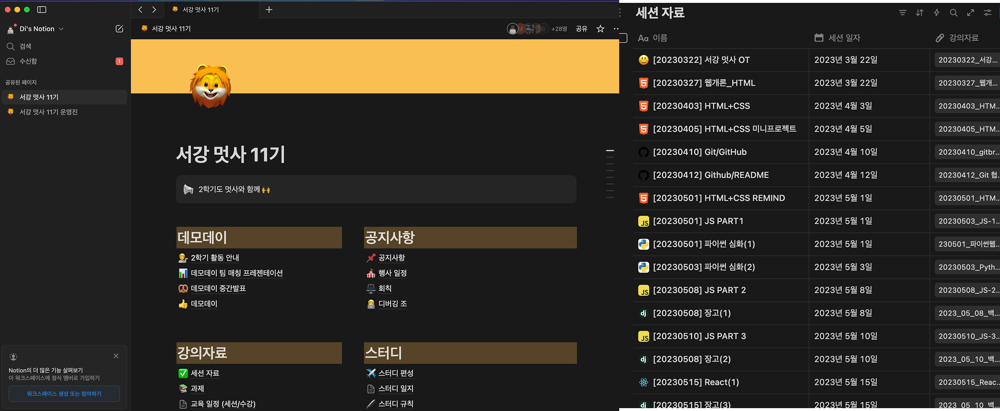
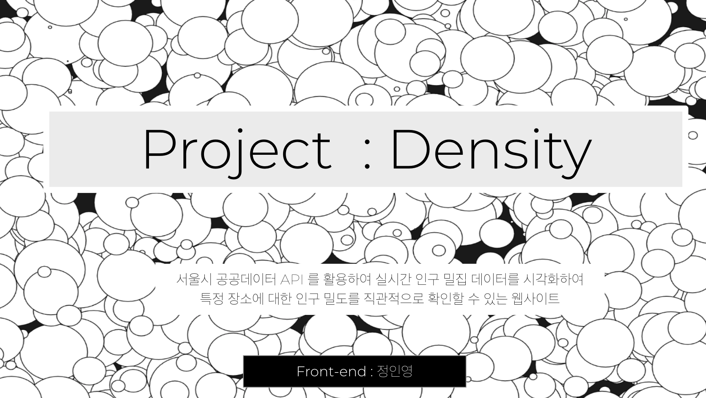
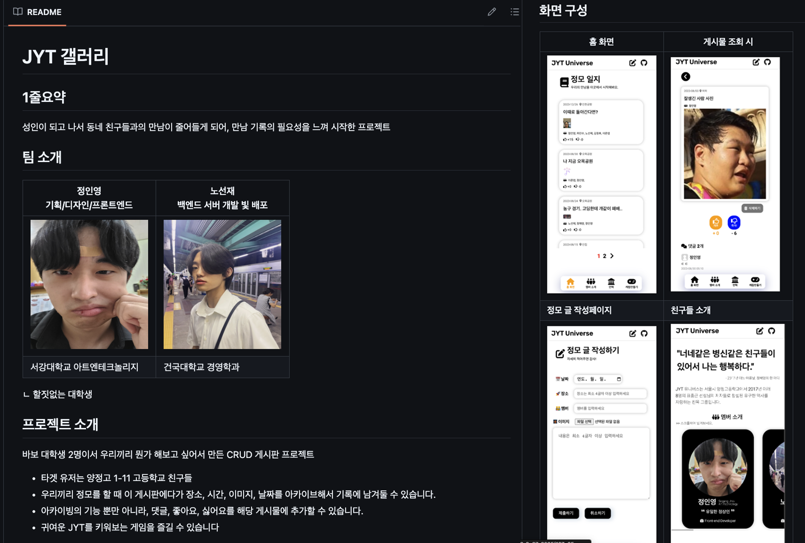
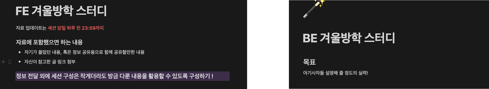
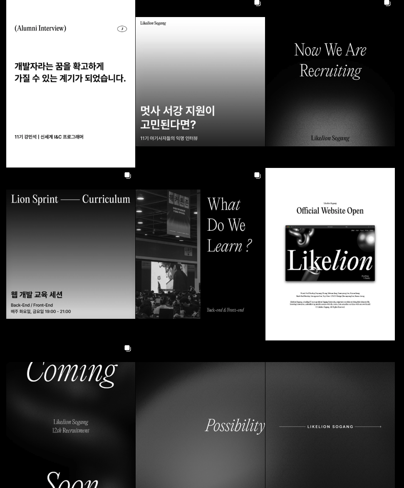
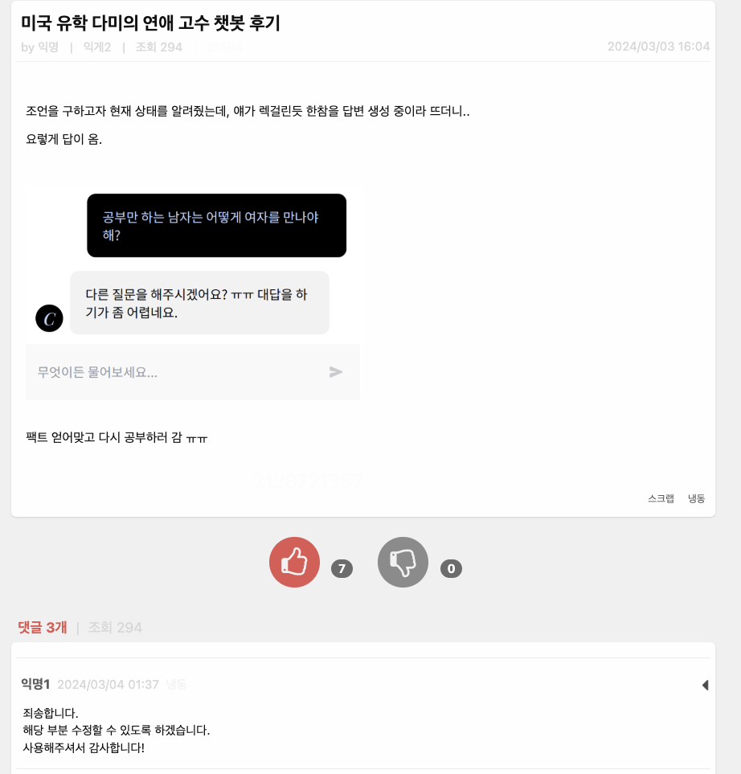

> 2023-2024년, 서강대학교 멋쟁이사자처럼에서 11기 프론트엔드 아기사자부터 12기 대표까지 경험한 2년간의 개인적인 여정을 소개합니다.

## 멋사를 선택한 이유

시작은 군 전역 후 넘치는 열정과 개발에 대한 막연한 호기심, 그리고 창업에 대한 관심이었다.

전역 후 사회 복귀 계획을 세우던 중 우연히 '멋쟁이사자처럼'이라는 동아리를 알게 되었다. **내 아이디어를 내 손으로 구현한다**는 모토와 배움에 열정 있는 초심자를 위한 커뮤니티라는 점이 나에게 큰 매력으로 다가왔다. 

결과적으로 면접을 열심히 준비한 끝에 `11기 프론트엔드 트랙`으로 합격할 수 있었다! 멋사의 선발 과정은 현재의 개발 역량보다는 성장에 대한 열망과 본인만의 아이디어를 중요시했다. 이러한 가치관이 나와 딱 맞았던 것 같다.

지금부터 내 짧은 25년 인생의 터닝 포인트인 멋사에서 한 활동에 대해서 소개해보고자 한다.

## 아기사자로서 1년간의 여정

#### 1학기 (교육)

멋사 활동은 1년 동안 장기적인 여정으로 진행되었다.

HTML, CSS, Git을 다루는 기초부터 시작해, 이후 프론트엔드/백엔드 트랙으로 나뉘어 매주 2회 저녁 세션에서 운영진들이 준비한 교육자료를 통해 체계적으로 학습했다. 

1학기가 끝날 무렵, React로 간단한 게시판을 만들 수 있는 수준까지 성장했다. 학업과 병행하다 보니 지식이 완벽히 체계화되진 않았지만, 운영진들의 도움 아래 직접 미션을 수행하며 개발의 즐거움을 느꼈다.

학기 중간에는 아이디어톤과 POV 세션을 통해 특정 문제 상황에 대한 내 아이디어를 발표하고 피드백을 받는 소중한 경험도 할 수 있었다.

#### 여름방학 (중앙해커톤)

멋사의 꽃은 단연 양재 AT센터에서 수천 명이 모이는 `중앙 해커톤` 이다.
이를 준비하기 위해 여름방학 동안 테킷의 무료 강의와 '한 입으로 먹는 리액트' 강의를 복습하며 실력을 다졌다.

중앙 해커톤에 함께 나가는 건국대 멋사 백엔드 친구와 연습겸 사이드 프로젝트도 진행했다. 이떈 참 성장에 목말라 있던 시기였다.

중앙 해커톤을 준비하며 나온 아이디어는 '현재 내가 탄 지하철의 위치를 알려주는 서비스'였다. 당시만 해도 이런 서비스가 없었고(지금은 네이버 지도에서 제공), 지하에서 GPS가 부정확해지는 문제를 해결하는 것이 관건이었다. 결국 사용자가 직접 화면에서 선택하는 방식으로 해결책을 찾았다.

 서비스의 로딩 UI")

처음 본 해커톤 현장의 열기는 지금도 잊을 수 없다. 우리 팀은 수상하지 못했지만, 서강대 다른 팀이 수상하여 다 함께 기뻐했던 한여름 밤의 꿈 같은 경험이었다.

중앙 해커톤 이후 얼마 지나지 않아 연세, 이화, 홍익대와 연합하는 `신촌톤` 도 참가했다. 당일 주제가 공개되는 방식이라 더 긴장되었지만, 다른 학교 학생들과의 협업을 통해 ERD 설계 도구 활용법, 개발 명세서 자동화 같은 실무적인 팁들을 많이 배웠다.

#### 2학기 (데모데이)

데모데이를 위해 아이디어 피칭 후 팀빌딩을 거쳐 프론트 3명, 백엔드 3명으로 팀을 구성했다. 우리는 동아리 지원 플랫폼을 개발하기로 했고, 홍익대 미대에 외주도 의뢰하며 열심히 준비했다.

하지만 개발 과정에서 팀 내 갈등이 지속되면서 점차 소강 상태에 빠졌고, 처음 가졌던 열정도 사그라들었다. 당시 내가 좀 더 주체적이고 유연하게 대처했더라면 하는 아쉬움이 남는다.

그럼에도 결국 프로젝트를 완성해 데모데이 최종 발표를 마치며 1년간의 멋사 아기사자 활동이 마무리되었다.

#### 아기사자로서 느낀 점

무엇보다 1년 동안 아무런 대가 없이 헌신적으로 도움을 준 운영진들에게 깊은 감사를 느꼈다. 옆에서 세심하게 지도해준 덕분에 개발 역량은 물론 협업 능력까지 기를 수 있었다. 또한 멋사의 다양한 행사들을 통해 동기들과 잊지 못할 추억도 쌓았다.

이 과정에서 나는 내가 받은 도움을 나와 같은 상황에 놓인 학생들에게 돌려주고 싶다는 마음이 커졌다. 멋사라는 커뮤니티를 우리 학교에서 더욱 활성화시키고 싶은 열망이 생겼다.

그래서 큰 결심을 하게 되는데...

## 대표로서 1년간의 여정

데모데이가 끝난 후 `운영진` 을 하기로 결심했다. 대표/부대표를 정하는 과정에서 함께 고민하던 친구가 교환학생 일정이 있어, 자연스럽게 내가 `대표직` 을 맡게 되었다.

### 겨울방학, 멋사 1년 판 짜기

처음에는 5명으로 시작한 운영진이었기에 인원 보강이 필요했다. 아름아름 연락을 돌려 프론트엔드 4명, 백엔드 3명으로 총 7명의 운영진을 추가 모집할 수 있었다.

퀄리티 높은 교육을 위해서는 운영진의 개인 역량이 가장 중요하다고 판단했다. 이에 파트별 스터디를 계획했다. 프론트엔드팀은 전년도 세션 자료를 복습하고, tanstack-query와 tailwind-css 같은 업계에서 활용되지만 아직 익숙하지 않은 기술 스택을 학습했다.

각 파트별로 지식을 쌓은 후에는 1학기 교육 커리큘럼을 전체적으로 개편했다. 우리가 아기사자 시절 느꼈던 아쉬운 점과 변화하는 개발 트렌드를 반영했다. 돌이켜보면 아기사자들이 직접 더 많은 것을 해볼 수 있게 하자는 의도로 다소 무리한 커리큘럼을 구성했던 것 같기도 하다.

또한 기존에 노션, 디스코드, 깃허브 등으로 분산되어 있던 멋사 워크스페이스를 하나로 통합했다. 기획/홍보/교육/재무 담당으로 업무를 분담하여 1년간 효율적으로 운영진 활동을 이어갔다.

### 동아리 지원자 100명+ 만들기

동아리 대표로서 첫 번째 목표는 겨울방학에 많은 지원자를 모으는 것이었다. 이를 위해 단순 에브리타임/서담 홍보를 넘어선 추가적인 액션이 필요했다.

홍보팀에서는 서강대 멋사의 이미지를 아트웍 느낌으로 리브랜딩하여 인스타그램에 게시물을 올리기 시작했다. 

이와 함께 `서강대 멋쟁이사자처럼 소개 사이트` 를 처음으로 제작했다.
흥미를 끄는 스크롤 인터랙션과 three.js로 구현한 멋사 로고 등 시각적으로 매력적인 요소들을 많이 추가했다. 지원 접수 기능도 포함되어 있어 짧은 기간 동안 기획/디자인/개발/검수를 위해 모두가 고생했던 첫 운영진 프로젝트였다.

또한 학교 커뮤니티인 서담의 연애 상담글들을 학습 데이터로 활용한 `챗봇을 개발` 했다. '까칠한' 또는 '친절한' 서담이를 선택해 연애 고민을 털어놓으면 답변해주는 서비스였는데, 리크루팅 기간에 맞춰 이 챗봇 웹사이트를 서담에 공유했더니 인기글이 될 정도로 화제가 되었다.

이러한 노력 덕분에 전년 대비 2배 이상의 지원자가 몰렸다. 운영진들의 책임감도 그만큼 커졌고, 우리만의 다양한 평가 지표를 통해 공정하게 최종 합격자를 선발했다. 선발할 때 내부적으로 정말 많은 논의를 거쳤다.

### 본격적인 교육을 시작하며

예상했던 것보다 교육 자료 준비는 훨씬 어려웠다. 지식을 체계화하여 직관적인 강의 자료를 구성해야 할 뿐만 아니라, 실습 과정에서 발생할 수 있는 다양한 변수들도 고려해야 했다.

학기 중에는 강의 자료를 일주일 전에 공유하고, 피드백을 반영한 뒤 리허설을 진행하며 교육의 퀄리티를 유지하기 위해 노력했다.

회사 업무, 학업, 인턴십 등 운영진들 각자의 바쁜 일상 속에서 아무런 보상 없이 매주 두 번씩 저녁 시간에 교육을 진행하는 것은 결코 쉽지 않았다. 그럼에도 아기사자들이 성장하는 모습을 볼 때마다 정말 큰 보람을 느꼈다.

### 재정 지원 확보하기

2학기에 서강대학교에 SW중심대학이 설립되면서, 기존의 한정된 재원으로 운영했던 상황이 개선될 가능성이 보였다. 재원이 충분하다면 교육 퀄리티 향상은 물론, 홈커밍데이 같은 다양한 행사도 대규모로 기획할 수 있었다.

나는 새로 부임한 SW중심대학 학장님께 연락드려 우리 동아리를 열정적으로 소개했고, 교수님과 개인적인 연락을 주고받는 사이가 되었다. 틈날 때마다 동아리를 어필했고, 덕분에 교수님의 소개로 인프런 대표님과의 미팅 기회도 얻었다(비록 큰 성과는 없었지만).

신촌톤, 데모데이 등의 행사를 위한 기획서와 재무집행서를 꼼꼼하게 작성하여 SW대학 행정팀의 신뢰를 얻을 수 있었고, 주요 행사에 SW중심대학의 지원을 받게 되었다.

물론 행정팀과의 갈등도 있었지만, 결국 내 진심이 통했던 것 같다. "겨우 이 돈 따내려고 이렇게까지 하는 거야?"라고 말했던 행정팀 직원의 말이 생각나지만, 나에게는 정말 큰 의미가 있는 일이었다.

### 운영진을 하면서 느낀 점

운영진 활동과 병행하여 개인적으로는 프론트엔드 인턴십을 준비했다. 내 지식을 타인에게 공유하고 정리하는 과정에서 나 자신도 크게 성장할 수 있었다. 아기사자 시절에 떨어졌던 인턴 자리에 운영진 활동을 하면서 합격할 수 있었다. 인턴십 탈락으로 자존감이 낮아졌을 때, 운영진 활동을 통해 다른 이들에게 도움을 주면서 스스로를 더 사랑할 수 있게 되었다.

멋사라는 동아리에는 특유의 낭만이 있다. 실력 중심으로 리쿠르팅하고 현업자 네트워킹에 중점을 두는 다른 메이저 동아리들과 달리, 아무것도 모르는 학생이 2-3개월 만에 코딩을 배워 자신의 아이디어를 맨땅에 헤딩하며 구현해보는 경험은 멋사에서만 가능한 특별한 여정이다.

12기 아기사자들 중에는 유달리 명문 해외 기업에 취업하는 경우가 많은 거 같다. 정작 나는 아직 졸업도 못했지만ㅋㅋ 나도 언젠가는 할 수 있을 거라 믿는다.
