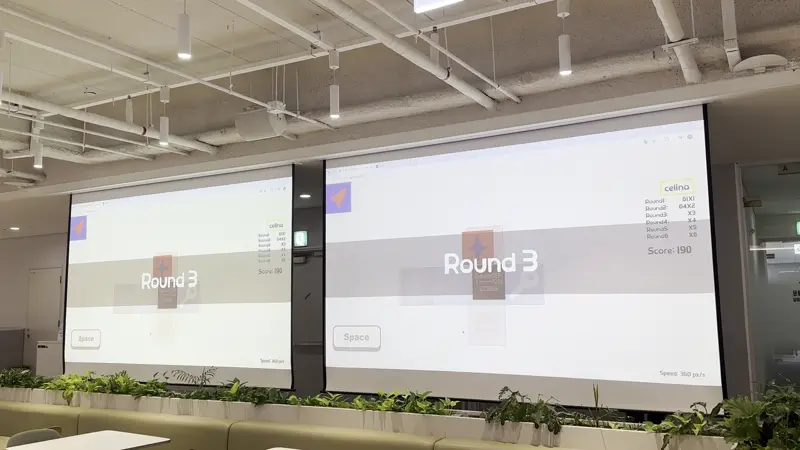

> "금융으로 세상을 바꾸는 기업, 카카오뱅크에서 6개월의 인턴쉽을 회고합니다. (+ 네이버랩스 인턴 최종 면접후기)"

### 네이버랩스 최종 탈락에서 카카오뱅크 인턴 합격까지

지난 1월, 나는 **네이버랩스의 Robot FE Developer**라는 인턴 직무에 지원했다. 내가 열심히 공부해 온 프론트엔드 분야이기도 하고, 로봇 엔지니어링을 경험할 수 있다는 것도 매력으로 다가와 합격을 위해 최선을 다했다.

참고로 인턴 전형은 아래와 같은 순서로 진행됐다.

```
1차 서류 -> 코딩 테스트 -> 전화 면접 -> 최종 면접
```

#### 전화 인터뷰

1차와 코딩 테스트를 통과한 뒤 현직자 분과 전화 인터뷰가 있었는데, 현직자 분께서 내 서류를 보고 지금까지 본 서류 중에 제일 잘 쓴 것 같다고 피드백을 주셔서 이미 그때부터 마음속으로 나는 네이버의 아들이 되었다.ㅋㅋㅋ

전화 인터뷰에서는 학부 수업이나 스타트업 인턴십을 하면서 경험한 것들을 물어보시고, 특히 당시에 개발하고 있었던 `연애 상담 서비스, 셰어마인드` 프로젝트에 관한 이야기를 나누면서 개발 현황과 앞으로의 계획에 대해 이야기를 나눴다.

코테에 관한 이야기도 나누었다. 다익스트라 알고리즘을 쓰는 문제에서 약식으로 `Priority Queue`를 구현했는데, 당시 단순 배열로 구현했던 것의 시간복잡도 한계(O(n) 삽입/삭제)와 제대로 구현한다면 어떻게 할 수 있는지(Binary Heap으로 O(log n) 구현) 물어보셨다.


#### PT 준비, HR 인터뷰

전화 합격 약 한 달 뒤에 네이버 사옥에서의 최종 대면 면접을 통보받았다. 사전에 10분 정도 직무와 관련한 경험들에 대한 소개를 하는 presentation을 준비하라고 하셨고, 발표자료를 미리 HR 담당자에게 송부했다.

듣던 대로 정말 네이버 사옥에서는 음식 배달 등을 위해 정말 로봇들이 자유롭게 이동하는 모습을 볼 수 있었다.


면접 전에 HR 담당자 분과 10분 정도 면접, 직무에 대한 소개를 받았는데...
나에게 마음을 단단히 먹으라고 하셨다. 면접 난이도가 어려울 수 있다.. 면접은 일대다(**면접자 1, 면접관 4**)로 1-2시간 동안 진행될 거다...라고 해서, 긴장을 잔뜩 한 채로 면접에 들어갔다.

#### 최종 면접 (망함 ☠)

면접은 약 1시간 30분 동안 진행되었는데, 40분은 내 발표와 발표에 대한 꼬리 질문으로, 나머지 시간은 현장에서 준비한 코딩 사고 테스트와 로봇과 관련된 사고 질문이 주를 이뤘다. 여러 질문이 오갔는데 지금 내 머릿속에 남는 아쉬웠던 것들을 아래에 정리해본다..🥹

**발표 꼬리 질문**

- 화이트보드로 발표에서 소개한 아키텍처 구조도를 그려보라는 질문에 나는 프론트 서버에서 axios 모듈을 통해 Tanstack query를 사용한 API를 호출해서 백엔드 서버로 통신한다는 걸로 답했는데, 실제로 질문의 의도는 Network 계층(TCP/IP, HTTP/HTTPS 프로토콜, DNS 해석 과정 등)에 대한 이해도를 묻는 질문이었던 것 같다. 애플리케이션 레벨이 아닌 더 로우레벨의 통신 메커니즘에 대한 설명을 원했던 것이었다.

**코딩 사고 테스트**

컴퓨터 OS에서 파일 경로를 찾는 알고리즘에 대해 pseudo code를 짠 뒤 예외적인 상황(순환 참조, 권한 부족, 파일 시스템 손상 등)에 대한 고려를 묻는 질문을 하셨고, 로봇과 관련된 사고 질문에서는 '면접자분이 로봇 웹앱을 설계한다면 어떤 서비스를 제공하는 로봇을 만들고 싶은지? 그 로봇의 통신(WebSocket, ROS 통신, MQTT 등), 시스템 아키텍처(마이크로서비스, 이벤트 드리븐 등)를 설계해서 뒤의 화이트보드에 그려봐라' 같은 질문들도 있었는데... 정말 밑바닥 수준인 나의 지식을 체감했다.

아무래도 비전공자이다 보니까 컴퓨터 네트워크, 운영체제, 시스템 아키텍처 같은 CS 기초 과목들을 체계적으로 학습하지 못했고, 내가 예상했던 React 컴포넌트 설계나 상태 관리 같은 프론트엔드 개발 관련 질문보다는 그 밑단의 시스템 레벨 지식들을 많이 물어보셨던 것 같다. 특히 로봇과 웹의 인터페이스, 실시간 통신, 임베디드 시스템에서의 리소스 최적화 등에 대한 이해가 부족했다는 걸 느꼈다.

지금 생각해보면, 아무래도 로봇 OS 위에서 돌아가는 로봇 웹 애플리케이션을 개발하니까 당연하게도 이에 대한 성능 개선이나 UX 개선을 위해서는 하드웨어 제약사항, 실시간 처리, 메모리 관리, 배터리 최적화 등 로우레벨 시스템 지식이 당연히 많이 필요했을 텐데, 내가 너무 안일하게 생각했구나 하는 반성이 든다.


결론적으로 나는 최종 면접에서 탈락했다. 하지만 이 경험을 통해 내가 부족한 부분을 명확하게 알 수 있었고, 앞으로 어떤 방향으로 공부해야 할지 구체적인 로드맵을 그릴 수 있었다.

포기하지 않고 동시에 카카오뱅크 개발 어시스턴트에도 지원했었다. 당시 우대사항 및 요구되는 역량이

```js
- 프론트엔드 개발 역량을 갖추신 분 (React, TypeScript, 모던 JS 등)
- 소프트웨어 개발과 개발 커뮤니티에 이해도가 높으신 분
- 디자인 및 편집 툴 (Figma, Adobe Creative Suite) 사용 경험
- 기술 문서 작성 및 글쓰기 역량을 갖추신 분
```

이정도였던 거 같은데,
당시에 `개발 커뮤니티 운영진`(멋사)과 `스타트업 인턴`을 하면서 했던 테크니컬 라이팅, 교육 컨텐츠 제작 경험들을 서류에서 어필했다.

서류 통과 후 면접에서는 편안한 분위기 속에서 본 전공 수업에서 다뤘던 아트앤테크놀로지 관련 디자인 툴들(Processing, Arduino, Figma 등)에 대한 경험과 개발 관련 기술적인 질문들(React Hooks, 상태 관리, 번들링 최적화 등)이 오갔다.

CES 2025 일정이 있어서 원래 근무 시작 일자보다 2주 정도 늦게 출근해야 해서 합격에 대한 미련을 버리고 있었는데,
결과적으로 합격했다!


첫 출근때부터 웰컴 박스에 편지와 함께 따뜻하게 맞이해 주셔서 너무 감사했다.


### 우리 팀, 그리고 나의 역할

우리 팀은 카카오뱅크 기술 조직을 위한 활동을 지원하는 업무를 맡았다.
특히 DR(Developer Relations), PR, IR, HR 업무 중에서 DR과 관련한 활동을 많이 했다.

업무 특성 상 주기적인 업무가 있기 보다는 매일매일 다른 컨텍스트 속에서 업무를 많이 했다.
평소에 많이 했던 일들은,

```
- 카카오뱅크 테크 블로그에 올라가는 기술 글을 검토, 개발 유지보수
- 기술 블로그 이미지 편집
- 금요일에 격주 간격으로 있는 사내 개발 컨퍼런스 행사 과정의 end-to-end 지원
```

이런 일을 하면서 개발이 필요한 특정 기간동안에는 위의 일을 진행하며 개발의 비중을 높이면서 업무를 진행했다.

어떤 걸 개발했는지는 아래에 작성해보도록 하겠다.

### 카카오뱅크 최초 해커톤, 뱅커톤 준비


3월 달에 카카오뱅크 최초 사내 해커톤인 `뱅커톤`을 개최했다. 우리 팀에서 end-to-end로 뱅커톤을 지원했는데, 그래서 처음 입사한 1월 말에는 뱅커톤을 준비하는 회의를 내부적으로 또는 타부서와 매일 하곤 했다.

#### 뱅커톤에서의 개발

나는 뱅커톤 행사를 진행하는데에 있어서 디스플레이할 시계/럭키드로우 프로그램을 개발하고, 단체게임을 개발했다.

단체게임은 뱅커톤 개발 애셋으로 이루어진 3D 큐브 전개도에서 움직이는 큐브 조각을 타이밍에 맞춰 스페이스바를 눌러 맞추는 게임이었다. 막판 역전이 가능한 게임성을 위해 Round가 진행됨에 따라 정확도에 가중치를 두는 점수 시스템을 설계했다. 또한 CSS3 transform과 requestAnimationFrame을 활용하여 부드러운 큐브 애니메이션을 구현했다.



#### 당일

뱅커톤 당일날에는 1박 2일동안 밤을 새서 뒷정리도 다 하고, 토요일 오후가 넘어 터덜터덜 집에 왔다.


다들 AI를 활용하여서 생각보다 일찍 개발을 마치고 좋은 발표를 하기 위해 힘쓰곤 했다.
(이후에 카카오에서 개최한 24K 해커톤을 참관했는데, 코딩하는 시간을 약 8시간밖에 제공하지 않고 심사도 AI로 돌리더라 ㄷㄷ)


#### 행사 이후

뱅커톤 행사 이후에는 오히려 행사 뒷작업을 하느라 바빴다.
뱅커톤에 출품한 모든 작품들에 대한 `아카이빙 웹사이트`를 만들고, 해커톤에 대한 `KPT 회고`를 진행했다. (Keep, Probelm, Try)
결과물을 아카이빙하면서 코드를 뜯어볼 수 있는, 지금까지 내가 본 학생들로만 이루어진 해커톤에서 나온 결과물과는 확실히 수준 차이가 많이 났다. 카뱅 개발자의 프로페셜리즘을 여실히 느꼈다.

또 카카오뱅크 기술블로그에 DevRel로서 뱅커톤을 회고하는 글을 작성하고, PR팀의 검토를 받아서 release를 했다.

[🟨 카카오뱅크 기술블로그 뱅커톤 회고글](https://tech.kakaobank.com/posts/2504-bankerthon-2025/)

글을 세상 밖으로 내보내는 과정은... 정말 리소스가 많이 드는 작업이다. 이떄의 기억 때문에 지금 기술 블로그에 글을 쓸때도 습관적으로 퇴고의 과정을 거치고 있다.

### 🧑‍🧑‍🧒 DevRel 활동

> "개발자들을 위해서 우리가 뭘 해줄 수 있는 게 뭐가 있을까"
> DevRel로서 우리 팀이 장소와 시간과 관계 없이 항상 생각하는 질문이다.

그들의 성장을 돕기 위해 카카오뱅크에서는 개발자들을 위한 여럿 프로그램을 지원하고 있다.
기존에는 카카오 기술조직 내에서 인사이트를 공유하는 세션, `DevCon`을 주기적으로 개최하여 End-to-end 로 지원했는데, 만족도 조사를 하면서 외부 인사의 목소리를 듣고 싶다는 후기가 많이 올라왔다. 종종 외부 인사를 초청하긴 했지만, 아예 외부 인사 초청 밋업을 `DevInvite` 라는 이름으로 리브랜딩하여 행사를 운영하기로 했다.

#### DevInvite 기획부터 운영까지

DevInvite는 카카오뱅크 개발자들이 외부 기술 인사들과 만나며 새로운 인사이트를 얻을 수 있는 자리로 기획되었다. 단순히 강연을 듣는 것을 넘어서, 네트워킹과 질의응답을 통해 실무에 도움이 되는 깊이 있는 대화가 이루어질 수 있도록 구성했다.

당시 일하던 선임자분과 함께, 이 행사의 기저를 차근차근 완성했다.
지금 생각나는 것들로는..

```js
- 행사 브랜딩
- 행사 홍보
- 행사 준비 프로세스 확립
- 행사 중 (카메라 설치, 행사장에 포스터/X배너/과자/출입증 설치)
- 후속 처리 (다시보기 편집, 스케치 글 작성 후 사내에 공유)
```

매 회차마다 참가자 피드백을 수집하고, 무엇이 잘되었고 무엇을 개선해야 할지 꼼꼼히 기록했다. 음향, 좌석 배치, 다과 준비, 네트워킹 시간 등 세세한 부분까지 최적화해 나갔다. 행사가 끝나면 단순히 끝내는 것이 아니라, 핵심 내용을 정리한 스케치 글을 작성해서 참석하지 못한 카뱅 크루들도 인사이트를 얻을 수 있도록 했다. 또 영상 편집을 통해 다시보기 컨텐츠도 제공했다.


인턴십 기간 동안 총 5회차의 DevInvite 행사를 기획하고 운영했다. 높은 퀄리티의 강의를 세션 때 마다 들을 수 있어서, 개발에 진로를 설정한 내 입장에서도 세션이 열릴 떄마다 흥미롭게 들었다.

#### 외부 활동

사내 개발자들의 외부 활동 지원을 하러 외부로 많이 나가기도 했다.

Spring Camp 2025 컨퍼런스에서 카카오뱅크 개발자들의 세션을 확보하기 위해 주최측과 적극적으로 소통하고, 현장에서 서버 개발자를 홍보했다!


카카오 공동체 안에서의 교류 행사에도 참석했다.


코드러너 장소 견학을 위해 수원 컨벤션 센터에도 방문했다.


카카오뱅크 내부 인턴들끼리 네트워킹 활동, 일명 어시의 숲도 있었다.


### 👨‍💻 코드러너 행사 진행을 위한 개발

#### **코드러너 소개**


[🟨 코드러너 소개글](https://tech.kakaobank.com/posts/2410-koderunner-2024/)

카카오뱅크에서는 사내 기술 컨퍼런스인 코드러너를 매년 개최한다. 어떻게 보면 우리 팀의 1년 중 가장 큰 과제이기도 한데, 행사 진행을 위해 나는 개발 업무를 담당했다.

작년 코드러너에서는 운영진이 QR 리더기를 통해 참석자들의 출석을 체크했는데, 이번에는 참가자들에게 핸드북 링크를 제공하여 더 풍부한 기능을 추가하는 것이 목표였다.

```js
- 컨퍼런스 최초 출석 체크
- 세션/부스/토론 출석 체크, 일정 조건 만족 시 럭키드로우 응모권 지급
- 단체게임 베팅, 베팅 성공 시 럭키드로우 응모권 지급
```

참고로 코드러너에서는 기술조직 구성원들이 모두 참여하는 단체 게임이 매년 있다. 예선을 거친 뒤 현장에서 결선을 치르는데, 지금까지는 돈 개수 세기, 타자 빨리치기 같은 게임들이 있었다.

코드러너를 진행 보조를 위해 인턴 마지막 2개월 동안 총 6개의 프로그램을 개발했다

#### 1. 코드러너 메인서버 개발

요구사항에 따른 백엔드 개발부터 시작했다. `FastAPI + PostgreSQL + Docker Container` 스택으로 구성했고, 다른 팀과 협의한 AES-256 대칭키 암호화를 통해 사용자 ID를 안전하게 관리했다.

RESTful API 설계 원칙에 따라 출석 체크, 베팅, 럭키드로우 응모권 관리 엔드포인트를 구현했다. FastAPI로 제대로 개발해보는 건 처음이어서 Pydantic 모델링과 의존성 주입 패턴을 익히는 데 시간이 걸렸다.


#### 2. 핸드북 (참여자 클라이언트 웹)

핸드북은 코드러너 컨퍼런스 정보 제공과 베팅/출석 기능을 제공하는 참가자 전용 웹앱이다.

[Stackflow](https://stackflow.so/) 라이브러리로 네이티브 앱 같은 자연스러운 페이지 전환을 구현했고, Intersection Observer API를 활용해 스크롤 기반 패럴럭스 효과와 요소별 지연 애니메이션을 적용했다.

특히 동시 접속자가 몰릴 상황을 대비해 TanStack Query의 staleTime, cacheTime 설정으로 서버 요청을 최소화하고, 데이터 prefetching과 background refetch 전략을 활용했다.

#### 3. 럭키드로우

경품 정보(이름, 사진, 당첨자 수)를 입력하면 Rolling 애니메이션을 통해 숫자를 추첨하는 럭키드로우 머신을 구현했다.

카카오뱅크 디자인 애셋을 활용해 SVG 형태로 럭키드로우 머신을 웹에 구현했다. 자연스러운 Rolling 애니메이션 구현이 까다로웠는데, CSS3 transform과 GSAP 라이브러리를 조합해 부드러운 추첨 효과를 만들 수 있었다.

#### 4. 단체게임 개발

단체 게임 컨셉을 정하는 데 많은 논의가 있었는데, 결국 `김카뱅의 환전소`라는 보드게임 '카지노' 룰 기반 게임으로 기획했다.

참가자들이 실물 주사위를 굴린 결과를 Admin 화면에 반영하면, 관객들이 Display 화면에서 경기 현황을 실시간으로 확인할 수 있도록 했다.

WebSocket 기반 실시간 양방향 통신으로 Supervisor Admin과 Display 화면 간 상태를 동기화했다. 고빈도 데이터 전송을 위한 debouncing과 throttling을 적용하고, 불필요한 리렌더링을 방지하기 위해 노력했다.


#### 5. 메인 디스플레이 화면

세션장에서 쉬는 시간에 트랙별 세션 장소가 다르다 보니 시간표 가이드가 필요했다.

Three.js를 활용한 카메라 애니메이션을 구현했다. Star 컴포넌트들을 배치하고 트랙별 컬러로 오로라 느낌을 주면서, 카메라 시점을 바꿔가며 전환 효과를 만들었다.

별도 Admin 패널을 통한 실시간 메시지 브로드캐스팅 기능도 WebSocket을 활용해 구현했다.

#### 6. 운영진 QR 스캔 전용 웹앱

운영진이 사용자의 핸드북 웹 애플리케이션 QR코드를 스캔하면 코드러너 메인 서버와 API 연동을 통해 출석 체크가 되도록 했다.

npm 생태계의 여러 QR 스캔 라이브러리들을 실제 테스트해보고 성능, 호환성, 사용성을 기준으로 최적의 라이브러리를 선택했다. 가장 마지막에 개발한 프로젝트라 시간이 촉박했지만, 핵심 기능에 집중해 안정적인 QR 스캔 환경을 구축할 수 있었다.

### 인턴을 마무리하며..

팀 특성상 기술 조직에 있는 크루들과 이야기할 기회가 많아서, 현업 개발자들의 시각에서 내가 부족한 부분과 앞으로 필요한 역량에 대한 구체적인 조언을 들을 수 있었다.

카뱅같은 기술 조직에서 **AI 활용 전략**에 대해 어떤 고민을 하고 있는지 엿볼 수 있었다.

단순히 코드 생성을 위한 도구가 아니라, 문제 해결의 사고 과정을 확장하고 학습 효율을 높이는 방향으로 AI를 활용하는 방법에 대해 많은 인사이트를 얻었다. 또한 **기술 트렌드와 학습 로드맵**에 대해서도 실무진들의 경험담을 통해 어떤 기술을 언제, 어떻게 학습해야 효과적인지에 대한 현실적인 조언을 받을 수 있었다.

기술조직의 채용 과정을 옆에서 지켜보면서는... 개발자로서 어떤 역량을 어필해야 하고, 반대로 어떤 부분들이 감점 요소가 될 수 있는지에 대한 실질적인 인사이트도 얻었다.ㅋㅋㅋ

**6개월의 인턴십을 통해 얻은 가장 큰 수확은 '개발자로서의 시야 확장'이었다.** 단순히 코드를 작성하는 것을 넘어서, 사용자 경험, 시스템 아키텍처, 팀 협업, 기술 문서화, 커뮤니티 기여 등 개발자가 갖춰야 할 다양한 역량들을 실무 환경에서 직접 경험할 수 있었다는 것이 정말 값진 경험이었다.
