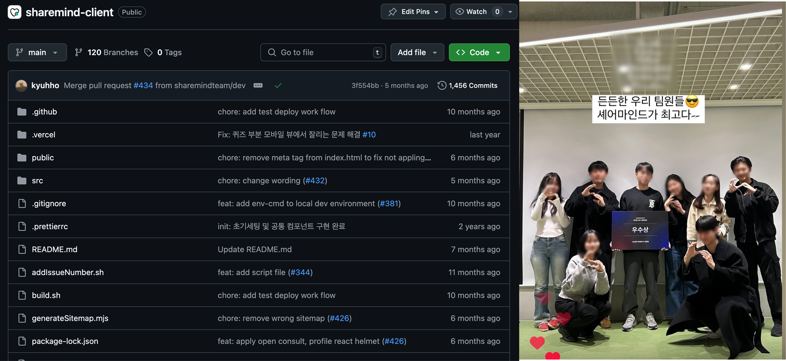

> "6개월동안 코딩 교육 스타트업 코딩밸리 🚀에서 프론트엔드 교육 코스를 기획/개발하게 된 기묘한 경험을 소개합니다."

# 배경

군대에서 전역을 한 후 나는 개발에 입문하게 되었고 당시에 멋사라는 동아리에서 프론트 개발에 대해서 공부를 하게 되면서 자연스레 프론트 개발에 관심이 생기게 되었다.


특히 난 운이 좋게도 좋은 사람들을 만나 '셰어마인드' 라는 실사용자가 어느 정도 나오는 프로젝트를 진행하게 되었고, 나의 첫번째 목표인 '사용자가 있는 서비스 만들기' 를 이뤄냈다. 재밌는 경험이었다. 무언가에 완전히 몰입한다는 건 아름다운 거 같다.



#### 그런데 이 이후..

서비스가 안정화된 이후, 나는 소강 상태에 빠졌다.

마침 휴학도 했겠다, 지금 내 실력으로는 유명 테크 기업 개발 인턴을 하기에는 무리라고 판단하였고, 현장 실습을 노렸다.

# Header 1

## Header 2

# Header 1

    Header 2
    --------

# Header 1

## Header 2

### Header 3

#### Header 4

##### Header 5

###### Header 6

    # Header 1
    ## Header 2
    ### Header 3
    #### Header 4
    ##### Header 5
    ###### Header 6

# Header 1

## Header 2

### Header 3

#### Header 4

##### Header 5

###### Header 6

    # Header 1 #
    ## Header 2 ##
    ### Header 3 ###
    #### Header 4 ####
    ##### Header 5 #####
    ###### Header 6 ######

> Lorem ipsum dolor sit amet, consectetuer adipiscing elit. Aliquam hendrerit mi posuere lectus. Vestibulum enim wisi, viverra nec, fringilla in, laoreet vitae, risus.

    > Lorem ipsum dolor sit amet, consectetuer adipiscing elit. Aliquam hendrerit mi posuere lectus. Vestibulum enim wisi, viverra nec, fringilla in, laoreet vitae, risus.

> ## This is a header.
>
> 1. This is the first list item.
> 2. This is the second list item.
>
> Here's some example code:
>
>     Markdown.generate();

    > ## This is a header.
    > 1. This is the first list item.
    > 2. This is the second list item.
    >
    > Here's some example code:
    >
    >     Markdown.generate();

- Red
- Green
- Blue

* Red
* Green
* Blue

- Red
- Green
- Blue

```markdown
- Red
- Green
- Blue

* Red
* Green
* Blue

- Red
- Green
- Blue
```

- `code goes` here in this line
- **bold** goes here

```markdown
- `code goes` here in this line
- **bold** goes here
```

1. Buy flour and salt
1. Mix together with water
1. Bake

```markdown
1. Buy flour and salt
1. Mix together with water
1. Bake
```

1. `code goes` here in this line
1. **bold** goes here

```markdown
1. `code goes` here in this line
1. **bold** goes here
```

Paragraph:

    Code

<!-- -->

    Paragraph:

        Code

---

---

---

---

---

    * * *

    ***

    *****

    - - -

    ---------------------------------------

This is [an example](http://example.com "Example") link.

[This link](http://example.com) has no title attr.

This is [an example][id] reference-style link.

[id]: http://example.com "Optional Title"

    This is [an example](http://example.com "Example") link.

    [This link](http://example.com) has no title attr.

    This is [an example] [id] reference-style link.

    [id]: http://example.com "Optional Title"

_single asterisks_

_single underscores_

**double asterisks**

**double underscores**

    *single asterisks*

    _single underscores_

    **double asterisks**

    __double underscores__

This paragraph has some `code` in it.

    This paragraph has some `code` in it.


    
