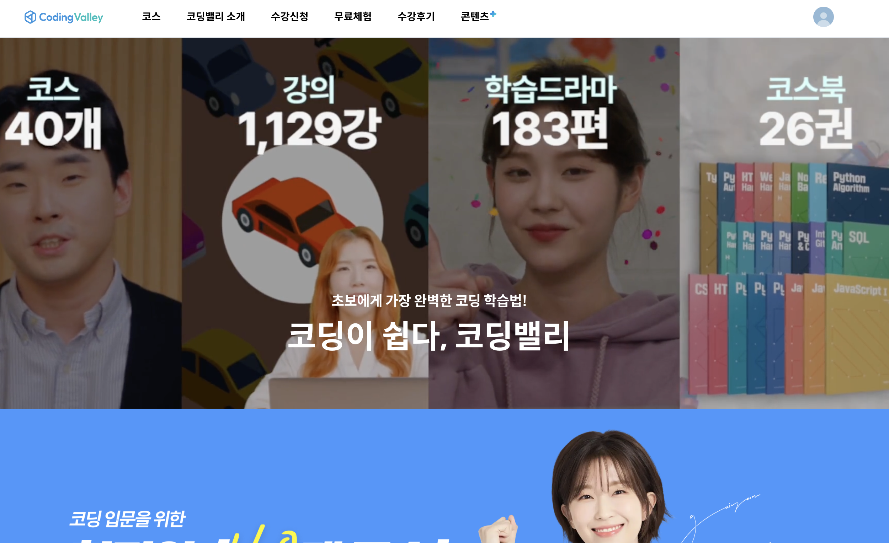
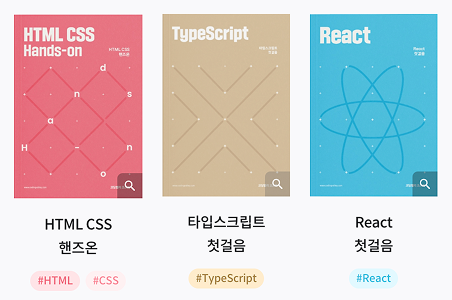
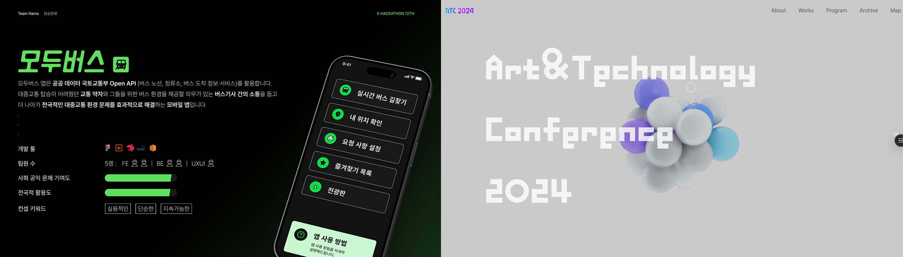

> "6개월의 카카오뱅크 인턴쉽"

# 배경

군대에서 전역을 한 후 나는 개발에 입문하게 되었고 당시에 멋사라는 동아리에서 프론트 개발에 대해서 공부를 하게 되면서 자연스레 프론트 개발에 관심이 생기게 되었다.

#### 사용자를 배출한 첫 프로젝트

특히 난 운이 좋게도 좋은 사람들을 만나 `셰어마인드` 라는 실사용자가 어느 정도 나오는 프로젝트를 진행하게 되었고, 나의 첫번째 목표인 '사용자가 있는 서비스 만들기' 를 이뤄냈다. 재밌는 경험이었다. 무언가애 완전히 몰입할 수 있던, 정말 좋은 기회였다.

#### 현타가 오다

3개월 정도 지난 뒤 서비스가 안정화된 이후, 나는 소강 상태에 빠졌다. 미래에 대한 불안감과 함께 이제 무언가를 새로 시작해야 될 거 같은데 아무것도 하기 싫은 느낌이 나를 사로잡았다.

마침 휴학도 했겠다, 이렇게 살면 안되겠다 싶어서 현장 실습에 지원했다. 현재 내 이력으로는 메이저 IT 업계에 인턴 개발자로 취업하는 건 불가능하다고 판단했기 때문이다.

결론적으로, 글로벌 IT통신사 회사에 지원하여 최종 면접까지 가긴 했으나, 예상치 못하게 최종 면접이 영어(?)로 이루어져서 (사전에 몰랐음) 당황하긴 했지만 결국엔 준비 부족으로 탈락했다. 사실 당시엔 번아웃에 가까웠고, 뭐라도 해야겠다는 압박감으로 억지로 지원한 터라 제대로 준비조차 하지 못했다.

#### 나를 강제로 되돌아보는 시간

나는 막연히 내가 현장 실습에 붙을 거라 생각하고 휴학을 신청하여 6개월이라는 시간동안을 무언가로 채워야 했다.
어느새 가벼운 우울감과 불안감이 나를 잠식하고 있었기에, 일단 지금 당장 몰입하기 어려운 개발을 제쳐놓기로 했다.

그리고 내가 그전까지 하고 싶었던 것들로 일주일을 채워갔다. 운동, 달리기, 밴드 합주, 야구 시청...
그때는 하루에 2번씩 헬스장에 갔었다.

방구석에서 있을 때보다, 밖에서 생산적인 활동을 하니 서서히 자신감도 생기고, 몸도 좋아졌다.
이제 슬슬 미래를 향한 날갯짓이 다시 필요한 때가 된 듯 했다.

#### 아 모르겠고 일단 지원해보자

한 코딩 교육 스타트업 인턴 채용 공고가 잡코리아에 올라온 걸 확인했다. 프론트엔드 교육 컨텐츠를 제작하는 업무였다.

1년정도 교내 코딩 동아리에서 프론트엔드 교육자로 활동했기에, 나에게 적합한 일이라고 생각이 들었다. 간단한 이력서를 보내고, 면접을 보자는 전화가 왔다.
면접은 커피챗 형식의 대화와 간단한 과제로 이루어졌다.

이전에 최종에서 떨어져본 경험으로 무장하여 자신감 있는 태도로 편하게 이야기를 나눴고, 다음 날 합격 문자가 왔다!

# 업무 시작

내가 취업한 `코딩밸리` 는 자사 어플을 통해 초심자들을 타겟으로 코딩 교육 컨텐츠를 `모바일 앱, 웹 환경`에서 제공하는 스타트업이었다.

회사에서 프론트엔드 심화 교육 코스를 오픈을 대기중이어서, 해당 코스에 사용될 책의 집필과 실습 코드 제작을 내게 맡기려고 했다.

#### 내가 맡은 일

처음 회사에 와서 맡게 된 업무는 **HTML-CSS 코스북**을 제작하는 일이었다. 개발적인 엄밀함과 테크니컬 라이팅 스킬이 필요한 업무였다. 사수 분과 함께 책을 집필하며,

- 말을 간결하고 핵심만 전달하기 위한 글쓰기에서의 피드백
- 기술적인 엄밀함을 크게 벗어나지 않으면서 공식 문서에 있는 내용들을 어떻게 쉽게 표현할 수 있는지에 대한 피드백

을 거치며 글을 쓸 때 이에 대해서 계속 고민했던 거 같다.

특히 기술 문서를 뒤져가며 내가 생각하기에는 확실한 레퍼런스를 들고 와서 사수분께 갑론을박을 벌이기도 했지만..

**'이건 진짜 내가 맞다'** 라고 생각하고 주장했다가 알고보니 아니었던 적이 한 두 번이 아니었다.

**HTML CSS 코스북** 제작을 시작으로, 통상적인 프론트엔드 공부 순대로 강의 커리큘럼이 하나씩 오픈 예정이었기에 일을 하면서 프론트엔드 전반적인 지식을 리마인드 할 수 있었다.

#### AI 도움을 받은 코스북 제작

코스북을 제작하는데에 AI 도움을 적극적으로 활용했다. 강의 스크립트를 input으로 받으면 앤트로픽의 클로드 모델을 사용하여 학습 데이터, 가이드 등을 포함한 프롬프트 틀을 설정해서 코스북에 들어갈 내용을 마크다운으로 생성해주는 시스템을 구축했다.

한 페이지 당 책의 특정한 규격에 맞춰서 이미지와 글을 배치해야 하는 문제점이 있었는데, 마크다운으로 제작한 텍스트 블록들을 웹 뷰를 통해 Python 코드로 HTML을 제어하여 인쇄 규격에 맞춰서 커스텀으로 편집하여 PDF로 추출하는 방식을 개발했다. 이를 통해 일관된 품질의 교육 자료를 효율적으로 제작할 수 있었다.

#### 근무 연장

3개월의 계약이 끝난 뒤, 근무 연장 의사를 물어보셨고 나는 연말에 CES 부스 준비와 학과 컨퍼런스 참석 일정이 있어서
회사와 파트타임으로 오후 2시부터 6시까지 일하는 것으로 합의했다.

회사에서 배려해주신 덕분에 엄청난 워라밸을 챙기면서, 내가 진행중인 프로젝트에 더욱 집중할 수 있었다.

연장 기간 동안에는 내 업무 범위를 비교적 더 확장해서 일할 수 있었다.
이제는 강의 커리큘럼을 직접 기획하고, 이를 기반으로 코스북을 만들고, 강사님과 직접 이야기를 나누면서 강의 구성에 대한 소통을 했다.

React 심화 코스, 타입스크립트 첫걸음, Next.js 첫걸음이라는 강의를 런칭하였다. 🚀

# What I've learned

결론적으로 난 근무 기간동안 **6개**의 프론트엔드 강의 코스 제작에 참여하였고, **100**여개의 프론트엔드 강의 서브 컨텐츠를 개발했다.

테크니컬 라이팅, 상사와의 커뮤니케이션과 같은 여러 소프트 스킬 성장과 기술적인 성장도 있었지만, 이번 인턴 경험은 그 이상의 의미가 있었다.

콘텐츠를 제작한다는 것은 곧, 누군가에게 ‘배움’을 전달한다는 일이다. 그러기 위해선 내가 먼저 본질을 이해하고, 그것을 구조화해서 설명할 수 있어야 했다. 프론트엔드 프로젝트를 여럿 경험했기에 어느 정도 알고 있다고 생각했지만, 교육자의 시선에서 바라보니 내가 모르고 있던 빈틈들을 많이 마주할 수 있었다.

피드백을 주고받으며 겸손한 태도를 배우기도 했고, 내가 틀렸음을 인정하고 다시 고쳐 나가는 경험이 얼마나 빠른 성장을 가져오는지도 체감할 수 있었다. 처음엔 그저 ‘뭐라도 해야겠다’는 마음으로 시작한 인턴십이었지만, 지금은 그 선택이 내 커리어의 중요한 전환점이자 회복의 시작이었음을 확신한다.  
내가 다시 개발에 몰입하고, 내가 좋아하는 일을 계속할 수 있게 만들어준 이 경험이 참 고맙다.

이제는 '해야만 해서'가 아닌, '하고 싶어서' 개발을 이어가고 있다.
